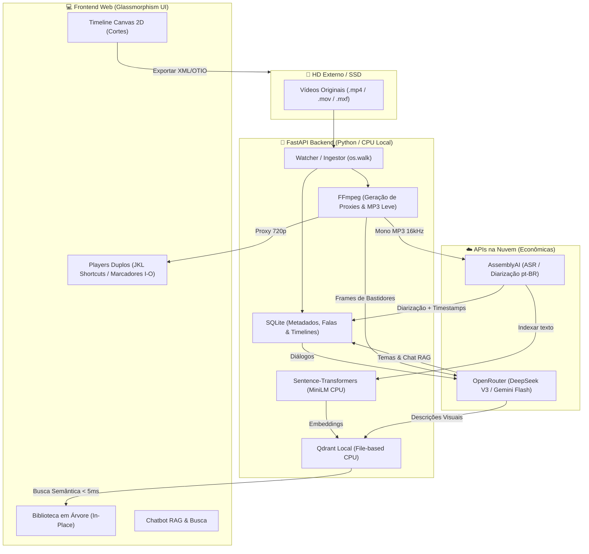

# 🎬 CapIAu-Talho — Motor de Inteligência e Decupagem Cinematográfica

O **CapIAu-Talho** é uma solução inteligente de decupagem e pré-edição projetada sob medida para fluxos de **Making Of e Documentários**. O sistema opera em um **Modelo Híbrido Otimizado** desenhado especificamente para rodar com alta performance em CPUs locais (como processadores Intel i7 com 32GB de RAM), sem depender de GPUs dedicadas locais. 

A inteligência é distribuída: buscas vetoriais e reconhecimento facial ocorrem 100% localmente no seu hardware, enquanto tarefas pesadas de linguagem e transcrição utilizam APIs em nuvem de baixíssimo custo de forma otimizada.

---

## 🚀 Recursos Principais (Features)

* **📁 Ingestão In-Place (HD Externo):** Varredura recursiva e catalogação de mídias gigantes localizadas em HDs externos ou SSDs sem precisar copiá-las localmente.
* **⚡ Geração de Proxies Inteligente:** Conversão automática de vídeos pesados em proxies leves de 720p/360p via FFmpeg, com controle de progresso real (0-100%) e prevenção de processos órfãos.
* **🎙️ Transcrição pt-BR & Diarização (ASR):** Transcrição palavra-a-palavra de entrevistas via AssemblyAI com identificação automática de personagens (quem falou o quê).
* **🔍 Busca Semântica Híbrida local:** Pesquise na biblioteca usando linguagem natural (ex: *"diretor falando sobre a escolha de lentes"*) e encontre o trecho exato instantaneamente via Qdrant local rodando em CPU.
* **👤 Reconhecimento Facial CPU Local:** Motor 100% local usando modelos YuNet e SFace (ONNX) para detectar, agrupar (DBSCAN), desambiguar e nomear personagens em fotos e vídeos.
* **💬 Chatbot RAG Integrado:** Tire dúvidas sobre o material bruto do documentário. As respostas da IA incluem citações clicáveis que abrem o vídeo correspondente no player e movem a agulha para o frame exato.
* **🖥️ Visualizadores Duplos (NLE):** Setup profissional de edição contendo monitor de origem (*Source Player*) com controles **JKL** de alta velocidade, marcadores de entrada e saída (**I/O**) e monitor de visualização da timeline (*Program Player*).
* **🎨 Timeline Multi-trilha Canvas 2D:** Linha do tempo de alto desempenho renderizada em Canvas, suportando trilhas de falas (`V1`), cobertura B-roll (`V2`), snapping magnético e zoom.
* **🎛️ Workspaces Multi-monitores:** Destaque qualquer painel principal (Biblioteca, Transcrição, Timeline, Players ou Chat) em janelas separadas do navegador mantendo atalhos e estados sincronizados via BroadcastChannel.
* **☁️ Sincronização e Backup ZIP:** Sincronize projetos inteiros (incluindo metadados, proxies e descrições faciais já computadas) via pacotes ZIP e links diretos do Google Drive.

---

## 📊 Arquitetura Técnica do Sistema



---

## ⚙️ Pré-requisitos & Execução Local

### Pré-requisitos
1. **Python 3.10+** instalado.
2. **FFmpeg** instalado na máquina e configurado no PATH do sistema. (Teste digitando `ffmpeg -version` no terminal).

### Instalação Rápida
1. Instale as dependências requeridas:
   ```bash
   pip install -r requirements.txt
   ```
2. Crie ou configure o arquivo [.env](file:///c:/Users/FGC/Desktop/Capiau-Talho-Kimi_MVP/.env) na raiz do projeto contendo suas chaves:
   ```env
   OPENROUTER_API_KEY=sua_chave_do_openrouter
   ASSEMBLYAI_API_KEY=sua_chave_da_assemblyai

   # Configurações de Modelos (Padrão Econômico)
   TEXT_MODEL=deepseek/deepseek-chat
   VISION_MODEL=google/gemini-2.5-flash
   ```

### Executando a Aplicação
Inicie o servidor de desenvolvimento:
```bash
python -m uvicorn src.api.server:app --reload
```
Abra no seu navegador de preferência:
👉 **[http://localhost:8000/](http://localhost:8000/)**

---

## 📁 Estrutura de Pastas Simplificada

* `/data` - Bancos de dados (`capiau.db`, `qdrant.db`) e caches locais gerados em execução (ignorado no Git).
* `/docs` - Documentações de arquitetura, manuais e guias de integração.
* `/src` - Código fonte principal da aplicação.
  * `/src/api` - Rotas FastAPI e controladores HTTP.
  * `/src/db` - Schemas e persistência SQLite.
  * `/src/ingest` - Watcher de mídias e gerador de proxies com FFmpeg.
  * `/src/search` - Sistema de indexação e buscas no Qdrant local.
  * `/src/ui` - Painel de controle Web e módulos Javascript (`/ui/js`).
* `/tests` - Suite de testes automatizados unitários e de integração.

---

## 🐳 Notas sobre Deploy e Nuvem

O CapIAu-Talho foi desenhado especificamente como uma ferramenta **desktop híbrida de uso local**. Devido ao tamanho das mídias originais de vídeo (que permanecem em discos externos) e à necessidade de dependências do sistema como o FFmpeg para proxying, **não recomendamos** o deploy em servidores serverless efêmeros (como Vercel ou Netlify).

Se for necessário compartilhar a aplicação em rede ou nuvem privada:
1. Monte a aplicação em un container **Docker** contendo os binários do FFmpeg.
2. Utilize volumes persistentes vinculados para manter os arquivos de banco de dados SQLite (`.db`) e o diretório de dados Qdrant.

---

## 📚 Documentações Complementares

Para aprofundar-se em guias de uso específicos e na operação fina do CapIAu-Talho, consulte os seguintes arquivos na pasta `/docs`:

* 📖 **[Manual do Usuário (USER_MANUAL.md)](file:///c:/Users/FGC/Desktop/Capiau-Talho-Kimi_MVP/USER_MANUAL.md):** Manual completo de operação das funcionalidades na tela.
* 🎬 **[Integração e Workflow com Kdenlive (docs/kdenlive_workflow.md)](file:///c:/Users/FGC/Desktop/Capiau-Talho-Kimi_MVP/docs/kdenlive_workflow.md):** O fluxo de edição offline/online com o Kdenlive e os planos de automação do formato nativo `.kdenlive` (MLT).
* 🎹 **[Cheat Sheet de Atalhos de Teclado (docs/shortcuts.md)](file:///c:/Users/FGC/Desktop/Capiau-Talho-Kimi_MVP/docs/shortcuts.md):** Lista rápida de atalhos e mapeamento de botões no player e timeline.
* 💰 **[Guia de Custos & Segurança de APIs (docs/costs_and_security.md)](file:///c:/Users/FGC/Desktop/Capiau-Talho-Kimi_MVP/docs/costs_and_security.md):** Melhores práticas para economizar chaves e tokens ao usar AssemblyAI e OpenRouter.
* 🔌 **[Referência de Endpoints de API (docs/api_endpoints.md)](file:///c:/Users/FGC/Desktop/Capiau-Talho-Kimi_MVP/docs/api_endpoints.md):** Lista de endpoints e payloads JSON de controle de faces e visão.
* 🚀 **[Walkthrough de Desenvolvimento (walkthrough.md)](file:///c:/Users/FGC/Desktop/Capiau-Talho-Kimi_MVP/walkthrough.md):** O progresso técnico detalhado das 11 fases concluídas de implementação do MVP.
