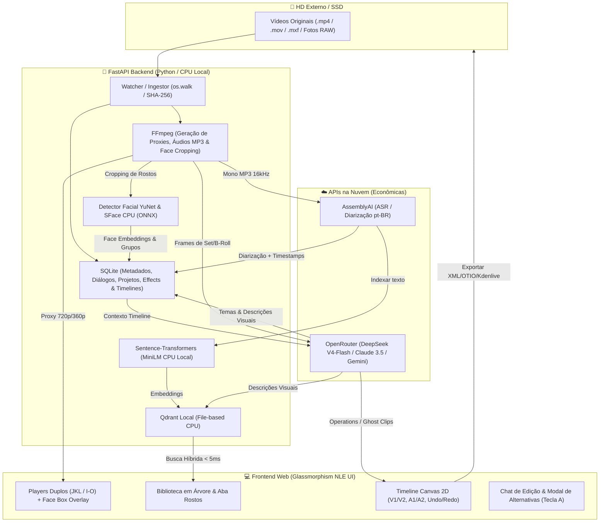

# 🎬 CapIAu-Talho — Plataforma de IA & Decupagem Cinematográfica para Grandes Acervos e Documentários

O **CapIAu-Talho** é uma ilha de pré-edição, logging e assistência inteligente baseada em IA, projetada sob medida para **documentaristas, editores de making-of e gestores de grandes acervos audiovisuais**. O sistema foi construído sobre uma **arquitetura híbrida otimizada para CPU local**, garantindo que tarefas críticas de privacidade e indexação (busca vetorial e biometria facial) rodem 100% localmente no seu computador (sem a necessidade de GPUs caras), enquanto tarefas linguísticas pesadas utilizam APIs de nuvem de forma econômica e cirúrgica.

Ao contrário das ferramentas tradicionais que tratam a IA de forma isolada, o CapIAu-Talho integra modelos de linguagem e visão diretamente a uma **timeline multipista de edição (NLE) em Canvas 2D**, permitindo o mapeamento de depoimentos palavra-a-palavra, buscas conceituais por imagem e a montagem semiautônoma de cortes narrativos exportáveis para softwares profissionais como o **Kdenlive, Premiere, Resolve e Final Cut**.

---

## 🎯 Por que usar o CapIAu-Talho?

### 🎞️ Para Documentaristas e Diretores de Making-Of
* **Edição por Texto:** Visualize depoimentos e entrevistas transcritos palavra-a-palavra. Selecione frases ou parágrafos inteiros e insira-os diretamente na timeline com o atalho `Shift+E`.
* **Relações de J/L-Cuts Nativos:** Monte diálogos de forma cinematográfica e fluida, estendendo o áudio sob a imagem do entrevistado ou inserindo B-rolls de cobertura antes da fala começar, com suporte visual a trims independentes e compensação auditiva em tempo real no player.
* **Agrupamento Temático Automático:** Deixe que a IA analise dezenas de horas de entrevistas e as organize em tópicos de assunto (ex: "Direção de Arte", "Problemas no Set"), permitindo navegar por subtemas instantaneamente.

### 💾 Para Gestores de Acervos e Arquivistas
* **Ingestão In-Place Sem Cópia:** Catalogar centenas de gigabytes de arquivos mantendo-os em seus discos rígidos externos ou SSDs originais, gerando proxies Web levíssimos em segundo plano sem sujar o armazenamento interno.
* **Busca Híbrida Semântica & Visual:** Pesquise seu material bruto usando linguagem humana natural (ex: *"diretor gesticulando em frente à câmera sob iluminação quente"*). O sistema localiza o trecho exato de vídeo ou foto do set em menos de 5ms.
* **Biometria Facial Local:** Detecte, agrupe por proximidade (Clustering DBSCAN) e identifique personagens e entrevistados de forma 100% local usando modelos ONNX otimizados para CPU.

### ✂️ Para Editores de Montagem Profissional
* **Zero Aprisionamento Tecnológico (No Vendor Lock-in):** Faça toda a triagem e rough cut no CapIAu-Talho e exporte sua timeline com precisão de frames para arquivos XML, OpenTimelineIO (.otio), EDL ou arquivos nativos do **Kdenlive 24/25** (.kdenlive).
* **Atalhos Profissionais (Scrubbing JKL):** Navegue pelas mídias com os mesmos atalhos de reprodução acelerada e reversa (J, K, L) e marcação de corte (I, O, E) usados no Premiere e DaVinci Resolve.

---

## 🚀 Recursos Principais (Features)

* **🤖 Agente Editor com Tools (IA Copiloto):** Um agente conversacional que analisa o roteiro e a timeline ativa, propondo cortes e edições diretamente na linha do tempo por meio de function-calling (loop de ferramentas). As edições simples são aplicadas direto (com undo/redo), enquanto edições complexas ou em lote viram rascunhos visuais (*ghost clips*) para aprovação.
* **👥 Biometria Facial, Desambiguação em Massa e Autocura:** Tela dedicada para catalogação de elenco e equipe técnica, permitindo reatribuir, fundir grupos de rostos idênticos e rejeitar artefatos com preview de vídeo de contexto em hover configurável. Conta com seleção em lote via **Shift + Clique**, busca instantânea por digitação rápida, paginação inteligente para navegação fluida, cacheamento local de thumbnails e um mecanismo robusto de **autocura de dados** que protege e reestabelece as suas decisões de auditoria manual contra sobrescritas automáticas do DBSCAN.
* **🔄 Modal de Alternativas da IA:** Todo clipe inserido pela IA carrega candidatos semânticos sugeridos. Ao selecionar um clipe na timeline e pressionar **`A`**, um modal centralizado exibe vídeos tocando em loop silencioso de cada alternativa com a justificativa da IA. Troque os clipes com um clique usando as ferramentas visuais **Slot Fixo** (mantém duração) ou **Ripple** (desloca a timeline para encaixar a duração ideal).
* **🖥️ Janelas Destacáveis (Workspaces Multi-monitores):** Destaque a Biblioteca, Timeline, Players ou Chatbot em janelas independentes. Elas mantêm sincronia de playhead, seleções e comandos em tempo real usando `BroadcastChannel`.
* **📂 Visualização em Árvore Inteligente:** Navegue por acervos gigantes organizados dinamicamente em pastas e subpastas hierárquicas colapsadas no estilo Explorer de arquivos, eliminando a poluição visual na biblioteca.
* **📸 Suporte a Fotos Still & Efeitos Ken Burns:** Permite inserir fotos do set (incluindo RAW) como stills na timeline com arrastar-e-soltar. Possibilita animar movimentos suaves (Ken Burns), ajustar enquadramento (Fit/Fill) e fades por meio do Inspetor de Foto e compose no Program Player.
* **🎛️ Layout Estúdio & Controle Flexível (Workspaces):** Preset de interface robusto para decupagem que reposiciona a biblioteca (maximizada) e empilha os players de Source/Program em formato limpo (*controles apenas no hover*). Permite expandir a transcrição como terceira coluna retrátil. Além disso, gerencie a altura vertical das pistas de vídeo e áudio via slider global ou arraste individual pela borda.
* **🎤 Assistente de Diarização Inteligente:** Fluxo completo para corrigir falantes na transcrição. Inclui uma gaveta de pistas globais (silêncios longos, perguntas e discrepâncias faciais) e um inspetor de balão avançado. O inspetor exibe uma *Waveform Interativa* de fala, permitindo dividir depoimentos com dois cliques precisos, e oferece desambiguação facial instantânea baseada em quem está na tela no milissegundo correspondente.
---

## 📊 Arquitetura Técnica do Sistema

O fluxo do CapIAu-Talho opera de forma circular, sincronizando o banco de dados de metadados, o banco vetorial vetorial e a timeline do editor:



---

## ⚙️ Pré-requisitos & Execução Local

### Pré-requisitos
1. **Python 3.10+** instalado.
2. **FFmpeg** instalado na máquina e configurado nas variáveis de ambiente do sistema (`PATH`).

### Instalação Rápida
1. Instale as dependências requeridas pelo backend:
   ```bash
   pip install -r requirements.txt
   ```
2. Crie ou configure o arquivo [.env](file:///c:/Users/FGC/Desktop/Capiau-Talho-Kimi_MVP/.env) na raiz do projeto contendo suas chaves:
   ```env
   OPENROUTER_API_KEY=sua_chave_do_openrouter
   ASSEMBLYAI_API_KEY=sua_chave_da_assemblyai

   # Configurações de Modelos (Padrão Híbrido Econômico)
   TEXT_MODEL=deepseek/deepseek-chat
   VISION_MODEL=google/gemini-2.5-flash
   ```

### Executando a Aplicação
Inicie o servidor local:
```bash
python -m uvicorn src.api.server:app --reload
```
Abra no seu navegador:
👉 **[http://localhost:8000/](http://localhost:8000/)**

---

## 📁 Estrutura de Pastas Simplificada

* `/data` - Bancos de dados locais (`capiau.db`, caches e diretórios de dados Qdrant/fotos).
* `/docs` - Documentações complementares de APIs, custos e workflow com NLEs externos.
* `/src` - Código fonte principal.
  * `/src/api` - Controladores, rotas FastAPI e rotas de reconhecimento facial (`/faces`).
  * `/src/db` - Schemas e persistência relacional SQLite.
  * `/src/ingest` - Varredura de diretórios, ingestão de fotos/vídeos e conversão de proxies.
  * `/src/search` - Mapeador e indexador de buscas semânticas híbridas no Qdrant.
  * `/src/vision` - Motores locais de biometria facial (Haar Cascades, YuNet, SFace).
  * `/src/ui` - Interface Web, estilos CSS e scripts interativos em JS (`/ui/js`).
* `/tests` - Suite de testes integrados automatizados.

---

## 📚 Documentações Complementares

Consulte a pasta [/docs](file:///c:/Users/FGC/Desktop/Capiau-Talho-Kimi_MVP/docs) para acessar guias específicos:

* 📖 **[Manual do Usuário (USER_MANUAL.md)](file:///c:/Users/FGC/Desktop/Capiau-Talho-Kimi_MVP/USER_MANUAL.md):** Manual completo de operação das funcionalidades visuais da tela.
* 🎬 **[Fluxo de Trabalho com Kdenlive (docs/kdenlive_workflow.md)](file:///c:/Users/FGC/Desktop/Capiau-Talho-Kimi_MVP/docs/kdenlive_workflow.md):** Guia detalhado de sincronização e exportação direta do CapIAu-Talho para edição offline no Kdenlive.
* 🎹 **[Cheat Sheet de Atalhos de Teclado (docs/shortcuts.md)](file:///c:/Users/FGC/Desktop/Capiau-Talho-Kimi_MVP/docs/shortcuts.md):** Lista de atalhos e mapa do teclado NLE.
* 💰 **[Custos & Segurança de APIs (docs/costs_and_security.md)](file:///c:/Users/FGC/Desktop/Capiau-Talho-Kimi_MVP/docs/costs_and_security.md):** Melhores práticas para economizar na precificação do OpenRouter e AssemblyAI.
* 🔌 **[Referência de APIs (docs/api_endpoints.md)](file:///c:/Users/FGC/Desktop/Capiau-Talho-Kimi_MVP/docs/api_endpoints.md):** Relação de chamadas HTTP internas para desenvolvedores.
* 🚀 **[Histórico e Walkthrough de Desenvolvimento (walkthrough.md)](file:///c:/Users/FGC/Desktop/Capiau-Talho-Kimi_MVP/walkthrough.md):** Diário técnico e progresso passo-a-passo do desenvolvimento deste MVP.
