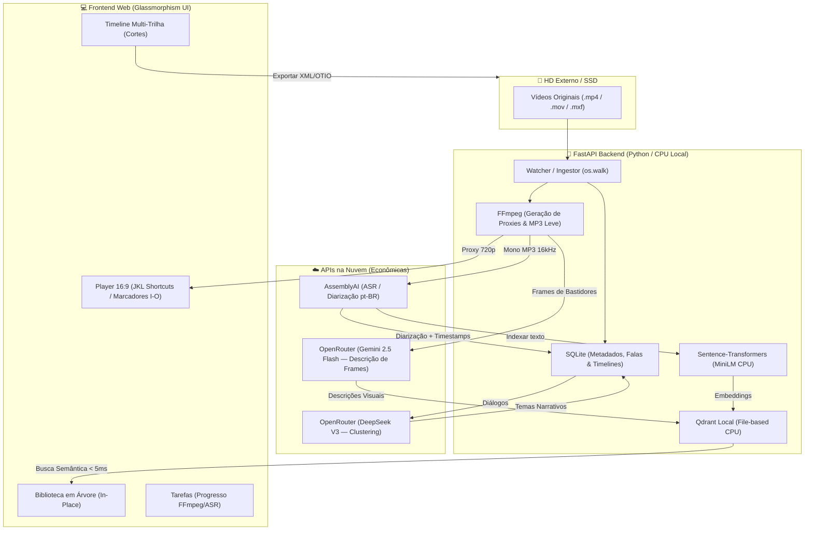

# 🎬 CapIAu-Talho — Motor de Inteligência e Decupagem Cinematográfica

O **CapIAu-Talho** é uma solução de inteligência artificial e pré-edição (decupagem) projetada especificamente para fluxos de **Making Of e Documentários**. O sistema foi projetado sob um **Modelo Híbrido Otimizado** para rodar com eficiência em CPUs locais (como processadores Intel i7 com 32GB de RAM), eliminando a dependência de GPUs Nvidia dedicadas locais através do uso de buscas locais rápidas em CPU combinadas com APIs na nuvem de baixíssimo custo.

Com o CapIAu-Talho, você pode processar mais de 20 horas de material bruto (entrevistas, B-rolls de bastidores, fotos de set), transcrever falas automaticamente com identificação de personagens (diarização), fazer pesquisas semânticas rápidas na biblioteca (ex: *"diretor escolhendo lentes"*) e exportar o rascunho de timeline diretamente para Premiere Pro ou DaVinci Resolve via XML e OpenTimelineIO.

---

## 🛠️ Arquitetura Técnica do Sistema

A arquitetura do CapIAu-Talho é baseada em três pilares: **Ingestão In-Place (HD Externo)**, **Banco de Dados Híbrido Local** e **Processamento de IA Híbrido**:



### 1. Camada de Dados e Busca Vetorial (Local em CPU)
* **SQLite (`capiau.db`):** Banco de dados relacional que gerencia metadados técnicos de mídias, timelines, relações e a tabela de falas palabra-a-palavra. Conta com deleção em cascata (`PRAGMA foreign_keys = ON`) para o isolamento completo de múltiplos projetos.
* **Qdrant Local (File-Based):** Banco vetorial embutido que opera localmente em CPU (sem necessidade de Docker) para armazenar os embeddings e realizar buscas semânticas instantâneas em milissegundos.
* **Sentence-Transformers (`all-MiniLM-L6-v2`):** Modelo local e offline de ~120MB encarregado de gerar os embeddings vetoriais na CPU.

### 2. Camada de Processamento de Mídia
* **FFmpeg / FFprobe:** Extrai metadados técnicos (duração, codec, resolução, taxa de quadros) na importação e converte vídeos pesados H.264/ProRes em proxies leves 720p/360p H.264 AAC com monitoramento em tempo real do progresso (0-100%).
* **Extração Monofônica Local:** Antes de transcrever na nuvem, o CapIAu-Talho extrai o áudio em MP3 mono de 16kHz localmente. Isso reduz o tamanho do arquivo a ser enviado à nuvem em mais de 99%, evitando falhas de rede e permitindo carregar o áudio de entrevistas de 30 minutos em menos de 10 segundos.

### 3. Camada de Inteligência Artificial (Nuvem Econômica)
* **AssemblyAI (Universal-2 API):** Transcreve depoimentos na língua portuguesa com pontuação e diarização automática de personagens (quem falou o quê e em qual tempo exato).
* **OpenRouter (DeepSeek V3 & Gemini 2.5/3.1 Flash):**
  * **DeepSeek V3:** Agrupa as falas de todas as entrevistas em temas de documentário (clustering narrativo).
  * **Gemini 2.5 Flash / Gemini 3.1 Flash Lite:** Analisa fotos de set e frames de B-roll a cada 10 segundos para gerar metadados visuais semânticos de bastidores.

### 4. Pipeline de Visão Inteligente e Reconhecimento Facial
O CapIAu-Talho implementa um fluxo de reconhecimento facial em cascata dividida em **4 Tiers** de processamento e precisão:
* **Tier 0 (Local CPU):** Deteção leve com **YuNet** e extração de embeddings com **SFace** rodando localmente na CPU.
* **Tier 1 (Nuvem Azure):** Integração com **Azure Face API** (com limite ativo de 20 chamadas/min e teste de conexão via `POST` robusto no plano gratuito) para extração fina de atributos e contornos de alta precisão.
* **Tier 2 (Nuvem AWS):** Reconhecimento de rostos de celebridades e busca de coleções no **AWS Rekognition**.
* **Tier 3 (Local GPU/CPU Avançado):** Suporte nativo ao **InsightFace** (ArcFace + RetinaFace). Se detectado que o módulo `insightface` está em falta, o backend expõe um endpoint para a instalação programática (`POST /api/faces/pipeline/install-insightface`) com um clique diretamente pela interface.

#### Motor de Enriquecimento de RAG e Busca Semântica
As descrições brutas dos frames de B-roll e fotos geradas pelas IAs de visão são associadas às marcações de rostos e objetos em uma janela de tolerância de **5.0 segundos**:
* **Substituição de Plurais:** Quando dois ou mais nomes de pessoas são identificados no mesmo frame, termos genéricos no texto (ex: `Duas mulheres`, `Pessoas`) são automaticamente substituídos pela junção de seus nomes reais (ex: `Fernanda e Aline`).
* **Resolução de Substantivos de Objetos:** Ao marcar um objeto (ex: `Abajur de Mesa`), o sistema localiza o substantivo correspondente na descrição original (ex: `um abajur`, `a luz`) e substitui o termo pelo nome preciso do objeto anotado.
* **Busca Semântica:** Mapeamentos manuais criados com a anotação Drag-and-Draw inserem representações textuais na base SQLite, garantindo que buscas por objetos ou pessoas encontrem o frame exato na biblioteca.

---

## 🔌 Detalhamento das APIs de Visão e Faces

Abaixo estão listadas as rotas do backend FastAPI que gerenciam o fluxo de detecções e desambiguação:

### 1. Rotulação e Resolução de Conflitos
* **`POST /api/faces/face/{face_id}/label`**
  * **Payload:** `{"name": "Nome da Pessoa/Objeto"}`
  * **Funcionamento:** Atribui um nome à detecção. Se a detecção pertencer a um cluster/grupo, aplica o nome a todas as faces do mesmo grupo.
  * **Resolução de Conflitos:** Se o nome fornecido já estiver associado a outro cluster, a API retorna um status `conflict` com os IDs dos clusters conflitantes, permitindo que o frontend inicie uma modal de desambiguação para fusão manual (`merge`) ou reatribuição (`reassign`).

### 2. Fusão de Grupos e Reatribuição de Rostos
* **`POST /api/faces/project/{project_id}/faces/merge`**
  * **Payload:** `{"src_cluster_id": int, "dest_cluster_id": int, "name": "Nome Confirmado"}`
  * **Funcionamento:** Une por completo o cluster de origem ao de destino.
* **`POST /api/faces/project/{project_id}/faces/reassign`**
  * **Payload:** `{"face_ids": List[int], "target_cluster_id": int, "target_name": "Nome"}`
  * **Funcionamento:** Transfere individualmente apenas as detecções selecionadas de um grupo para o grupo correto.

### 3. Rejeição e Catalogação de Objetos
* **`POST /api/faces/face/{face_id}/reject`**
  * **Payload (Opcional):** `{"name": "Nome do Objeto"}`
  * **Funcionamento:** Descarta uma detecção de rosto errônea.
    * Se nenhum nome for fornecido (ou deixado em branco), a detecção é rotulada como `"Não Relevante"` e seu status é atualizado para `rejected`, fazendo com que seja totalmente ignorada nos algoritmos de clustering e de enriquecimento RAG.
    * Se um nome de objeto for fornecido (ex: `Abajur`), a detecção é arquivada como `rejected` (para não poluir o clustering de pessoas), mas o nome do objeto é persistido no banco de dados para indexação na busca semântica e enriquecimento textual de B-rolls.

### 4. Desenho de Caixas Manuais (Drag-and-Draw)
* **`POST /api/faces/face`**
  * **Payload:** `{"project_id": int, "video_id": Optional[int], "photo_id": Optional[int], "timestamp": Optional[float], "bounding_box": [x, y, w, h], "name": "Nome"}`
  * **Funcionamento:** Permite criar uma nova marcação retangular nas coordenadas normalizadas `[0.0 a 1.0]` do vídeo/foto, indexando elementos personalizados do set.

---

## 📂 Estrutura Modular do Código

O projeto está organizado seguindo práticas de modularidade para facilitar expansões futuras:

```
├── data/                       # Arquivos gerados localmente (ignorado no Git)
│   ├── cache/                  # Áudios MP3 temporários para upload ASR
│   ├── originals/              # Mídias copiadas fisicamente (se copy_original=True)
│   ├── proxies/                # Vídeos proxies leves MP4 gerados pelo FFmpeg
│   ├── capiau.db               # Banco de dados relacional SQLite
│   └── qdrant.db/              # Base vetorial local do Qdrant
├── scratch/                    # Scripts rápidos e ferramentas de teste de conexão
│   └── test_connections.py     # Script utilitário de diagnóstico das APIs
├── src/                        # Código-fonte principal da aplicação
│   ├── api/
│   │   └── server.py           # Rotas FastAPI e silenciador de log de polling
│   ├── db/
│   │   ├── schema.py           # Definição e inicialização do SQLite
│   │   └── operations.py       # Operações CRUD do banco de dados e isolamento
│   ├── export/
│   │   └── otio_export.py      # Conversor de Timeline para XML (Resolve/Premiere)
│   ├── ingest/
│   │   └── watcher.py          # Watcher de arquivos, FFprobe e gerador de proxies
│   ├── nlp/
│   │   └── theme_cluster.py    # Clustering inteligente de falas via DeepSeek V3
│   ├── search/
│   │   └── semantic.py         # Busca vetorial local via Qdrant e MiniLM
│   ├── transcription/
│   │   └── asr_engine.py       # Extração de MP3 e integração com AssemblyAI
│   ├── ui/                     # Interface Web Premium (Glassmorphism)
│   │   ├── index.html          # HTML5 semântico com abas e player widescreen
│   │   ├── app.js              # Atalhos JKL, I/O, in-place updates e persistência
│   │   └── styles.css          # Estilo translúcido premium responsivo
│   ├── vision/
│   │   └── multimodal_engine.py# Análise visual de fotos e frames via Gemini
│   └── config.py               # Configurações globais e inicialização de pastas
├── tests/                      # Conjunto de testes de integração e unitários
│   ├── test_database.py        # Validação do SQLite e busca semântica em CPU
│   └── test_hybrid_pipeline.py # Validação de ingestão e fluxo de proxies
├── .env                        # Variáveis de ambiente e API Keys (não comitar!)
├── .gitignore                  # Regras de exclusão do Git
├── requirements.txt            # Dependências unificadas do Python
└── USER_MANUAL.md              # Manual de utilização para o usuário final
```

---

## ⚡ Instalação e Execução Local

### Pré-requisitos:
1. **Python 3.10+** instalado.
2. **FFmpeg** instalado na máquina e adicionado ao PATH do Windows. (Verifique abrindo o console e digitando `ffmpeg -version`).

### Configuração:
1. **Instalar dependências:**
   ```bash
   pip install -r requirements.txt
   ```
2. **Configurar as APIs no arquivo `.env`:**
   Crie ou edite o arquivo `.env` na raiz do projeto com as chaves corretas:
   ```env
   OPENROUTER_API_KEY=sua_chave_do_openrouter
   ASSEMBLYAI_API_KEY=sua_chave_da_assemblyai
   
   # Opcional: Modelos OpenRouter (Gemini 2.5 Flash / DeepSeek V3)
   TEXT_MODEL=deepseek/deepseek-chat
   VISION_MODEL=google/gemini-2.5-flash
   ```

### Executar a aplicação:
1. Inicie o servidor FastAPI:
   ```bash
   python -m uvicorn src.api.server:app --reload
   ```
2. Acesse a URL no navegador:
   👉 **[http://localhost:8000/](http://localhost:8000/)**

---

## 🐙 Gerenciamento com Git e GitHub

Como a pasta local ainda não está rastreada por controle de versão, siga as etapas abaixo no terminal do seu computador para inicializar e publicar o repositório no seu GitHub.

### Passo 1: Inicializar o repositório local
1. Abra o prompt de comando no diretório do projeto:
   ```powershell
   cd c:\Users\FGC\Desktop\Capiau-Talho-Kimi_MVP
   ```
2. Inicialize o repositório Git:
   ```bash
   git init
   ```

### Passo 2: Commitar as bases de código modulares
Adicione os arquivos respeitando as regras do `.gitignore` (que ignoram as mídias pesadas e bancos locais para não exceder limites de tamanho de arquivo do GitHub):
```bash
git add .
git commit -m "feat: setup do MVP CapIAu-Talho funcional com proxies in-place, ASR, busca semântica em CPU e correções de usabilidade"
```

### Passo 3: Criar repositório remoto no GitHub e fazer o Push
1. Acesse o seu [GitHub](https://github.com/) e crie um novo repositório vazio (ex: `Capiau-Talho-Kimi_MVP`). **Não** adicione README, licença ou gitignore automáticos na interface do site.
2. Copie o endereço HTTPS ou SSH do repositório gerado e rode os comandos abaixo no seu computador:
   ```bash
   # Renomear branch padrão para main
   git branch -M main
   
   # Conectar o repositório local com o GitHub remoto
   git remote add origin https://github.com/SEU_USUARIO/Capiau-Talho-Kimi_MVP.git
   
   # Fazer o envio definitivo do código
   git push -u origin main
   ```

---

## ☁️ Instruções de Deploy (Vercel & Produção)

### Cenário 1: Hospedar o Frontend na Vercel (Recomendado para Interface)
O frontend estático está localizado em `src/ui/`. A Vercel é excelente para servir páginas estáticas de forma gratuita e rápida.

1. Instale a Vercel CLI ou conecte seu repositório do GitHub diretamente no site da [Vercel](https://vercel.com).
2. Configure a raiz do projeto de deploy direcionado para `src/ui` (ou configure as configurações padrão para servir arquivos HTML estáticos).
3. **Desvantagem local:** O player Web local precisa acessar as rotas de API `/api/...` que rodam na sua máquina (FastAPI).

### Cenário 2: Servidor Completo (FastAPI + Frontend)
Hospedar o backend FastAPI na Vercel requer configurar um arquivo `vercel.json` na raiz do repositório para mapear requisições do servidor FastAPI como Serverless Functions.

#### Exemplo de `vercel.json`:
```json
{
  "rewrites": [
    { "source": "/api/(.*)", "destination": "/src/api/server.py" },
    { "source": "/(.*)", "destination": "/src/ui/$1" }
  ]
}
```

> [!CAUTION]
> **Aviso de Limitações de Cloud (Vercel/Render):**
> Hospedar a aplicação 100% na nuvem (como na Vercel) para um MVP de vídeo possui **3 restrições técnicas graves**:
> 1. **Execução do FFmpeg:** Servidores serverless como o Vercel não possuem binários do `ffmpeg` pré-instalados para gerar proxies locais, e as funções expiram em no máximo 10-60 segundos (causando timeout em processamento de vídeo).
> 2. **Espaço em Disco:** HDs Externos e mídias de 20 horas não podem ser acessados pela Vercel em nuvem (ingestão in-place só funciona localmente na rede física do usuário).
> 3. **Bancos Embutidos:** SQLite e Qdrant Local File-Based gravam dados em arquivos locais. Em plataformas como a Vercel ou Heroku, o sistema de arquivos é **efêmero** (tudo é apagado a cada novo deploy ou reinício de servidor).
>
> **Estratégia Recomendada para Produção Remota:**
> Se desejar acessar o CapIAu-Talho de outros computadores em nuvem, configure:
> * **Banco de Dados Remoto:** SQLite no Render/Railway com volume persistente (Disk), ou migrar para PostgreSQL na nuvem + Qdrant Cloud (Instância de nuvem gratuita).
> * **Geração de Proxies no Cliente/Servidor Dedicado:** Um servidor com Docker dedicado que possua FFmpeg instalado em uma máquina com GPU (ex: AWS EC2 ou Railway com volume) para computar os proxies.

---

## 🔮 Roadmap: Futuras Fases do Projeto

Após a validação bem-sucedida do MVP com proxies e buscas, as próximas etapas de desenvolvimento do CapIAu-Talho contemplam:

1. **Edição Baseada em Texto (Text-Based Video Editing):**
   * Permitir que o editor monte a timeline apenas selecionando linhas de texto da transcrição. O sistema cortará o vídeo automaticamente nos marcadores de tempo das palavras selecionadas.
2. **Integração Nativa DaVinci Resolve / Premiere (FCPXML/OTIO completo):**
   * Aprimorar o exportador para gerar metadados de marcadores coloridos de falas diretamente nos clipes na timeline de edição profissional.
3. **Subtítulo Inteligente Integrado:**
   * Geração e gravação física (*burn-in*) ou exportação de arquivos de legenda SRT/VTT a partir dos blocos da diarização gerados pela AssemblyAI.
4. **Painel de Controle de Custos:**
   * Gráficos em tempo real do uso do OpenRouter para monitorar o gasto exato em centavos de cada clipe ou frame analisado.
