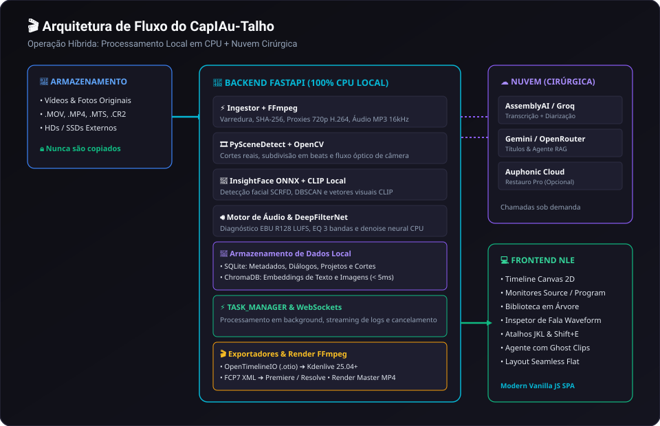

<div align="center">

# 🎬 CapIAu-Talho

**Ilha de pré-edição, decupagem e assistência por IA para grandes acervos e documentários**

[](LICENSE)
[](https://www.python.org/)
[](docs/PLANO_IMPLEMENTACAO.md)
[](#arquitetura-do-sistema)

</div>

<!-- IMAGEM: visão geral da interface com a timeline preenchida.
     Solte o arquivo em docs/images/hero-timeline.png e descomente a linha abaixo. -->
<!--  -->

O **CapIAu-Talho** é uma ilha de pré-edição, logging e assistência inteligente baseada em IA,
projetada sob medida para **documentaristas, editores de making-of e gestores de grandes acervos
audiovisuais**.

O sistema roda sobre uma **arquitetura híbrida otimizada para CPU local**: tarefas críticas de
privacidade e indexação — busca vetorial e biometria facial — acontecem 100% na sua máquina, **sem
GPU**. Só o trabalho linguístico pesado (transcrição e descrição de imagens) vai para APIs de nuvem,
de forma econômica e cirúrgica.

Ao contrário de ferramentas que tratam a IA como um acessório isolado, o CapIAu-Talho integra
modelos de linguagem e visão diretamente a uma **timeline multipista (NLE) em Canvas 2D**. Isso
permite mapear depoimentos palavra a palavra, buscar por conceito visual e montar cortes narrativos
semiautônomos — exportáveis para **Kdenlive, Premiere, Resolve e Final Cut**.

---

## 📑 Índice

- [🎯 Por que usar o CapIAu-Talho?](#por-que-usar-o-capiau-talho)
  - [Para documentaristas e diretores de making-of](#para-documentaristas-e-diretores-de-making-of)
  - [Para gestores de acervos e arquivistas](#para-gestores-de-acervos-e-arquivistas)
  - [Para editores de montagem profissional](#para-editores-de-montagem-profissional)
- [📸 Galeria](#galeria)
- [🚀 Recursos principais](#recursos-principais)
  - [🎞️ Decupagem e análise por IA](#decupagem-e-analise-por-ia)
  - [✂️ Timeline e edição](#timeline-e-edicao)
  - [📝 Títulos, legendas e animação (Titler NLE)](#titulos-legendas-e-animacao-titler-nle)
  - [👥 Rostos e personagens](#rostos-e-personagens)
  - [🔊 Diagnóstico e tratamento de áudio](#diagnostico-e-tratamento-de-audio)
  - [🎬 Render de vídeo e exportação](#render-de-video-e-exportacao)
  - [🖥️ Interface e produtividade](#interface-e-produtividade)
  - [🛡️ Resiliência e operação](#resiliencia-e-operacao)
- [📊 Arquitetura do sistema](#arquitetura-do-sistema)
  - [As quatro camadas](#as-quatro-camadas)
  - [Diagrama de fluxo](#diagrama-de-fluxo)
  - [O caminho de uma mídia, do disco à timeline](#o-caminho-de-uma-midia-do-disco-a-timeline)
- [🛠️ Como montar localmente](#como-montar-localmente)
  - [Requisitos](#requisitos)
  - [Passo a passo](#passo-a-passo)
  - [Executando](#executando)
- [⚙️ Configuração (.env)](#configuracao-env)
- [🩺 Solução de problemas](#solucao-de-problemas)
- [🧪 Testes](#testes)
- [🗺️ Roadmap](#roadmap)
- [📁 Estrutura de pastas](#estrutura-de-pastas)
- [📚 Documentação complementar](#documentacao-complementar)
- [📄 Licença](#licenca)

---

## 🎯 Por que usar o CapIAu-Talho? <a id="por-que-usar-o-capiau-talho"></a>

### Para documentaristas e diretores de making-of <a id="para-documentaristas-e-diretores-de-making-of"></a>

- **Edição por texto.** Visualize depoimentos e entrevistas transcritos palavra a palavra.
  Selecione frases ou parágrafos inteiros e insira-os direto na timeline com `Shift+E`.

- **J/L-cuts nativos.** Monte diálogos de forma cinematográfica, estendendo o áudio sob a imagem do
  entrevistado ou inserindo B-rolls de cobertura antes da fala começar — com trims independentes e
  compensação auditiva em tempo real no player.

- **Agrupamento temático automático.** Deixe a IA analisar dezenas de horas de entrevistas e
  organizá-las em tópicos (ex.: *"Direção de Arte"*, *"Problemas no Set"*), para navegar por
  subtemas instantaneamente.

### Para gestores de acervos e arquivistas <a id="para-gestores-de-acervos-e-arquivistas"></a>

- **Ingestão in-place, sem cópia.** Catalogue centenas de gigabytes mantendo os arquivos nos discos
  externos originais. Os proxies leves são gerados em segundo plano, sem sujar o armazenamento
  interno.

- **Busca híbrida, semântica e visual.** Pesquise o material bruto em linguagem natural (ex.:
  *"diretor gesticulando em frente à câmera sob iluminação quente"*). O sistema localiza o trecho
  exato em menos de 5 ms.

- **Biometria facial local.** Detecte, agrupe por proximidade (clustering DBSCAN) e identifique
  personagens de forma 100% local, com modelos ONNX otimizados para CPU. Nenhum rosto sai da sua
  máquina.

### Para editores de montagem profissional <a id="para-editores-de-montagem-profissional"></a>

- **Sem aprisionamento tecnológico.** Faça a triagem e o rough cut no CapIAu-Talho e exporte a
  timeline com precisão de frames em **OpenTimelineIO (`.otio`)**, **XML (Final Cut Pro 7)** ou
  **EDL**. O **Kdenlive 25.04+ abre o `.otio` nativamente**; Premiere, Resolve e Final Cut importam
  o `.xml`. O passo a passo está em [`docs/kdenlive_workflow.md`](docs/kdenlive_workflow.md).

- **Atalhos profissionais (scrubbing JKL).** Navegue com os mesmos atalhos de reprodução acelerada
  e reversa (`J`, `K`, `L`) e marcação de corte (`I`, `O`, `E`) do Premiere e do DaVinci Resolve.

---

## 📸 Galeria <a id="galeria"></a>

> As capturas de tela ficam em [`docs/images/`](docs/images/). Solte os arquivos com os nomes
> indicados e descomente as linhas correspondentes.

<!--  -->
<!-- *Biblioteca em árvore: acervos grandes organizados em pastas hierárquicas colapsáveis.* -->

<!--  -->
<!-- *Busca por conceito visual em português, sem depender das palavras da descrição.* -->

<!--  -->
<!-- *Catalogação de elenco e equipe, com desambiguação em massa.* -->

<!--  -->
<!-- *O agente propõe cortes direto na timeline, como rascunhos aprováveis (ghost clips).* -->

---

## 🚀 Recursos principais <a id="recursos-principais"></a>

### 🎞️ Decupagem e análise por IA <a id="decupagem-e-analise-por-ia"></a>

- **Segmentação real por shots e beats.** A decupagem visual não usa mais um relógio fixo (1 frame
  a cada 10 s). O vídeo é dividido em cortes reais (PySceneDetect), e planos-sequência longos são
  subdivididos em *beats* por deriva de conteúdo visual, com classificação automática do movimento
  de câmera (estático, pan, tilt, caminhando, mão livre, whip). Isso reduz o número de chamadas de
  IA e faz o player pular exatamente para o trecho certo ao clicar num resultado de busca.

- **Busca visual e "encontrar similares" (CLIP local).** Todo keyframe de vídeo e foto de set é
  embedado localmente por um modelo CLIP multilíngue, sem custo de API. Habilita busca por conceito
  visual em português (ex.: *"contraluz na janela"*) mesmo sem palavra correspondente na descrição,
  além de um botão **Encontrar Similares** no card de foto, no lightbox e no inspetor de vídeo.

- **Busca por similaridade em lote e explicações didáticas do RAG.** Selecione múltiplos cards para
  busca em lote e veja a justificativa de por que a IA relacionou determinado trecho à busca. Inclui
  painel de filtros em duas linhas e filtro por ciclo de status (*Todos*, *Analisados*, *Não
  Analisados*, *Erros*).

- **Títulos executivos gerados por IA.** Cada vídeo e foto recebe um título curto de 3 a 6
  palavras que diz o que a mídia é, no lugar do nome de arquivo da câmera — *"Zé: Crítica ao
  primeiro corte"*, *"Detalhe das mãos no vinil"*. O prompt proíbe explicitamente as aberturas
  genéricas que tornam um acervo ilegível (*"Vídeo de"*, *"Depoimento de"*, *"Este clipe
  mostra"*). A geração roda em lote pelo botão **Gerar Títulos IA**, em micro-lotes de 20, com
  progresso e cancelamento na tela de Tarefas — e qualquer título pode ser corrigido com duplo
  clique no card.

- **Assistente de diarização inteligente.** Fluxo completo para corrigir falantes na transcrição:
  gaveta de pistas globais (silêncios longos, perguntas, discrepâncias faciais) e inspetor de balão
  avançado. O inspetor exibe uma *waveform interativa* de fala, permite dividir depoimentos com dois
  cliques precisos e oferece desambiguação facial baseada em quem está na tela no milissegundo
  correspondente.

- **Gerenciamento de Cor & Perfis (OCIO - Fase 0).** Detecção automática de metadados cruas de cor
  via FFprobe (`color_range`, `color_space`, `color_transfer`, `color_primaries`, `pix_fmt`),
  classificação heurística em perfis conhecidos (sRGB, Rec.709, V-Log, S-Log, D-Log, HLG, etc.),
  persistência protegida contra sobrescrita de auditoria humana e ferramenta de auditoria de acervo
  (`scripts/auditar_cor.py`), preparando a pipeline para transformações OCIO.

### ✂️ Timeline e edição <a id="timeline-e-edicao"></a>

- **Arquitetura Track-Based clássica de NLE.** A timeline opera no padrão multipista profissional
  (estilo Premiere / DaVinci Resolve), com posições temporais absolutas e total liberdade de montagem:
  - **Gaps como entidades de primeira classe:** Clique no espaço vazio entre clipes para selecionar o Gap e pressione **`Delete`** ou **`Backspace`** para realizar Ripple Delete fechando o espaço imediatamente.
  - **Pontos de Entrada/Saída [In–Out], Loop e Operações Lift / Extract:** Marque intervalos com **`I`** e **`O`** (limpe com **`Alt+X`**), salte com **`Shift+I`/`Shift+O`** e alterne reprodução contínua em loop com **`Ctrl+L`** / **`Cmd+L`**. Execute operações de **Lift** (`;` - remove mantendo o gap) e **Extract** (`'` - remove e fecha com ripple).
  - **Prioridade de Hitbox & Cursores Temáticos SVG:** A agulha (playhead) tem prioridade de seleção na régua sobreposta a pontos In/Out, com contorno sutil inteligente e cursores gráficos em alta resolução (Vermelho para Playhead, Ciano para In, Rosa para Out, Bidirecional para Intervalo).
  - **Dupla camada de inserção:** Arraste normal para posicionamento livre / *Overwrite*; segure **`Ctrl`**
    (ou **`Cmd`**) ao arrastar ou soltar para executar *Ripple Insert* (com linha guia roxa e setas).
  - **Sync Lock granular por pista:** Botões dedicados nos cabeçalhos de V1, V2, A1 e A2 para
    habilitar ou desabilitar se a pista deve acompanhar operações de ripple (gaps, deletes e trims).
  - **Snapping Magnético global (`S`):** Atalho rápido para ligar/desligar o encaixe magnético, com
    linhas guias verticais ciano projetadas em tempo real através de todas as pistas.
  - **Lift Delete (`Delete`) vs. Ripple Delete (`Shift + Delete`):** Escolha se a exclusão de um clipe
    deve preservar o buraco intacto ou fechar a timeline puxando os cortes seguintes.

- **Agente editor com ferramentas (IA copiloto).** Um agente conversacional analisa o roteiro e a
  timeline ativa e propõe cortes por *function-calling*. Edições simples são aplicadas direto (com
  undo/redo); edições complexas ou em lote viram rascunhos visuais (*ghost clips*) para aprovação.

- **Modal de alternativas da IA.** Todo clipe inserido pela IA carrega candidatos semânticos.
  Selecione um clipe e pressione **`A`**: um modal exibe cada alternativa tocando em loop silencioso,
  com a justificativa da IA. Troque com um clique usando **Slot Fixo** (mantém a duração) ou
  **Ripple** (desloca a timeline para encaixar a duração ideal).

- **Fotos still e efeito Ken Burns.** Insira fotos do set (inclusive RAW) como stills por
  arrastar-e-soltar. Anime movimentos suaves (Ken Burns), ajuste enquadramento (Fit/Fill) e fades
  pelo Inspetor de Foto, com composição no Program Player.

- **Viewport estável, transformação interativa, crop e guias magnéticas.** O viewport do Program
  mantém proporção física estável da sequência, com máscara de transbordo pontilhada em ciano.
  Selecione clipes e manipule uma *bounding box* direto no player para mover, escalar (alças de canto)
  ou rotacionar em tempo real — agora com **guias de alinhamento magnético automáticas** (linhas ciano
  nas bordas, centro X/Y, ângulos retos de 90° e escala 100%). Inclui recorte (*crop*) relativo ao
  conteúdo e histórico total de undo/redo (`Ctrl+Z`).

- **Configurações da sequência e autoconfiguração.** Resolução e taxa de quadros (FPS) da timeline
  são definidas e persistidas (local e backend). O sistema autodetecta resolução e FPS do primeiro
  vídeo inserido para configurar uma timeline vazia. Alterar as configurações exibe avisos de
  reescalagem e atualiza a representação em frames preservando as durações em segundos.

- **Controles nativos de pista e interação avançada.** Botões para mutar, solar, sincronizar (Sync Lock)
  e ocultar pistas de vídeo (V1/V2) e áudio (A1/A2) individualmente. Inclui pré-visualização ao passar o
  mouse pela régua e pelos clipes, miniaturas progressivas e **duplo clique para resetar sliders**
  (posição, escala, rotação, crop e volume).

- **Sistema de Keymap, Perfis NLE e Teclado Visual 1:1.** Motor centralizado com **6 perfis integrados** (*CapIAu*, *Kdenlive*, *Premiere Pro*, *DaVinci Resolve*, *Final Cut Pro* e *Custom*). Inclui simulador de teclado mecânico ANSI TKL em tamanho real com **destaque bidirecional** (hover tecla ↔ manual esquemático), camadas de modificadores (`Shift`, `Ctrl`, `Alt`), **Live Testing HUD** para testar atalhos sem sair do modal, gravação de teclas com detecção de conflitos e exportação/importação JSON.

- **Marcadores teclado-first.** Marcadores de régua e marcadores ancorados ao clipe de vídeo
  (V1 / V2 B-Roll), com caixa flutuante compacta (310 px) que opera sem pausar a reprodução.
  Navegação rápida por teclado (**`M`** cria/edita, **`Tab`** alterna campos, **`Enter`/`Esc`** salva
  e fecha), seleção múltipla via **`Shift` + clique** e exclusão em lote via **`Delete`/`Backspace`**.

- **Formas de onda reais, não decorativas.** Os picos vêm do stream PCM do arquivo, extraídos por
  FFmpeg em resolução de 10 ms (100 picos por segundo), guardados em cache no disco e em memória.
  O desenho preserva **mínimo e máximo** de cada balde em vez de tirar média: um estalo, uma
  plosiva ou um clique de microfone continuam visíveis com a timeline toda afastada — com média
  aritmética eles desapareceriam justamente no zoom em que você procura por eles. O botão **Ondas**
  gera as formas de todo o projeto de uma vez.

### 📝 Títulos, legendas e animação (Titler NLE) <a id="titulos-legendas-e-animacao-titler-nle"></a>

- **Motor NLE de titulação e cartelas.** Crie e posicione Lower Thirds (GCs com identificação automática de personagens), cartelas de contexto cinematográficas, títulos de capítulo e créditos finais diretamente na timeline.
- **Overlay interativo no Player.** Manipule caixas de texto sobre o vídeo com alças de redimensionamento, arrasto livre, guias magnéticas e edição de texto no lugar com duplo clique.
- **Catálogo de fontes Google Fonts integrado.** Explore e aplique centenas de tipografias divididas por estilo (*Serif*, *Sans*, *Display*, *Handwriting*, *Monospace*) com preview tipográfico ao vivo e download sob demanda.
- **Motor de interpolação e keyframes.** Anime transições de entrada e saída com controle de opacidade, posição X/Y, escala, fades e curvas de easing (*Linear*, *Ease-In*, *Ease-Out*, *Ease-In-Out*).
- **Normalizador de créditos e templates.** Formatação automática de cartelas e créditos de duas colunas a partir do texto bruto do roteiro ou metadados de produção.
- **Exportação para SRT, VTT e OTIO.** Exporte faixas de texto como legendas padronizadas (`.srt` / `.vtt`) ou como geradores de título (`otio.schema.GeneratorReference`) preservando tipografia e minutagem para Kdenlive, Premiere, DaVinci Resolve e Final Cut Pro.

### 👥 Rostos e personagens <a id="rostos-e-personagens"></a>

- **Biometria facial, desambiguação em massa e autocura.** Tela dedicada à catalogação de elenco e
  equipe técnica: reatribua, funda grupos de rostos idênticos e rejeite artefatos, com preview de
  vídeo de contexto no hover. Inclui seleção em lote via **`Shift` + clique**, busca instantânea por
  digitação, paginação inteligente, cache local de miniaturas e um mecanismo de **autocura de dados**
  que protege suas decisões de auditoria manual contra sobrescritas automáticas do DBSCAN.

### 🔊 Diagnóstico e tratamento de áudio <a id="diagnostico-e-tratamento-de-audio"></a>

- **Medição antes de sugestão, sempre.** Editor de vídeo não é técnico de áudio — por isso nada aqui
  parte de chute. Um passe de FFmpeg (~3 s por clipe) mede loudness (LUFS), pico real (dBTP),
  clipping, piso de ruído, faixa de loudness (LRA) e correlação entre canais; dos números saem selos
  de severidade e um preset sugerido. Uma faixa sobre o clipe mostra **onde** estourou, com momentos
  clicáveis que levam o playhead direto ao problema.

- **Duas frentes de ajuste, fronteira visível na interface.** *Ao vivo*: EQ, gate, compressor e ganho
  rodam no navegador (WebAudio) sobre o mesmo elemento do player — latência zero, reversível, nunca
  gera arquivo. *Renderizado*: reparo de clipping, denoise, loudness e limitador rodam fora do
  servidor e produzem um WAV derivado em `data/audio_tratado/`, para o qual o clipe passa a apontar;
  o original nunca é tocado. Cada WAV é 48 kHz 24 bits (~360 MB para uma entrevista de 22 min), com
  cache por hash da cadeia para não reprocessar.

- **Seis presets com velocidade medida nesta máquina.** De `so_entrega` (loudness + limitador) a
  `resgate_ia` (reparo de clipping + denoise IA): a cadeia clássica de FFmpeg corre a 31x–44x tempo
  real — uma entrevista de 22 min sai em ~43 s. O denoise por IA (DPDFNet, na CPU) tem RTF 0,71: a
  mesma entrevista leva ~15 min, cerca de 45 vezes mais lento. O botão **Prever 15 s** responde antes
  de comprometer o clipe inteiro.

- **O ganho da IA é medido, não prometido.** Numa janela de teste do acervo (6:45–8:15), o filtro
  clássico levou o piso de ruído de -26,7 dB a -36,4 dB; a IA, a -49,4 dB — 13 dB mais fundo, o que
  justifica os minutos de espera. Nos dois caminhos a loudness chega ao alvo de -16 LUFS e o pico
  fica abaixo do teto de -1,5 dBTP.

- **Denoise por IA local, opcional e sob demanda.** sherpa-onnx + modelo DPDFNet 48 kHz rodam na sua
  CPU, clipe a clipe, nunca no ingest. Não vem instalado — os dois comandos estão em
  [Configuração](#configuracao-env). Sem o pacote, o programa avisa exatamente o que falta em vez de
  fingir que processou.

- **Auphonic, a única peça de nuvem, também opcional.** Faz o que o motor local não faz (dereverb,
  AutoEQ, alargamento de banda, denoise preservando ambiência) num plano gratuito de 2 h/mês, com a
  cota visível no painel e recusa antes de tocar na rede quando falta chave ou saldo. O corte
  automático de silêncio e hesitação fica sempre desligado — regra de documentário, nem sobrescrita
  muda isso.

- **Explicações onde você está, chat especialista sob pedido.** Ícone ⓘ ao lado de cada métrica e
  controle abre um verbete com bloco *"na prática"* — 39 verbetes em `src/nlp/audio_glossario.py`,
  fonte única que alimenta o chat também. O agente ganhou 4 ferramentas de áudio (medir, sugerir,
  aplicar, ajustar ao vivo), somando 16; ele não aciona o Auphonic (gastaria a sua cota — recomenda e
  explica) e nunca liga corte automático.

### 🎬 Render de vídeo e exportação <a id="render-de-video-e-exportacao"></a>

- **O alvo é paridade com o que você vê, não "um MP4 qualquer".** O motor traduz a timeline em um
  grafo de FFmpeg reproduzindo o monitor de Programa efeito por efeito, e na ordem em que o
  navegador aplica: enquadramento → cor → borrão → opacidade → recorte → transformação → composição.
  Trocar duas dessas etapas de lugar já muda a imagem — por isso a ordem é contrato, não detalhe.

- **A cor é matemática do CSS, não aproximação.** `brightness`/`contrast` viram dois estágios de
  `lutrgb` encadeados (dois, porque o CSS satura entre uma função e outra — compor num só clareia
  demais), e `saturate`/`hue-rotate`/`sepia`/`grayscale` viram matrizes `colorchannelmixer` na
  ordem, pulando as neutras. Conferido contra conta feita à mão: um pixel RGB(200,100,50) com
  saturação zero sai em 117, contra 117,7 do cálculo.

- **Fades com a curva que você desenhou.** As curvas da casa têm tensão contínua, e nenhuma do
  catálogo do FFmpeg reproduz isso — então viram expressão avaliada quadro a quadro. Divergência
  medida contra o binário real: 1,97e-5, toda de quantização de 16 bits.

- **Nada é degradado em silêncio.** Antes de começar, um *preflight* diz o que existe e o que falta:
  mídia ausente e master sem o HD dos originais **bloqueiam** a exportação em vez de renderizar
  preto; limitação conhecida do motor (o joelho do compressor vai a 8 dB contra 30 dB do navegador,
  diferença medida de 2,1 dB no limiar) vira aviso âmbar com a lista dos clipes afetados. E se o que
  está na tela não for o que está salvo no banco, o painel avisa e oferece salvar antes.

- **Rascunho e master pelo mesmo grafo.** O rascunho usa os proxies e parâmetros mais baratos; o
  master sai dos originais. A fidelidade é idêntica — muda só o custo. Fila sequencial, progresso
  real vindo do `-progress` do FFmpeg, cancelamento que encerra o processo e descarta o parcial, e
  encoder por hardware (NVENC/QSV/AMF) detectado automaticamente.

- **Exportação de Timeline e Render com Proxies Locais.** Exporte sequências de intercâmbio (`.otio`, `.xml`, `.edl`)
  apontando diretamente para os proxies locais com sufixo `_proxy` para montagem offline em outras máquinas, ou renderize vídeos
  MP4 em alta velocidade utilizando exclusivamente os proxies locais com aviso informativo de fidelidade (`RENDER_COM_PROXIES`).

### 🖥️ Interface e produtividade <a id="interface-e-produtividade"></a>

- **Janelas destacáveis multi-monitor com persistência total.** Destaque a Biblioteca ou outros painéis
  em janelas popout nomeadas (`CapIAu_Library_Window`) com handshake bidirecional via `BroadcastChannel`,
  gravação de coordenadas de tela (`screenX`/`screenY`/`outerWidth`/`outerHeight` no `localStorage`) e reposicionamento
  automático (`moveTo`/`resizeTo`). Inclui **zoom dinâmico de cards via `Shift + Roda`**, **inserção direta na timeline
  por duplo clique** com *debounce* no player Source e sincronização de pôsteres/miniaturas em tempo real em todas as janelas.

- **Visualização em árvore hierárquica e ações de mídia.** Navegue por acervos gigantes organizados
  dinamicamente em pastas e subpastas recursivas colapsadas no estilo do Explorer, com:
  - Expansão e colapso global ou por ramificação.
  - Menus contextuais completos: reanálise completa de IA individual, relink de caminhos quebrados e
    abertura direta no **Windows Explorer nativo**.
  - **Miniaturas instantâneas:** detecção e exibição imediata a partir de frames sequenciais já gerados
    (`thumb_vid_seq_0001`), evitando tempos de espera e chamadas redundantes.

- **Índice temático na barra de rolagem (Scroll Peeker).** Parar o mouse sobre a barra de
  rolagem da biblioteca abre um cartão com a miniatura, o título executivo, o tipo, a duração e o
  resumo do item naquela altura — sem rolar até ele. Arrastar salta com alinhamento ao topo do
  card, e **`Shift` + roda** redimensiona a miniatura. Pensado para acervos em que rolar às cegas
  custa minutos.

- **Layout Estúdio e workspaces flexíveis.** Preset de interface para decupagem que maximiza a
  biblioteca e empilha os players Source/Program de forma limpa (*controles apenas no hover*), com a
  transcrição como terceira coluna retrátil. Gerencie a altura das pistas por slider global ou
  arraste individual pela borda. Workspaces customizadas podem ser salvas, sobrescritas, renomeadas
  e restauradas.

### 🛡️ Resiliência e operação <a id="resiliencia-e-operacao"></a>

- **Autossalvamento e histórico resiliente.** Gravação contínua em segundo plano (debounce de 1 s)
  de todo o estado da timeline (cortes, pistas, ghost clips) e da interface (zoom, scrolls, playhead,
  seleções), além da retenção completa do histórico de undo/redo contra `F5` e `Ctrl+F5`, por ID de
  projeto.

- **Resiliência de IA e fallback automático.** Seletor de modelos de visão na interface com queda
  automática para um modelo reserva quando o principal falha N vezes seguidas (veja
  [Configuração](#configuracao-env)). Inclui declaração explícita de `max_tokens`, para evitar
  reservas indevidas de saldo no OpenRouter, e proteção anti-sobrescrita de análises existentes.

- **Painel de logs avançado com IA.** Aba lateral que simula um terminal escuro, intercepta o
  console de desenvolvimento e registra as ações do usuário em tempo real. Conta com exportação
  rápida em texto e dois botões de IA (via OpenRouter) para gerar um relatório legível por humanos
  ou uma análise técnica estruturada de performance e exceções.

- **Aceleração por Hardware (GPU) com fallback resiliente para CPU.** O motor de mídia do FFmpeg
  e do OpenCV detecta e aproveita automaticamente aceleradores de hardware disponíveis no sistema
  (Intel QuickSync `h264_qsv`, AMD AMF `h264_amf`, Nvidia NVENC `h264_nvenc`, Direct3D 11 / DXVA2 e
  OpenCL). Em caso de sobrecarga da GPU, limites de sessões simultâneas ou incompatibilidade de
  arquivo, o sistema executa um fallback automático e silencioso para a CPU (`libx264`), garantindo
  máxima velocidade sem qualquer risco de travamento.

- **Aba de Configurações de Hardware & GPU com Tooltips Didáticas.** Painel dedicado na interface
  para gerenciar o codificador de vídeo de proxies, a decodificação por hardware, o uso de OpenCL no
  OpenCV e a alocação de dispositivos para os modelos de IA, com explicações completas e tooltips
  técnicas (ícone ⓘ) em cada opção.

- **Gerenciador de tarefas de miniaturas e lançador desgrudado.** Painel para pausar, cancelar,
  remover e sincronizar a geração de miniaturas. No Windows, o script
  [`scripts/launch_detached.py`](scripts/launch_detached.py) roda o backend desvinculado do console,
  evitando travamentos acidentais (veja [Executando](#executando)).

---

## 📊 Arquitetura do sistema <a id="arquitetura-do-sistema"></a>

### As quatro camadas <a id="as-quatro-camadas"></a>

O CapIAu-Talho é dividido em quatro camadas. A decisão de projeto mais importante está na coluna
**Onde roda**: tudo que é sensível ou repetitivo fica na sua máquina; a nuvem só é acionada para o
que exige um modelo grande, uma vez por mídia.

| Camada | Onde roda | O que faz | Custo |
|---|---|---|---|
| 💾 **Armazenamento** | HD externo / SSD | Guarda os arquivos originais, que **nunca são copiados** | — |
| 🐍 **Backend** | Sua CPU, local | Ingestão, proxies, segmentação, embeddings, biometria facial, banco vetorial | Grátis |
| ☁️ **Nuvem** | APIs externas | Transcrição com diarização e descrição de imagens | Pago, por uso |
| 💻 **Frontend** | Navegador | Timeline em Canvas 2D, players duplos, biblioteca, chat do agente | — |

### Diagrama de fluxo <a id="diagrama-de-fluxo"></a>



### O caminho de uma mídia, do disco à timeline <a id="o-caminho-de-uma-midia-do-disco-a-timeline"></a>

1. **Ingestão.** O ingestor varre a pasta apontada, calcula um SHA-256 de cada arquivo (para nunca
   catalogar o mesmo material duas vezes) e grava só o *caminho* no SQLite. O arquivo original não
   sai do lugar.
2. **Proxies.** O FFmpeg gera uma cópia leve em 720p para o player e um MP3 mono de 16 kHz para a
   transcrição. Só o MP3 sobe para a nuvem — nunca o vídeo.
3. **Segmentação.** O PySceneDetect quebra o vídeo nos cortes reais e subdivide planos longos em
   *beats*, escolhendo um keyframe representativo de cada trecho.
4. **Análise.** Os keyframes escolhidos (poucos, não um a cada 10 s) vão para o OpenRouter, que
   devolve descrições visuais. O áudio vai para o AssemblyAI, que devolve a transcrição já separada
   por falante.
5. **Indexação.** Texto e imagem viram vetores — MiniLM para texto, CLIP para imagem — e são
   gravados no Qdrant local. É isso que permite buscar *"contraluz na janela"* e achar o plano
   mesmo sem essa palavra na descrição.
6. **Rostos.** Em paralelo, o YuNet detecta rostos, o SFace os transforma em vetores e o DBSCAN os
   agrupa. Suas correções manuais ficam travadas contra reagrupamentos futuros.
7. **Tratamento de áudio (opcional, sob demanda).** Um passe de FFmpeg (~3 s) mede loudness, pico
   real e piso de ruído e sugere um preset; renderizar grava um WAV derivado em
   `data/audio_tratado/` e o clipe passa a apontar para ele — o original segue intocado. Ajustes como
   EQ e compressor podem ficar apenas ao vivo no navegador, sem gerar arquivo algum.
8. **Edição e exportação.** Você monta na timeline em Canvas 2D e exporta em `.otio`, `.xml` ou
   `.edl` para finalizar no seu NLE de preferência.

---

## 🛠️ Como rodar o CapIAu-Talho <a id="como-montar-localmente"></a>

Você pode rodar o CapIAu-Talho de duas formas:
1. **Via Docker (Recomendado)**: Ambiente isolado e 100% reprodutível. Nunca quebra com atualizações do seu computador.
2. **Localmente via Python Virtualenv**: Usando `.venv` com Python 3.12.

> 💡 **Atalho Inteligente no Windows:** Dê duplo clique em `criar-atalho.bat` na raiz do projeto. Ele criará um ícone do CapIAu na sua Área de Trabalho que detecta automaticamente se o Docker está aberto (sobe via container) ou se deve iniciar via Python local. Você também pode fixá-lo na Barra de Tarefas!

---

### 🐳 Opção 1: Rodando com Docker (Recomendado)

O container já inclui **Python 3.12**, **FFmpeg**, **PyTorch CPU**, **OpenCV**, **OpenTimelineIO** e todas as dependências pré-configuradas. Suas pastas de mídias (`watch/`), banco de dados e modelos (`data/`) são persistidas no seu disco físico, e o código em `src/` recarrega automaticamente ao ser editado.

**1. Configure o `.env` (se ainda não o fez):**

```bash
cp .env.example .env
```
Preencha suas chaves da OpenRouter e AssemblyAI no `.env`.

**2. Inicie o container:**

No Windows (PowerShell):
```powershell
.\scripts\run-docker.ps1
```
Ou com o comando padrão do Docker:
```bash
docker compose up --build
```

**3. Acesse a interface:**
Abra no navegador: [http://localhost:8000](http://localhost:8000)

---

### 🐍 Opção 2: Rodando Localmente (.venv)

### Requisitos

| Item | Mínimo | Observações |
|---|---|---|
| **Python** | 3.12 (Recomendado) | 3.10+ compatível |
| **FFmpeg** | qualquer versão recente | Precisa do `ffmpeg` **e** do `ffprobe`, ambos no `PATH` |
| **RAM** | 8 GB | 16 GB recomendados para acervos grandes |
| **GPU** | não é necessária | Todo o processamento local roda em CPU |

**1. Inicie com o script automatizado:**

No Windows (PowerShell):
```powershell
.\scripts\run-local.ps1
```

Ou execute manualmente:

```powershell
# Criação do ambiente virtual com Python 3.12
uv venv .venv --python 3.12
# ou: py -3.12 -m venv .venv

# Instalação das dependências
uv pip install -r requirements.txt
# ou: .venv\Scripts\pip install -r requirements.txt

# Inicialização do servidor
.venv\Scripts\python -m uvicorn src.api.server:app --reload
```

**Acesse:** 👉 **http://localhost:8000/**

---

## ⚙️ Configuração (.env) <a id="configuracao-env"></a>

Todas as chaves abaixo são lidas do arquivo `.env` na raiz do projeto. As marcadas como
**ajustáveis na interface** também podem ser alteradas pelo painel de configurações, sem reiniciar —
e o valor salvo no painel **tem prioridade sobre o `.env`**.

### Chaves de API (obrigatórias) <a id="chaves-de-api-obrigatorias"></a>

| Variável | Para que serve |
|---|---|
| `OPENROUTER_API_KEY` | Descrições visuais, temas, resumos e o agente de edição |
| `ASSEMBLYAI_API_KEY` | Transcrição com diarização em pt-BR |

### Modelos de IA <a id="modelos-de-ia"></a>

| Variável | Padrão | Para que serve |
|---|---|---|
| `TEXT_MODEL` | `deepseek/deepseek-v4-flash` | Resumos, temas, sugestões de timeline e chat. `deepseek/deepseek-v4-pro` entrega melhor qualidade a um custo maior. *Ajustável na interface.* |
| `VISION_MODEL` | `google/gemini-2.5-flash` | Descrição de frames e fotos. *Ajustável na interface.* |
| `VISION_MODEL_FALLBACK` | `nvidia/nemotron-nano-12b-v2-vl:free` | Modelo reserva, acionado só depois que o principal falha. *Ajustável na interface.* |
| `VISION_MAX_RETRIES` | `2` | Quantas tentativas no modelo principal antes de cair para a reserva |
| `AGENT_MODEL` | `deepseek/deepseek-v4-flash` | Modelo do agente que edita a timeline por comandos de chat |
| `EMBEDDING_MODEL` | `sentence-transformers/paraphrase-multilingual-MiniLM-L12-v2` | Embeddings de texto. Ao trocar, rode `POST /api/search/reindex` para reindexar o acervo |

> **Sobre modelos gratuitos (`:free`).** O limite da OpenRouter é de 20 pedidos por minuto sempre, e
> 1000 por dia apenas se a conta já acumulou US$ 10 em compras — caso contrário, 50 por dia. Em lotes
> grandes eles também falham com timeout sob carga. Por isso o padrão de visão é pago e o gratuito
> fica como reserva.

### Desempenho <a id="desempenho"></a>

| Variável | Padrão | Para que serve |
|---|---|---|
| `MAX_CONVERSION_WORKERS` | `2` | Conversões de proxy em paralelo. Ex.: `6` para um i7-10700 |

### Caminhos locais (opcionais) <a id="caminhos-locais-opcionais"></a>

| Variável | Padrão | Para que serve |
|---|---|---|
| `CAPIAU_DB_PATH` | `data/capiau.db` | Banco SQLite |
| `CAPIAU_EXPORTS_DIR` | `data/exports` | Destino das timelines exportadas |

### Armazenamento remoto (opcional) <a id="armazenamento-remoto-opcional"></a>

| Variável | Para que serve |
|---|---|
| `USE_S3_STORAGE` | `true` para enviar proxies e miniaturas ao S3 em vez de manter só localmente |
| `AWS_ACCESS_KEY_ID` | Credencial da AWS |
| `AWS_SECRET_ACCESS_KEY` | Credencial da AWS |
| `AWS_REGION` | Região do bucket (ex.: `us-east-1`) |
| `AWS_S3_BUCKET` | Nome do bucket |

### Reconhecimento facial em nuvem (opcional) <a id="reconhecimento-facial-em-nuvem-opcional"></a>

| Variável | Para que serve |
|---|---|
| `AZURE_FACE_ENDPOINT` | Endpoint do Azure Face, alternativa ao motor local |
| `AZURE_FACE_KEY` | Chave do Azure Face |

### Tratamento de áudio (opcional) <a id="tratamento-de-audio-opcional"></a>

O programa mede e trata áudio inteiro na sua máquina, sem nuvem e sem pacote extra. As duas opções a
seguir são opcionais — nenhuma delas é requisito para nada funcionar.

- **Auphonic (`api.auphonic_key`).** Chave do tipo *secret*, definida em **Configurações › Modelos &
  Chaves** (não fica no `.env`). Plano gratuito de 2 h/mês recorrentes; habilita dereverb, AutoEQ,
  alargamento de banda e denoise preservando ambiência. Sem chave ou sem cota, a rota recusa antes de
  tocar na rede.
- **Denoise por IA local (DPDFNet).** Roda na CPU via sherpa-onnx e não vem instalado:

```bash
pip install sherpa-onnx soundfile
python scripts/baixar_modelo_denoise.py
```

Sem qualquer uma das duas, o programa avisa exatamente o que falta em vez de fingir que processou.

> ⚠️ O arquivo `.env` é ignorado pelo Git de propósito — ele contém segredos. **Nunca** faça commit
> dele. Veja [`docs/costs_and_security.md`](docs/costs_and_security.md).

---

## 🩺 Solução de problemas <a id="solucao-de-problemas"></a>

<details>
<summary><strong>O servidor não abre e o erro fala em <code>tokenizers</code> ou <code>transformers</code></strong></summary>

<br>

Mensagem típica:

```
ImportError: tokenizers>=0.22.0,<=0.23.0 is required for a normal functioning
of this module, but found tokenizers==0.23.1
```

Alguma instalação avulsa atualizou o `tokenizers` além do que o `transformers` aceita. Rebaixe para
a versão compatível:

```bash
pip install "tokenizers==0.22.2"
```

> A versão `0.23.0` nunca foi publicada em formato final — o salto foi de `0.22.2` para `0.23.1`.
> Por isso `0.22.2` é a maior que satisfaz o requisito.

**Como evitar:** use um ambiente virtual dedicado (passo 3 da [montagem](#passo-a-passo)). Sem ele,
qualquer projeto Python da máquina pode mexer nas dependências deste.

</details>

<details>
<summary><strong><code>ffmpeg</code> não é reconhecido como comando</strong></summary>

<br>

O CapIAu-Talho chama o FFmpeg pelo nome, então ele precisa estar no `PATH` do sistema. Ter o
`ffmpeg.exe` numa pasta qualquer do disco **não basta**.

Confirme onde ele está:

```powershell
Get-Command ffmpeg
```

Se não aparecer nada, adicione a pasta que contém `ffmpeg.exe` e `ffprobe.exe` às variáveis de
ambiente do Windows e abra um terminal novo.

**Sintoma associado:** a ingestão até roda, mas nenhum proxy é gerado e a transcrição nunca começa.

</details>

<details>
<summary><strong>O servidor morre sozinho depois de horas rodando</strong></summary>

<br>

Se a janela do terminal que iniciou o servidor for fechada, o Windows envia `CTRL_CLOSE_EVENT` e o
runtime MKL/PyTorch aborta, derrubando servidor e workers juntos.

Use o lançador desgrudado descrito em [Executando](#executando).

</details>

<details>
<summary><strong>A busca não retorna nada, ou avisa que o índice está indisponível</strong></summary>

<br>

O banco vetorial (Qdrant) é gravado em `data/qdrant.db`. Se o acervo foi ingerido antes de uma troca
de `EMBEDDING_MODEL`, os vetores antigos ficam incompatíveis com as buscas novas.

Reindexe:

```bash
curl -X POST http://localhost:8000/api/search/reindex
```

</details>

<details>
<summary><strong>A exportação de timeline falha ou avisa sobre o worker de exportação</strong></summary>

<br>

Mensagem típica no console:

```
[EXPORT] Aviso: 'opentimelineio' sem wheel neste Python; exportacao usara o worker
do venv 3.12 (data/venv312) se ele existir.
```

A exportação depende de três pacotes que **não estão no `requirements.txt`**, porque a
disponibilidade do `opentimelineio` varia conforme a versão do Python. Instale-os:

```bash
pip install opentimelineio otio-fcp-adapter otio-cmx3600-adapter
```

Os dois adaptadores não são opcionais: sem `otio-fcp-adapter` não sai XML, e sem
`otio-cmx3600-adapter` não sai EDL.

Se o `opentimelineio` não instalar no seu Python, crie o interpretador auxiliar 3.12 descrito no
[passo 6 da montagem](#passo-a-passo).

</details>

<details>
<summary><strong>As análises de visão falham com timeout ou erro 504</strong></summary>

<br>

Costuma acontecer com modelos gratuitos (`:free`) sob carga — o gateway da OpenRouter fica esperando
o modelo responder e desiste.

Troque o `VISION_MODEL` para um modelo pago no painel de configurações e deixe o gratuito apenas
como `VISION_MODEL_FALLBACK`. Essa é a configuração padrão justamente por isso.

</details>

---

## 🧪 Testes <a id="testes"></a>

A suíte cobre exportação OTIO, agente de chat, segmentação, paletas, entidades, triagem e o
tratamento de respostas nulas da IA.

O `pytest` é uma dependência só de desenvolvimento e **não vem no `requirements.txt`**. Instale-o
antes da primeira execução:

```bash
pip install pytest
```

Rode a suíte completa:

```bash
python -m pytest tests/ -v
```

Ou um arquivo específico:

```bash
python -m pytest tests/test_f3_segmentation.py -v
```

---

## 🗺️ Roadmap <a id="roadmap"></a>

O plano completo, com decisões registradas e critérios de aceite, está em
[`docs/PLANO_IMPLEMENTACAO.md`](docs/PLANO_IMPLEMENTACAO.md).

| Etapa | Escopo | Situação |
|---|---|---|
| **1 — Sanear a base** | Limpeza do pipeline de análise | ✅ Concluída |
| **2 — Segmentação e CLIP local** | Shots, beats, embeddings de imagem e análise condicional | ✅ Concluída (faltam chips de faceta na UI e o título no índice) |
| **3 — Sala de Projeto** | Cartão de contexto, chat produtor, extração de roteiro, *capability manager* | 🔄 Em andamento |
| **4 — Busca multi-vetor e agentes** | Busca em 3 passos, chat com ferramentas, servidor MCP, farm de GPUs | 📋 Planejada |

---

## 📁 Estrutura de pastas <a id="estrutura-de-pastas"></a>

```
capiau-talho/
├── data/              Bancos locais (capiau.db, Qdrant, proxies, caches) — não versionado
├── docs/              Documentação complementar
│   └── images/        Capturas de tela do README
├── scripts/           Utilitários (lançador desgrudado, retriagem)
├── src/
│   ├── api/           Rotas FastAPI e controladores
│   │   └── routes/    entities · faces · media · narrative · projects · scenes · settings
│   ├── core/          Modelos e tipos compartilhados
│   ├── db/            Schema SQLite e repositórios de persistência
│   ├── export/        Exportação de timeline (.otio, .xml, .edl)
│   ├── ingest/        Varredura de diretórios e ingestão de mídias
│   ├── media/         Wrappers de FFmpeg e manipulação de arquivos
│   ├── nlp/           Temas, resumos, enriquecimento e chamadas de LLM
│   ├── search/        Indexação e busca híbrida no Qdrant
│   ├── services/      Regras de negócio (pipeline, agente, rostos, settings, S3)
│   ├── transcription/ Motor de ASR e diarização
│   ├── ui/            Interface web (HTML, CSS e JS em /ui/js)
│   └── vision/        Biometria facial local e análise multimodal
├── tests/             Suíte de testes automatizados
└── watch/             Pasta observada para ingestão automática
```

---

## 📚 Documentação complementar <a id="documentacao-complementar"></a>

| Documento | Conteúdo |
|---|---|
| 📖 [**Manual do Usuário**](USER_MANUAL.md) | Operação completa das funcionalidades visuais da tela |
| 🎬 [**Fluxo com o Kdenlive**](docs/kdenlive_workflow.md) | Sincronização e exportação para edição offline |
| 🎹 [**Atalhos de teclado**](docs/shortcuts.md) | Lista de atalhos e mapa do teclado NLE |
| 💰 [**Custos e segurança de APIs**](docs/costs_and_security.md) | Como economizar na precificação do OpenRouter e AssemblyAI |
| ⚙️ [**Guia de configurações de IA**](docs/ai_settings_pro_guide.md) | Referência do painel de configurações, campo a campo |
| 🔌 [**Referência de APIs**](docs/api_endpoints.md) | Chamadas HTTP internas, para desenvolvedores |
| 🧭 [**Plano de implementação**](docs/PLANO_IMPLEMENTACAO.md) | Etapas, decisões fechadas e critérios de aceite |
| 🚀 [**Walkthrough de desenvolvimento**](walkthrough.md) | Diário técnico e progresso passo a passo do MVP |

---

## 📄 Licença <a id="licenca"></a>

Distribuído sob a **GNU General Public License v3.0**. Veja [`LICENSE`](LICENSE) para o texto
completo.

Em resumo: você pode usar, estudar, modificar e redistribuir este software livremente. Se
distribuir uma versão modificada, ela também precisa ser publicada sob a GPL-3.0, com o código
aberto.
