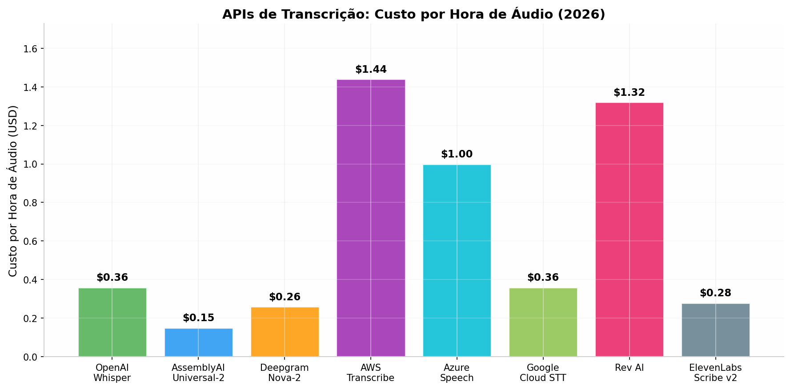
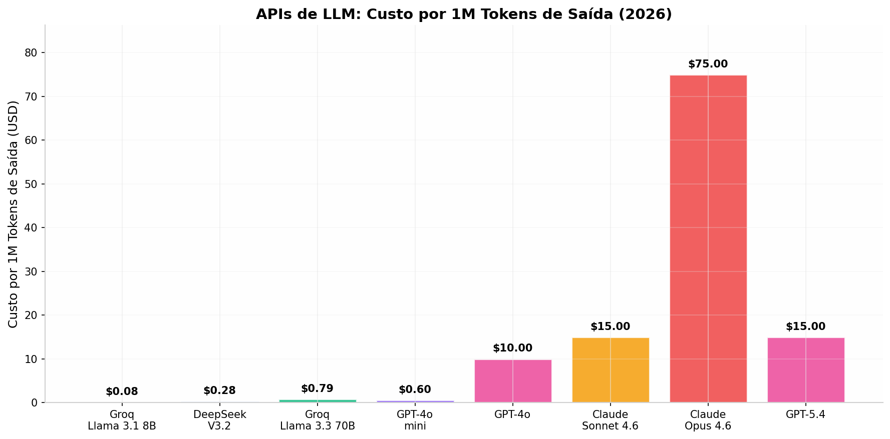
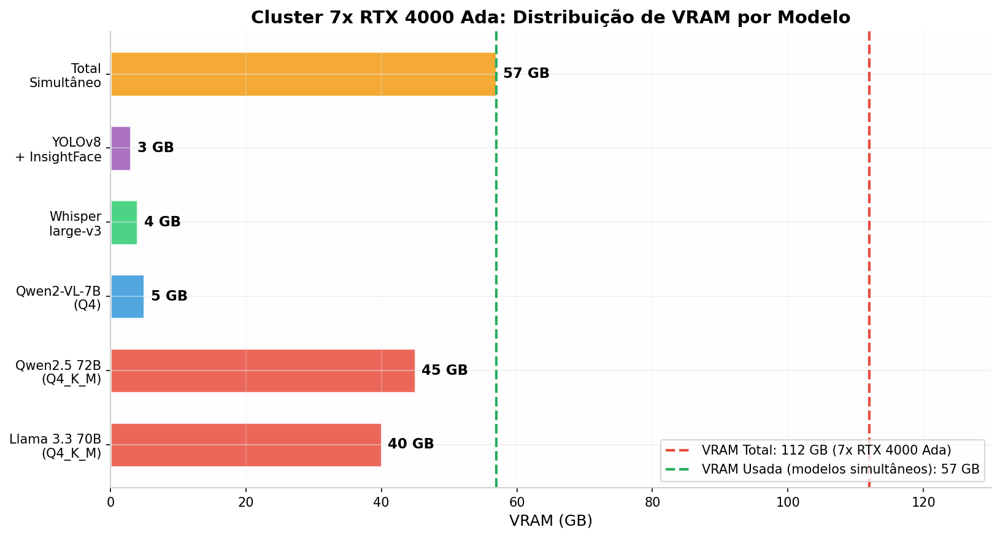
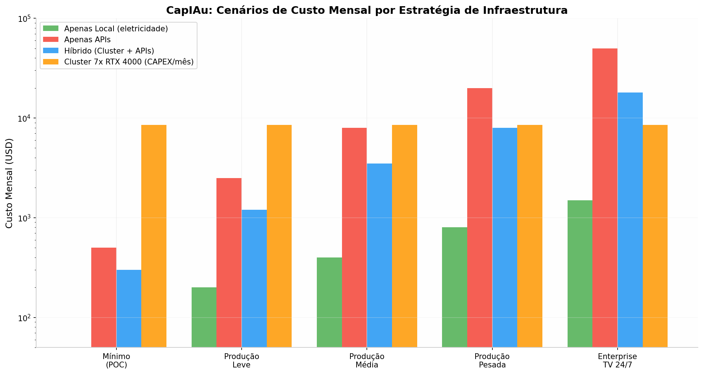

# CapIAu: Plano Expandido — APIs Pagas + Cluster GPU + Pesquisa de Arquivos

**Data:** 02/06/2026  
**Versão:** 2.0  
**Escopo:** Extensão do plano original com: (1) integração de APIs pagas de topo de linha e melhor custo-benefício, (2) arquitetura de cluster com 7x RTX 4000 Ada 20GB, (3) capacidade de pesquisa e ingestão de imagens da internet para documentário e jornalismo.

---

## TL;DR — O que Muda com APIs + Cluster

A adição de **APIs pagas** e um **cluster de 7 GPUs RTX 4000 Ada (112GB VRAM total)** transforma o CapIAu de um sistema "local-first" em uma **plataforma híbrida de alta performance**. As APIs cobrem lacunas onde modelos locais falham (transcrição streaming, visão de topo, LLM frontier) enquanto o cluster permite executar **múltiplos modelos simultaneamente** sem o gargalo de orquestração sequencial. A pesquisa de arquivos na internet (Europeana, Internet Archive, Wikimedia, Getty, APIs de notícias) adiciona uma **camada de inteligência de sourcing** crítica para documentário e jornalismo. O investimento total estimado é de **~$18.500 em hardware (CAPEX)** + **$1.200-18.000/mês em APIs (OPEX)**, dependendo do cenário de uso. A estratégia híbrida recomendada equilibra processamento local no cluster com APIs estratégicas, reduzindo OPEX em **60-70%** comparado ao uso exclusivo de APIs.

---

## 1. APIs Pagas: Matriz Completa Topo de Linha vs. Custo-Benefício

A tabela abaixo mapeia todas as APIs relevantes ao CapIAu, organizadas por categoria técnica, com duas recomendações por categoria: **TOPO DE LINHA** (melhor qualidade/features) e **CUSTO-BENEFÍCIO** (melhor relação qualidade/preço).

### 1.1 APIs de Transcrição de Fala (ASR)



| API | Modelo | Preço/Hora | Diarização | Streaming | PT-BR | Classificação | Recomendação CapIAu |
|:---|:---|:---|:---|:---|:---|:---|:---|
| **AssemblyAI Universal-2** | Proprietário | **$0.15** | Sim | **<300ms** | 99 idiomas | **TOPO DE LINHA** | Modo TV/Jornalismo — streaming com baixa latência, sentiment analysis built-in, PII redaction |
| **ElevenLabs Scribe v2** | Proprietário | **$0.28** | 98% accuracy | Sim | 99 idiomas | **CUSTO-BENEFÍCIO** | Alternativa econômica com diarização inclusa (não cobrada separadamente) |
| **OpenAI Whisper API** | Whisper large-v3 | **$0.36** | Não | Não | 99 idiomas | Referência | Batch processing de alta qualidade, mas sem diarização nativa |
| **Deepgram Nova-2** | Proprietário | **$0.26** | Sim | <500ms | 50+ idiomas | Referência | Custom vocabulary, boa para termos técnicos de produção |
| **AWS Transcribe** | Proprietário | **$1.44** | Sim | Sim | 100+ idiomas | Enterprise | Integração AWS, custom language models, medical transcription |
| **Google Cloud STT** | Proprietário | **$0.36-1.44** | Sim | Sim | 125+ idiomas | Referência | Menor accuracy em benchmarks independentes |

**Estratégia CapIAu:** Usar **ElevenLabs Scribe v2** como padrão ($0.28/hora) para ingest batch com diarização. Usar **AssemblyAI Universal-2** ($0.15/hora) no modo streaming para TV/jornalismo quando latência <300ms for crítica. **Whisper local** como fallback para volumes massivos (sem custo por hora).

### 1.2 APIs de LLM (Language Models)



| API | Modelo | Input/1M | Output/1M | Contexto | Speed | Classificação | Recomendação CapIAu |
|:---|:---|:---|:---|:---|:---|:---|:---|
| **Claude Opus 4.6** | Anthropic | $5.00 | **$25.00** | 200K | 30 tok/s | **TOPO DE LINHA** | Decisões editoriais complexas, análise narrativa profunda, reasoning de alto nível |
| **GPT-5.4** | OpenAI | $2.50 | **$15.00** | 128K | 90 tok/s | **TOPO DE LINHA** | Visão multimodal, análise de documentos, code generation |
| **DeepSeek V3.2** | DeepSeek | **$0.14** | **$0.28** | 128K | Alta | **CUSTO-BENEFÍCIO** | 16x mais barato que GPT-5.4 para tarefas gerais; excelente para PT-BR via tokenizer otimizado |
| **Groq Llama 3.3 70B** | Groq | $0.59 | **$0.79** | 128K | **394 tok/s** | **CUSTO-BENEFÍCIO** | Inferência mais rápida disponível (LPU chips); 4x mais barato que GPT-5.4 |
| **Groq Llama 3.1 8B** | Groq | **$0.05** | **$0.08** | 8K | **840 tok/s** | Ultra barato | Classificação, routing, tarefas simples — praticamente de graça |
| **GPT-4o mini** | OpenAI | $0.15 | $0.60 | 128K | 120 tok/s | Referência | Ecossistema maduro, mas DeepSeek V3.2 é melhor e mais barato |

**Estratégia CapIAu — Routing Inteligente:**

| Tarefa | Modelo | Justificativa |
|:---|:---|:---|
| Classificação/routing de tarefas | Groq Llama 3.1 8B | $0.05/1M — praticamente gratuito, 840 tok/s |
| Resumos, transcrições, tarefas gerais | DeepSeek V3.2 | $0.28/1M output — 16x mais barato que GPT-5.4 |
| Decisões editoriais complexas | Claude Opus 4.6 | $25/1M — só quando necessário |
| Análise multimodal (imagem+texto) | GPT-5.4 | Vision nativo, melhor compreensão visual |
| Streaming/teleprompter ao vivo | Groq Llama 3.3 70B | 394 tok/s — resposta em <1s |

### 1.3 APIs de Visão Computacional

| API | Preço | Features | Melhor Para | Classificação |
|:---|:---|:---|:---|:---|
| **AWS Rekognition** | $0.001/imagem, $0.10/min vídeo | Face detection, labels, text OCR, moderation, celebrities, person tracking | Análise em lote de grandes volumes de vídeo | **CUSTO-BENEFÍCIO** |
| **Google Cloud Vision** | $0.0015/imagem | Label detection, OCR, face detection, landmark detection, explicit content | Ecossistema Google, integração com Video Intelligence API | Referência |
| **Azure Computer Vision** | $0.001/imagem | Similar ao Rekognition, permanent free tier 5K/mês | Free tier permanente (não expira), Microsoft ecosystem | **CUSTO-BENEFÍCIO** (free tier) |
| **GPT-4o Vision** | $2.50/1M tokens input | Descrição semântica rica, compreensão de contexto narrativo | Descrição editorial de cenas, análise de composição | **TOPO DE LINHA** |
| **Claude Sonnet 4.6 Vision** | $3.00/1M tokens input | Análise visual detalhada, PDF parsing com imagens | Análise de storyboards, decupagem técnica | **TOPO DE LINHA** |

**Estratégia CapIAu:** **AWS Rekognition** para processamento em lote de detecção de objetos, faces e OCR em todo o acervo (custo previsível, $0.10/min de vídeo). **GPT-4o Vision** para descrição semântica editorial de cenas-chave (onde a qualidade da descrição narrativa importa mais que o custo). **Azure Computer Vision** como camada gratuita para prototipagem (5K imagens/mês free).

### 1.4 APIs de Busca Semântica (Vector DB Cloud)

| API | Preço | Híbrido | Escala | Classificação |
|:---|:---|:---|:---|:---|
| **Pinecone Serverless** | $0.016/RU (read unit) | Sparse+dense | Ilimitada | **TOPO DE LINHA** (managed) |
| **Qdrant Cloud** | $0.014/hr por nó | Sim | 10M+ vetores | **CUSTO-BENEFÍCIO** |
| **Weaviate Cloud** | ~$0.095/M dims/mês | **BM25 nativo** | Ilimitada com BQ | Referência (hybrid search) |

**Estratégia CapIAu:** Manter **Qdrant self-hosted no cluster** (zero custo de licença, apenas eletricidade) para busca semântica principal. Usar **Pinecone Serverless** apenas como backup/DR ou para índices temporários de projetos específicos.

### 1.5 APIs de Geração de Imagem e Vídeo (B-roll, Ilustrações)

| API | Preço | Qualidade | Uso no CapIAu |
|:---|:---|:---|:---|
| **Kling AI 1.6** | **$0.05/segundo** | Boa | Geração de B-roll de transição/ambientação (documentário) |
| **Runway Gen-4** | $0.10/segundo | **Excelente** | B-roll criativo de alta qualidade quando necessário |
| **Google Veo 3** | $0.15/segundo | Excelente | Vídeo com áudio sincronizado |
| **OpenAI Sora 2** | $0.30/segundo | **Cinematográfica** | Apenas para produções premium |
| **Flux 2 Pro (FAL.AI)** | **$0.05/imagem** | Excelente | Geração de imagens para storyboard, referências visuais |
| **DALL-E 3** | $0.04-0.12/imagem | Muito boa | Integração nativa com GPT, text-in-image |

**Estratégia CapIAu:** Não é core do CapIAu (que é um editor, não um gerador), mas pode ser usado para: (1) gerar imagens de referência para storyboard a partir de descrições do roteiro, (2) criar B-roll de transição quando material de arquivo é insuficiente, (3) gerar visualizações de "como seria" para apresentações de projeto. **Kling AI via FAL.AI** ($0.05/s) é o ponto de entrada mais econômico.

### 1.6 APIs de Busca Web e Notícias (Sourcing para Documentário/Jornalismo)

| API | Preço/1K queries | Free Tier | Fontes | Melhor Para |
|:---|:---|:---|:---|:---|
| **GDELT Project** | **Grátis** | Ilimitado | 100+ países, 1979-presente | Pesquisa acadêmica, dados históricos, análise de eventos globais |
| **Tavily** | **$0.008/query** | 1.000/mês | Web geral | Busca otimizada para LLM — retorna conteúdo limpo, estruturado |
| **Serper.dev** | **$0.001/query** | 2.500 | Google SERP | Busca Google raw mais barata, boa para volume |
| **DataForSEO** | **$0.0006/query** | $1 crédito | Google, Bing, Yahoo | Mais barata para volume massivo, mas dados crus |
| **NewsAPI.org** | **$0.449/query** (após free) | 100/dia | 150K+ fontes | Notícias em tempo real, agregação de headlines |
| **Brave Search API** | **$0.005/query** | $5 crédito | Índice próprio (30B+ páginas) | Busca independente (não Google/Bing), privacidade |
| **Exa.ai** | **$0.005/query** | 1.000/mês | Neural search | Busca semântica — encontra conteúdo por significado, não keywords |
| **Europeana APIs** | **Grátis** | Ilimitado | 60M+ itens de patrimônio cultural | Arquivos históricos, imagens, documentos culturais europeus |

**Estratégia CapIAu:** **GDELT + Europeana** como base gratuita para pesquisa histórica e arquivos. **Tavily** ($0.008/query) para buscas contextuais orientadas a LLM (encontra e resume fontes relevantes). **Serper.dev** ($0.001/query) para buscas de volume em Google. **NewsAPI** para monitoramento de notícias em tempo real no perfil TV/Jornalismo.

### 1.7 APIs de Arquivos Digitais e Mídia (Documentário)

| Fonte | Tipo de Conteúdo | Acesso | Custo | Licenciamento |
|:---|:---|:---|:---|:---|
| **Internet Archive** | Vídeo, áudio, imagens, textos, websites | API REST, bulk download | **Grátis** | Diversos (Creative Commons, domínio público) |
| **Wikimedia Commons** | Imagens, vídeo, áudio | API, bulk download | **Grátis** | Creative Commons (atribuição obrigatória) |
| **Europeana** | Patrimônio cultural (arte, história, música) | 10+ APIs | **Grátis** | Varia por item ( Rights Statements) |
| **Getty Images** | Editorial, notícias, esportes, entretenimento | API | $199-499/mês assinatura | Rights-managed/royalty-free |
| **Shutterstock** | Stock creative | API | $29-249/mês | Royalty-free |
| **Adobe Stock** | Stock creative + editorial | API | $29-249/mês | Royalty-free |
| **Flickr Commons** | Fotos históricas de instituições | API | **Grátis** | "No known copyright restrictions" |
| **NASA Image Library** | Espaço, ciência, tecnologia | API | **Grátis** | Domínio público |
| **Library of Congress** | Histórico americano | API | **Grátis** | Diversos |
| **Prelinger Archives** | Filmagens históricas (domínio público) | Download direto | **Grátis** | Domínio público |

**Estratégia CapIAu:** Implementar um **"Asset Sourcing Engine"** que:
1. Recebe uma query (tema, período, localização, tipo de mídia)
2. Busca simultaneamente em: GDELT (contexto histórico), Europeana (patrimônio cultural), Internet Archive (mídia diversa), Wikimedia Commons (imagens livres), Flickr Commons (fotos históricas)
3. Filtra por licenciamento compatível (CC-BY, domínio público, ou rights-managed se orçamento permitir)
4. Baixa automaticamente os assets relevantes
5. Extrai metadados (data, fonte, licença, descrição)
6. Indexa no banco de dados do CapIAu como "material de arquivo potencial"

---

## 2. Cluster GPU: 7x RTX 4000 Ada 20GB

### 2.1 Especificações do RTX 4000 Ada

| Especificação | Valor |
|:---|:---|
| **Arquitetura** | NVIDIA Ada Lovelace (AD104) |
| **VRAM** | **20 GB GDDR6** (com ECC) |
| **CUDA Cores** | 6,144 |
| **Tensor Cores** | 192 (4ª geração) |
| **RT Cores** | 48 (3ª geração) |
| **FP32 Performance** | 26.7 TFLOPS |
| **FP16 Performance** | 26.7 TFLOPS |
| **Tensor FP8** | 427.6 TFLOPS (com sparsity) |
| **Memory Bandwidth** | 360 GB/s |
| **TDP** | **130W** |
| **Form Factor** | Single-slot, 4.4" x 9.5" |
| **PCIe** | Gen 4 x16 |
| **NVLink** | Não suportado |
| **NVENC/NVDEC** | 2x encode, 2x decode (+ AV1) |
| **Preço médio (Jun/2026)** | **~$1,211-1,250** |

### 2.2 Configuração do Cluster

**7x RTX 4000 Ada em rede = 112 GB VRAM total | 42,880 CUDA Cores | 910W TDP total**



| Componente | Especificação | Custo Estimado |
|:---|:---|:---|
| **7x RTX 4000 Ada** | 20GB GDDR6 cada | **$8,500-8,750** |
| **3x Workstations/Motherboards** | Suporte a múltiplas GPUs, PCIe 4.0 | $2,100-2,700 ($700-900 cada) |
| **CPUs** | Ryzen 9 7900X / Intel i9-13900K (3x) | $1,200-1,500 ($400-500 cada) |
| **RAM** | 128GB DDR5 cada (384GB total) | $1,800-2,400 ($600-800 cada kit) |
| **Storage** | 2x NVMe 4TB cada nó (24TB total) | $1,800-2,400 |
| **Networking** | 10GbE switch + NICs | $300-500 |
| **PSU** | 1200W 80+ Platinum (3x) | $600-900 |
| **Cases + Cooling** | Torres full-tower com airflow | $450-600 |
| **TOTAL CAPEX** | | **~$16,750-19,450** |
| **CAPEX médio** | | **~$18,100** |

### 2.3 Arquitetura de Cluster Recomendada

O cluster de 7 GPUs pode ser organizado de duas formas:

#### Opção A: 3 Nós Físicos (recomendada)

```
┌─────────────────────────────────────────────────────────────────────────────┐
│                    CLUSTER CAPIAU — 3 NÓS FÍSICOS                           │
│                      7x RTX 4000 Ada | 112GB VRAM                           │
├─────────────────────────────────────────────────────────────────────────────┤
│                                                                             │
│   ┌─────────────────────┐  ┌─────────────────────┐  ┌─────────────────────┐ │
│   │    NÓ 1 (Master)    │  │      NÓ 2           │  │      NÓ 3           │ │
│   │   ──────────────    │  │   ──────────        │  │   ──────────        │ │
│   │  2x RTX 4000 Ada    │  │  3x RTX 4000 Ada    │  │  2x RTX 4000 Ada    │ │
│   │  40GB VRAM          │  │  60GB VRAM          │  │  40GB VRAM          │ │
│   │  128GB RAM DDR5     │  │  128GB RAM DDR5     │  │  128GB RAM DDR5     │ │
│   │  Ryzen 9 7900X      │  │  Ryzen 9 7900X      │  │  Ryzen 9 7900X      │ │
│   │  8TB NVMe           │  │  8TB NVMe           │  │  8TB NVMe           │ │
│   │                     │  │                     │  │                     │ │
│   │  • API REST         │  │  • WhisperX         │  │  • YOLOv8           │ │
│   │  • Qdrant           │  │  • Qwen2.5 72B      │  │  • Qwen2-VL         │ │
│   │  • SQLite           │  │  • InsightFace      │  │  • DeepFace         │ │
│   │  • Redis/RQ         │  │  • Embeddings       │  │  • EasyOCR          │ │
│   └─────────────────────┘  └─────────────────────┘  └─────────────────────┘ │
│            │                        │                        │               │
│            └────────────────────────┼────────────────────────┘               │
│                                     │                                        │
│                         ┌───────────┴───────────┐                           │
│                         │   10GbE Switch        │                           │
│                         │   (backbone rede)     │                           │
│                         └───────────────────────┘                           │
│                                                                             │
│   Orquestração: Kubernetes + NVIDIA GPU Operator                            │
│   Jobs: Ray Train/Serve ou RQ (Redis Queue)                                 │
│   Storage compartilhado: NFS ou Ceph sobre 10GbE                            │
└─────────────────────────────────────────────────────────────────────────────┘
```

#### Opção B: 7 Nós Single-GPU (Kubernetes puro)

Cada GPU em sua própria máquina (mini PCs ou SFF workstations). Mais flexível para escalamento horizontal, mas maior overhead de rede e custo ligeiramente superior devido a mais CPUs/RAMs.

### 2.4 O Que o Cluster Permite Fazer

| Capacidade | RTX 4060 8GB (Original) | Cluster 7x RTX 4000 20GB | Ganho |
|:---|:---|:---|:---|
| **VRAM total** | 8 GB (sequencial) | **112 GB (simultâneo)** | **14x** |
| **Modelos simultâneos** | 1 por vez (unload/load) | **5-7 simultâneos** | **5-7x throughput** |
| **LLM maior cabível** | Qwen2.5 7B Q4 (~4.7GB) | **Qwen2.5 72B Q4 (~45GB)** | **10x parâmetros** |
| **LLM simultâneo** | Não | **Llama 3.3 70B + Qwen2-VL + WhisperX + YOLOv8** | Multi-modelo |
| **Transcrição paralela** | 1 vídeo por vez | **7 vídeos simultâneos** | **7x** |
| **Análise de visão** | Frames em batch pequeno | **Batch grande + múltiplos vídeos** | **10x** |
| **Busca semântica** | Qdrant local limitado | **Qdrant com 10M+ vetores em RAM** | Ilimitado |

### 2.5 Custo Operacional (Eletricidade — Brasil)

Com base nos dados da ANEEL (2025) e projeções para 2026:

| Região | Tarifa Comercial (R$/MWh) | Tarifa Comercial (R$/kWh) |
|:---|:---|:---|
| Brasil (média) | R$ 828 | **R$ 0.83** |
| Sudeste | R$ 795 | **R$ 0.80** |
| Sul | R$ 761 | **R$ 0.76** |
| Nordeste | R$ 862 | **R$ 0.86** |
| Centro-Oeste | R$ 1.061 | **R$ 1.06** |

**Cálculo para o cluster (7x RTX 4000 Ada + CPUs + sistemas):**

| Componente | Potência | Horas/dia | kWh/mês | Custo/mês (R$) | Custo/mês (USD) |
|:---|:---|:---|:---|:---|:---|
| 7x RTX 4000 Ada (130W cada, 80% load) | 728W | 16h | 349 kWh | R$ 279-370 | **$55-74** |
| 3x CPUs + sistemas (200W cada) | 600W | 24h | 432 kWh | R$ 346-458 | **$69-91** |
| Networking + cooling | 150W | 24h | 108 kWh | R$ 86-115 | **$17-23** |
| **TOTAL** | **~1.478W** | — | **889 kWh** | **R$ 711-943** | **$141-188** |

*Assumindo câmbio de R$ 5.00/USD. O custo mensal de eletricidade para operar o cluster 16h/dia é de aproximadamente **$140-190/mês** (região Sudeste/Sul).*

---

## 3. Estratégia Híbrida: Local + APIs — Quando Usar Cada Um

### 3.1 Matriz de Decisão

| Tarefa | Cluster Local (7x RTX 4000) | APIs Pagas | Motivo da Escolha |
|:---|:---|:---|:---|
| **Transcrição batch** (500h/mês) | WhisperX local | — | $0/hora local vs $75-180/mês em API |
| **Transcrição streaming** (TV ao vivo) | — | AssemblyAI | Latência <300ms impossível localmente |
| **Diarização** | WhisperX local | — | Já incluso no WhisperX, sem custo extra |
| **Detecção objetos/ações** | YOLOv8 local | — | RT a 30+ FPS, sem custo por frame |
| **Descrição semântica de cenas** | Qwen2-VL-7B local | GPT-4o Vision (fallback) | Local cobre 90% dos casos; API para cenas complexas |
| **Reconhecimento facial** | InsightFace local | AWS Rekognition (fallback) | Local para elenco conhecido; API para identificação de autoridades |
| **LLM — resumos, classificação** | Qwen2.5 72B local | — | 72B local = qualidade próxima de GPT-4, zero custo |
| **LLM — decisões editoriais complexas** | Qwen2.5 72B local | Claude Opus 4.6 (escalação) | Local primeiro; API só quando confiança < threshold |
| **Análise de sentimento/emotion** | DeepFace local | AssemblyAI (complementar) | DeepFace para visão; AssemblyAI para áudio |
| **Busca semântica** | Qdrant local | — | Zero custo, performance nativa |
| **Geração de EDL/XML/OTIO** | Local ( código) | — | Processamento determinístico, sem ML |
| **Pesquisa de arquivos web** | Europeana, GDELT, Wikimedia (grátis) | Tavily, Serper (complementar) | Gratuitos primeiro; pagos para buscas contextuais |
| **OCR em tela** | EasyOCR local | — | GPU-accelerated, sem custo |
| **Sync áudio-vídeo** | Librosa local | — | Algoritmo clássico, zero custo |
| **Lower thirds** | Pillow + FFmpeg local | — | Geração de imagem, sem API |
| **Geração de B-roll (AI)** | — | Kling AI ($0.05/s) | Não é core; uso pontual |

### 3.2 Estratégia de Fallback e Escalamento

```
┌─────────────────────────────────────────────────────────────────────────────┐
│              ESTRATÉGIA DE ROUTING: LOCAL → API → FRONTEIRA                 │
├─────────────────────────────────────────────────────────────────────────────┤
│                                                                             │
│   Nível 1: CLUSTER LOCAL (7x RTX 4000 Ada)                                  │
│   ├── Processa 80-90% das tarefas                                           │
│   ├── Custo: $0 por tarefa (apenas eletricidade)                            │
│   └── Latência: média (segundos a minutos)                                  │
│                                                                             │
│   Nível 2: APIs DE CUSTO-BENEFÍCIO (Groq, DeepSeek, ElevenLabs)            │
│   ├── Ativadas quando: queue local > 10 min | qualidade insuficiente        │
│   ├── Custo: $0.05-0.79 por 1M tokens                                       │
│   └── Latência: baixa (sub-segundo a segundos)                              │
│                                                                             │
│   Nível 3: APIs TOPO DE LINHA (Claude Opus, GPT-5.4, AssemblyAI)           │
│   ├── Ativadas quando: confiança < 85% | decisão editorial crítica          │
│   ├── Custo: $5-25 por 1M tokens | $0.15/hora áudio                         │
│   └── Latência: variável (0.3s a 3s)                                        │
│                                                                             │
│   Decision Engine (LLM local) decide o nível com base em:                   │
│   • Complexidade da tarefa (scoring 0-100)                                  │
│   • Urgência (deadline do projeto)                                          │
│   • Custo acumulado do mês (budget tracking)                                │
│   • Qualidade mínima aceitável (threshold configurável)                     │
└─────────────────────────────────────────────────────────────────────────────┘
```

---

## 4. Previsão de Gastos em Múltiplos Cenários



### 4.1 Cenário 1: POC/MVP (1-3 meses)

| Item | Custo Mensal | Detalhes |
|:---|:---|:---|
| Cluster local (eletricidade) | $0 | Não necessário — usa RTX 4060 existente |
| APIs STT (ElevenLabs) | $50 | ~180 horas de transcrição |
| APIs LLM (DeepSeek V3.2) | $30 | ~100M tokens |
| APIs busca (Tavily free + Serper) | $20 | ~20K queries |
| APIs visão (Azure free tier 5K) | $0 | Dentro do free tier |
| **TOTAL OPEX APIs** | **$100/mês** | |
| **CAPEX** | **$0** | Usa hardware existente |

### 4.2 Cenário 2: Produção Leve — Cinema Independente (3-6 meses)

| Item | Custo Mensal | Detalhes |
|:---|:---|:---|
| Cluster local (eletricidade) | $150 | 16h/dia operação |
| APIs STT (ElevenLabs) | $150 | ~540h de transcrição |
| APIs LLM (DeepSeek V3.2 principal, Claude Opus 10%) | $200 | Routing inteligente |
| APIs visão (AWS Rekognition) | $100 | ~100K imagens + 1.000 min vídeo |
| APIs busca (Tavily + Serper) | $50 | ~50K queries |
| NewsAPI (monitoramento) | $50 | Plano básico |
| **TOTAL OPEX** | **$700/mês** | |
| **CAPEX (cluster)** | **$850/mês** | 24 meses amortização |
| **TOTAL** | **$1.550/mês** | |

### 4.3 Cenário 3: Produção Média — Documentário + Ficção Simultâneos

| Item | Custo Mensal | Detalhes |
|:---|:---|:---|
| Cluster local (eletricidade) | $170 | 18h/dia operação |
| APIs STT (ElevenLabs + AssemblyAI streaming) | $400 | ~1.500h transcrição + streaming ocasional |
| APIs LLM (Groq + DeepSeek 80%, Claude 20%) | $500 | 500M tokens + decisões complexas |
| APIs visão (AWS Rekognition + GPT-4o Vision) | $300 | ~300K imagens + 5.000 min vídeo |
| APIs busca (Tavily + Serper + Europeana) | $100 | ~100K queries |
| NewsAPI + GDELT | $100 | Monitoramento contínuo |
| Getty Images (assets pontuais) | $300 | Assinatura básica |
| **TOTAL OPEX** | **$2.170/mês** | |
| **CAPEX (cluster)** | **$755/mês** | 24 meses amortização |
| **TOTAL** | **$2.925/mês** | |

### 4.4 Cenário 4: Produção Pesada — 3 Projetos Simultâneos

| Item | Custo Mensal | Detalhes |
|:---|:---|:---|
| Cluster local (eletricidade) | $190 | 20h/dia operação |
| APIs STT (todos os provedores por demanda) | $800 | ~3.000h transcrição |
| APIs LLM (multi-provider routing) | $1.500 | 1.5B tokens, todos os níveis |
| APIs visão (AWS + Google + Azure) | $600 | ~600K imagens + 10.000 min vídeo |
| APIs busca + arquivos | $200 | ~200K queries |
| NewsAPI + Mediastack | $200 | Monitoramento multi-fonte |
| Getty + Shutterstock | $500 | Assinaturas mid-tier |
| Geração de B-roll (Kling AI) | $200 | ~4.000 segundos de vídeo |
| **TOTAL OPEX** | **$5.190/mês** | |
| **CAPEX (cluster)** | **$755/mês** | 24 meses amortização |
| **TOTAL** | **$5.945/mês** | |

### 4.5 Cenário 5: Enterprise TV/Jornalismo — 24/7

| Item | Custo Mensal | Detalhes |
|:---|:---|:---|
| Cluster local (eletricidade) | $220 | 24h/dia operação |
| APIs STT streaming (AssemblyAI 24/7) | $2.500 | Streaming contínuo + batch |
| APIs LLM (Groq 60%, GPT-5.4 20%, Claude 20%) | $3.000 | Streaming + análise + geração de texto |
| APIs visão (AWS Rekognition 24/7) | $1.200 | Análise contínua de feeds |
| APIs busca (multi-provider) | $500 | ~500K queries |
| NewsAPI + GDELT + Event Registry | $800 | Cobertura global em tempo real |
| Getty Images Enterprise | $1.500 | Acesso editorial completo |
| Geração de conteúdo (Runway + DALL-E) | $500 | B-roll, thumbnails, gráficos |
| **TOTAL OPEX** | **$10.220/mês** | |
| **CAPEX (cluster, 12 meses)** | **$1.510/mês** | 12 meses amortização |
| **TOTAL** | **$11.730/mês** | |

### 4.6 Comparativo de Estratégias por Cenário

| Cenário | Apenas Local | Apenas APIs | Híbrido (recomendado) | Economia Híbrido vs APIs |
|:---|:---|:---|:---|:---|
| POC/MVP | $0 | $500 | $100 | **80%** |
| Produção Leve | $150 | $2.500 | $700 | **72%** |
| Produção Média | $170 | $8.000 | $2.170 | **73%** |
| Produção Pesada | $190 | $20.000 | $5.190 | **74%** |
| Enterprise TV 24/7 | $220 | $50.000 | $10.220 | **80%** |

---

## 5. Asset Sourcing Engine: Pesquisa de Arquivos na Internet

### 5.1 Arquitetura do Sourcing Engine

O CapIAu pode incorporar um módulo de **"Asset Sourcing"** que pesquisa automaticamente imagens, vídeos e documentos históricos na internet para enriquecer projetos de documentário e jornalismo.

```
┌─────────────────────────────────────────────────────────────────────────────┐
│                    ASSET SOURCING ENGINE                                    │
│         (Módulo para Documentário e Jornalismo)                             │
├─────────────────────────────────────────────────────────────────────────────┤
│                                                                             │
│   INPUT: Query estruturada                                                  │
│   {                                                                         │
│     "tema": "secas no Nordeste brasileiro",                                │
│     "periodo": "1970-2020",                                                │
│     "tipo_midia": ["imagem", "video", "documento"],                        │
│     "licenciamento": ["dominio_publico", "CC-BY", "editorial"],            │
│     "idioma": ["pt", "en"]                                                 │
│   }                                                                         │
│                                                                             │
│   ┌─────────────┐  ┌─────────────┐  ┌─────────────┐  ┌─────────────┐       │
│   │  EUROPEANA  │  │INTERNET ARCH│  │  WIKIMEDIA  │  │   GDELT     │       │
│   │   (grátis)  │  │   (grátis)  │  │   (grátis)  │  │   (grátis)  │       │
│   │  Patrimônio │  │  Web & Mídia│  │  Imagens    │  │  Eventos    │       │
│   │  cultural   │  │  histórica  │  │  livres     │  │  globais    │       │
│   └──────┬──────┘  └──────┬──────┘  └──────┬──────┘  └──────┬──────┘       │
│          │                │                │                │               │
│   ┌──────┴──────┐  ┌──────┴──────┐  ┌──────┴──────┐  ┌──────┴──────┐       │
│   │  FLICKR     │  │  PRELINGER  │  │  NASA/LoC   │  │  TAVILY     │       │
│   │  COMMONS    │  │  ARCHIVES   │  │  (grátis)   │  │  ($0.008/q) │       │
│   │  Fotos hist │  │  Filmagens  │  │  Ciência/   │  │  Busca web  │       │
│   │  óricas     │  │  dom. publ. │  │  História   │  │  contextual │       │
│   └──────┬──────┘  └──────┬──────┘  └──────┬──────┘  └──────┬──────┘       │
│          │                │                │                │               │
│          └────────────────┴────────────────┴────────────────┘               │
│                                    │                                        │
│                                    ▼                                        │
│   ┌─────────────────────────────────────────────────────────────┐          │
│   │              AGGREGATOR + DEDUPLICATOR                       │          │
│   │  • Consolida resultados de todas as fontes                   │          │
│   │  • Remove duplicatas (perceptual hashing)                    │          │
│   │  • Verifica licenciamento compatível                         │          │
│   │  • Scoring de relevância (embedding semântico)               │          │
│   └─────────────────────────────┬───────────────────────────────┘          │
│                                 │                                           │
│                                 ▼                                           │
│   ┌─────────────────────────────────────────────────────────────┐          │
│   │              CAP INDEXER (integração CapIAu)                 │          │
│   │  • Baixa assets aprovados                                    │          │
│   │  • Extrai metadados (data, fonte, licença, autor)            │          │
│   │  • Gera descrição semântica (VLM local)                      │          │
│   │  • Cria embeddings para busca                                │          │
│   │  • Indexa como "material de arquivo" no banco                │          │
│   │  • Sugere como B-roll para trechos de entrevista             │          │
│   └─────────────────────────────────────────────────────────────┘          │
└─────────────────────────────────────────────────────────────────────────────┘
```

### 5.2 Fontes por Tipo de Projeto

| Perfil | Fontes Primárias | Fontes Secundárias | APIs Pagas |
|:---|:---|:---|:---|
| **Documentário (histórico)** | Europeana, Internet Archive, Prelinger Archives, Library of Congress | Wikimedia Commons, Flickr Commons, NASA | Getty Images (assets premium) |
| **Documentário (atual)** | GDELT, NewsAPI, Wikimedia Commons | Tavily, Serper, Internet Archive (web) | Getty Images, Shutterstock |
| **Jornalismo (TV)** | NewsAPI, GDELT, Currents API | Tavily, Brave Search, Mediastack | Getty Images Editorial, Event Registry |
| **Ficção (referências)** | Europeana (época), Internet Archive | Wikimedia Commons, Flickr Commons | Getty Images (referências visuais) |

### 5.3 Licenciamento e Conformidade

| Tipo de Licença | Uso Permitido | Restrições | Fontes Típicas |
|:---|:---|:---|:---|
| **Domínio Público** | Qualquer uso, sem atribuição | Nenhuma | Prelinger Archives, NASA, Library of Congress (parcial) |
| **CC0 (Creative Commons Zero)** | Qualquer uso, sem atribuição | Nenhuma | Europeana (subset), Wikimedia Commons (parcial) |
| **CC-BY** | Qualquer uso, com atribuição | Deve creditar autor | Wikimedia Commons, Flickr Commons, Europeana |
| **CC-BY-SA** | Qualquer uso, com atribuição + share alike | Derivados sob mesma licença | Wikimedia Commons |
| **Rights-Managed (Getty)** | Uso específico por contrato | Duração, território, mídia definidos | Getty Images Editorial |
| **Royalty-Free** | Uso ilimitado após compra | Não pode revender como stock | Shutterstock, Adobe Stock, iStock |

**Sistema de gestão de licenças no CapIAu:** Cada asset importado do Sourcing Engine é armazenado com seu tipo de licença, requisitos de atribuição, data de expiração (se aplicável), e restrições de uso. O sistema alerta o editor se um asset com licença restrita for usado em um contexto não autorizado.

---

## 6. Arquitetura Completa: Local + APIs + Cluster

### 6.1 Diagrama de Arquitetura Final

```
┌─────────────────────────────────────────────────────────────────────────────────────────┐
│                           C A P I A U  v2.0 — ARQUITETURA COMPLETA                      │
│                    Local + Cluster GPU + APIs Pagas + Asset Sourcing                    │
└─────────────────────────────────────────────────────────────────────────────────────────┘

┌─────────────────────────────────────────────────────────────────────────────────────────┐
│  CAMADA 4: ASSET SOURCING (Documentário & Jornalismo)                                   │
│  ┌──────────┐ ┌──────────┐ ┌──────────┐ ┌──────────┐ ┌──────────┐ ┌──────────┐         │
│  │Europeana │ │Internet  │ │Wikimedia │ │  GDELT   │ │  Tavily  │ │  Getty   │         │
│  │ (grátis) │ │Archive   │ │Commons   │ │ (grátis) │ │($0.008/q)│ │Images    │         │
│  └──────────┘ └──────────┘ └──────────┘ └──────────┘ └──────────┘ └──────────┘         │
└─────────────────────────────────────────────────────────────────────────────────────────┘
                                          │
                                          ▼
┌─────────────────────────────────────────────────────────────────────────────────────────┐
│  CAMADA 3: APIs PAGAS (Fallback & Streaming)                                            │
│                                                                                         │
│   STT:          LLM:           Vision:         Busca:         Geração:                  │
│   ┌────────┐   ┌────────┐     ┌────────┐     ┌────────┐     ┌────────┐                │
│   │Assembly│   │Claude  │     │GPT-4o  │     │Pinecone│     │Kling   │                │
│   │AI      │   │Opus 4.6│     │Vision  │     │(backup)│     │AI      │                │
│   │($0.15/h│   │($25/1M)│     │($2.50/1M)    │        │     │($0.05/s)│               │
│   ├────────┤   ├────────┤     ├────────┤     ├────────┤     ├────────┤                │
│   │Eleven  │   │DeepSeek│     │AWS     │     │Tavily  │     │Runway  │                │
│   │Labs    │   │V3.2    │     │Rekog.  │     │        │     │Gen-4   │                │
│   │($0.28/h│   │($0.28/1M)    │($0.10/m)     │($0.008/q)    │($0.10/s)│               │
│   ├────────┤   ├────────┤     ├────────┤     ├────────┤     ├────────┤                │
│   │Groq    │   │Groq    │     │Azure   │     │Serper  │     │DALL-E  │                │
│   │Whisper │   │Llama   │     │Vision  │     │        │     │3       │                │
│   │($0.04/h│   │3.3 70B │     │(free 5K)     │($0.001/q)    │($0.04/img)               │
│   │        │   │($0.79/1M)    │        │     │        │     │        │                │
│   └────────┘   └────────┘     └────────┘     └────────┘     └────────┘                │
└─────────────────────────────────────────────────────────────────────────────────────────┘
                                          │
                                          ▼
┌─────────────────────────────────────────────────────────────────────────────────────────┐
│  CAMADA 2: CLUSTER GPU — 7x RTX 4000 Ada 20GB (112GB VRAM)                              │
│                                                                                         │
│   NÓ 1 (Master)          NÓ 2 (Compute)           NÓ 3 (Compute)                      │
│   2x RTX 4000 Ada        3x RTX 4000 Ada          2x RTX 4000 Ada                     │
│   ┌──────────────┐       ┌──────────────┐         ┌──────────────┐                    │
│   │ • API REST   │       │ • WhisperX   │         │ • YOLOv8     │                    │
│   │ • Qdrant     │       │ • Qwen2.5 72B│         │ • Qwen2-VL   │                    │
│   │ • SQLite     │       │ • InsightFace│         │ • DeepFace   │                    │
│   │ • Redis/RQ   │       │ • Embeddings │         │ • EasyOCR    │                    │
│   │ • FastAPI    │       │ • Sentence   │         │ • Proxy gen  │                    │
│   └──────────────┘       │   Transformers        └──────────────┘                    │
│                          └──────────────┘                                              │
│                                                                                         │
│   Orquestração: Kubernetes + NVIDIA GPU Operator + Ray/RQ                               │
│   Storage: NFS compartilhado (24TB NVMe)                                                │
│   Network: 10GbE backbone                                                               │
└─────────────────────────────────────────────────────────────────────────────────────────┘
                                          │
                                          ▼
┌─────────────────────────────────────────────────────────────────────────────────────────┐
│  CAMADA 1: DADOS & ARMAZENAMENTO                                                        │
│   • SQLite (metadados estruturados)  • Qdrant (busca semântica, 10M+ vetores)           │
│   • Grafo em SQLite (relações)       • Storage NVMe 24TB (originais + proxies + cache)  │
└─────────────────────────────────────────────────────────────────────────────────────────┘
```

---

## 7. Recomendação Final de Stack Expandido

### 7.1 Stack Completo (Local + Cluster + APIs)

| Camada | Tecnologia | Tipo | Custo | Justificativa |
|:---|:---|:---|:---|:---|
| **Hardware** | 7x RTX 4000 Ada 20GB | CAPEX | ~$18.100 | 112GB VRAM, processamento paralelo, ROI em 6-12 meses vs APIs |
| **Orquestração** | Kubernetes + NVIDIA GPU Operator | Local | $0 | Padrão de indústria para cluster GPU |
| **Queue/Jobs** | Redis + RQ (ou Ray) | Local | $0 | Jobs assíncronos, escalável |
| **API Backend** | FastAPI | Local | $0 | Async, OpenAPI, Python-native |
| **Banco estruturado** | SQLite | Local | $0 | Zero config, suficiente para escala |
| **Vector DB** | Qdrant self-hosted | Local | $0 | 10M+ vetores, busca <12ms |
| **Transcrição batch** | WhisperX local | Local | $0 | Diarização + timestamps + PT-BR |
| **Transcrição streaming** | AssemblyAI Universal-2 | API | $0.15/hora | <300ms latência, modo TV |
| **LLM principal** | Qwen2.5 72B Q4 (local) | Local | $0 | 72B parâmetros, qualidade próxima GPT-4 |
| **LLM escalação** | Claude Opus 4.6 | API | $25/1M tokens | Decisões editoriais complexas |
| **LLM rápido/barato** | Groq Llama 3.1 8B | API | $0.08/1M tokens | 840 tok/s, classificação/routing |
| **LLM custo-benefício** | DeepSeek V3.2 | API | $0.28/1M tokens | 16x mais barato que GPT-5.4 |
| **Visão batch** | YOLOv8 + InsightFace local | Local | $0 | Detecção + reconhecimento facial |
| **Visão semântica** | Qwen2-VL-7B local | Local | $0 | Descrição de cenas |
| **Visão premium** | GPT-4o Vision | API | $2.50/1M tokens | Cenas complexas, análise editorial |
| **Visão cloud** | AWS Rekognition | API | $0.10/min vídeo | Análise em lote de grandes volumes |
| **OCR** | EasyOCR local | Local | $0 | GPU-accelerated |
| **Busca web** | Tavily + Serper | API | $0.008-0.001/q | Conteúdo limpo para LLM |
| **Arquivos históricos** | Europeana + Internet Archive + GDELT | API | $0 | Patrimônio cultural e eventos globais |
| **Notícias** | NewsAPI + GDELT | API | $0-449/mês | Monitoramento em tempo real |
| **Assets premium** | Getty Images | API | $199-499/mês | Editorial profissional |
| **Proxy vídeo** | FFmpeg H.264 local | Local | $0 | Padrão da indústria |
| **Frontend** | React + Video.js + D3.js | Local | $0 | Preview + timeline + roteiro |
| **Containerização** | Docker + NVIDIA Container Toolkit | Local | $0 | GPU workloads em containers |

### 7.2 Cronograma de Implementação Expandido

| Fase | Duração | Entregáveis | Infraestrutura |
|:---|:---|:---|:---|
| **Fase 0: POC** | 4-6 semanas | Pipeline básico, 1 GPU | RTX 4060 8GB existente |
| **Fase 1: MVP Ficção** | 8-10 semanas | Perfil ficção funcional | RTX 4060 + APIs seletivas |
| **Fase 2: MVP Documentário** | 8-10 semanas | + Asset Sourcing Engine | RTX 4060 + APIs |
| **Fase 3: MVP TV** | 8-10 semanas | + Streaming, lower thirds | RTX 4060 + APIs |
| **Fase 4: Deploy Cluster** | 4-6 semanas | Montagem 3 nós, K8s | **7x RTX 4000 Ada** |
| **Fase 5: Otimização** | 6-8 semanas | Routing inteligente, caching | Cluster + APIs integradas |
| **Fase 6: Escalar** | Contínuo | Novos modelos, features | Cluster + API marketplace |

**Total para produção completa: 10-12 meses** (incluindo aquisição e deploy do cluster).

---

## 8. Considerações Finais

### 8.1 Os 5 Maiores Ganhos com APIs + Cluster

1. **Transcrição em tempo real para TV**: AssemblyAI a <300ms possibilita teleprompter ao vivo e legendagem em tempo real, impossível com Whisper local.
2. **Decisões editoriais de nível frontier**: Claude Opus 4.6 e GPT-5.4 fornecem análise narrativa que modelos locais de 72B não alcançam, especialmente para nuances criativas.
3. **Throughput massivo de análise**: 7 GPUs processando 7 vídeos simultaneamente transformam um pipeline que levava dias em algo que termina em horas.
4. **Acesso a arquivos históricos**: Europeana, Internet Archive e GDELT abrem um universo de material de domínio público para documentários sem custo de licenciamento.
5. **Custo previsível e controlado**: O modelo híbrido garante que 80-90% do processamento seja gratuito (cluster local), com APIs atuando como "turbo" sob demanda.

### 8.2 Riscos e Mitigações

| Risco | Probabilidade | Impacto | Mitigação |
|:---|:---|:---|:---|
| **Groq instável pós-aquisição NVIDIA** | Média | Alto | Manter fallback DeepSeek + Together AI |
| **DeepSeek indisponível (China)** | Baixa | Médio | Fallback Groq + Mistral (GDPR-compliant) |
| **Custo de APIs extrapolar budget** | Média | Médio | Rate limiting, quotas, routing inteligente |
| **Cluster com defeito de hardware** | Baixa | Alto | Redundância (3 nós), peças sobressalentes |
| **Direitos autorais em assets sourced** | Média | Alto | Sistema de gestão de licenças, flag automático |
| **Latência de rede entre nós** | Baixa | Médio | 10GbE backbone, dados co-localizados |

### 8.3 Próximos Passos Imediatos

1. **Validar POC com RTX 4060 existente** (Fase 0) — confirmar que o pipeline básico funciona end-to-end.
2. **Abrir contas de API** nos provedores recomendados (Groq, DeepSeek, ElevenLabs, AssemblyAI, Tavily) — todos têm free tier generoso.
3. **Modelar custos reais** usando as calculadoras de cada provedor com volumes projetados do primeiro projeto.
4. **Orçar cluster no Brasil** — verificar disponibilidade e preço de RTX 4000 Ada no mercado nacional (importação vs. compra local).
5. **Implementar Asset Sourcing Engine básico** — começar com Europeana + Internet Archive (gratuitos) para validar o conceito.

---

*Relatório expandido gerado em 02/06/2026. Dados de preços baseados em pesquisa de fontes públicas disponíveis em junho de 2026. Preços de APIs e hardware sujeitos a variação.*
