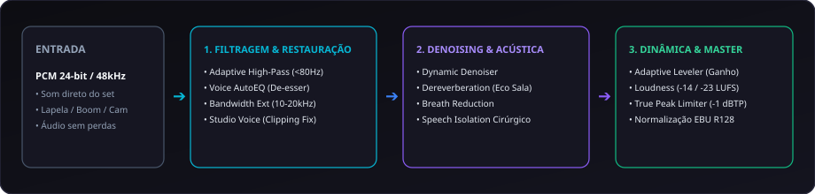

# Guia de Restauração de Áudio Auphonic e Sistema de Diagnóstico Inteligente — CapIAu / Talho

> **Referência de Sessão Antigravity:** [Auphonic Audio Restoration Guide](conversation://ee745f2c-3917-4514-8471-125c91618dbd)  
> **Data de Registro:** 27 de Agosto de 2026  
> **Status:** Especificação Técnica, Benchmark de Casos Reais e Modelo de Relatórios para o Talho NLE.

---

## 1. Visão Geral e Propósito

Este documento consolida a pesquisa aprofundada dos algoritmos do [Auphonic](https://auphonic.com/) (incluindo as atualizações de 2024–2026), documenta os diagnósticos reais de áudios de entrevistas do projeto e define a arquitetura para o **módulo de relatórios interativos e restauração automática de áudio do CapIAu / Talho**.

O objetivo a médio/longo prazo no Talho é duplo:
1. **Assistente de Áudio com IA:** O usuário solicita uma análise de um clipe ou da timeline inteira; a IA analisa as métricas espectrais/dinâmicas, gera um **Relatório Visual Interativo** com gráficos e prescreve o melhor plano de ação (local via DSP/FFmpeg ou externo via Auphonic Cloud API).
2. **Matriz Heurística Offline (Classificação por Proximidade):** Para quando a IA estiver offline ou para processamento em lote ultrarrápido, o sistema utilizará uma base de centenas de perfis pré-analisados para classificar o áudio por distância vetorial no espaço de métricas `(LUFS, LRA, TruePeak, FlatFactor, NoiseFloor, ClipCount)` e prescrever a cadeia de restauração ideal instantaneamente.

---

## 2. Anatomia Técnica dos Algoritmos Auphonic (Estado da Arte 2026)



### 2.1. Filtering and Enhancement (Filtragem e Síntese)
* **Adaptive High-Pass Filtering:** Detecta a frequência fundamental do locutor e corta ruídos subsônicos, impactos físicos e efeito de proximidade excessivo de lapelas. Aplica *notch filters* para cancelar zumbido elétrico (*ground hum* de 60 Hz no Brasil / 50 Hz internacional e harmônicos).
* **Voice AutoEQ:** Equalizador dinâmico inteligente treinado em milhares de vozes em estúdio. Remove sibilância excessiva (*de-esser*), ressonâncias de caixa (*boominess*) e estouros de vento/saliva (*de-plosive*).
* **Voice AutoEQ + Bandwidth Extension:** Quando o áudio é gravado por lapelas baratas ou transmissões sem fio/Bluetooth que cortam frequências acima de 8–10 kHz, este modelo de aprendizado profundo **sintetiza e recria os agudos inaudíveis** (10 kHz a 20 kHz), restaurando o "ar" e o brilho característicos de microfones condensadores caros.
* **Studio Voice (Beta):** O modelo generativo mais potente do Auphonic. Especializado em **reconstruir ondas ceifadas por clipping severo**, recuperar transientes perdidos por compressores destrutivos e transformar gravações de salas reverberantes e microfones de celular em sonoridade de estúdio tratado.

### 2.2. Denoising, Dereverberation & Breath Reduction (Desacoplados)
Nas versões recentes, o controle de ruído, acústica e respiração é 100% independente:
* **Denoising Methods:**
  * `Dynamic` (Padrão): Aprende o ruído de fundo continuamente (ar condicionado, rua, ventoinhas) e subtrai a sujeira sem apagar trilhas musicais ou efeitos intencionais.
  * `Speech Isolation`: Isola exclusivamente a voz humana, apagando qualquer elemento externo.
  * `Static`: Remove apenas zumbidos e chiados estacionários estritos.
  * `Classic`: Algoritmo legado de subtração espectral (não recomendado por gerar artefatos metálicos).
* **Remove Noise (dB):** Dosagem em dB (`6 dB` sutil, `12 dB` médio, `15+ dB` agressivo/auto).
* **Remove Reverb (dB):** Analisa a resposta impulsiva da sala e encurta a cauda de reverberação sem gerar efeito de voz em tubo (*comb filtering*).
* **Breath Reduction:** Atenua respirações pesadas sem cortar o fluxo orgânico da interpretação.

### 2.3. Adaptive Leveler (Nivelamento Inteligente)
Ao contrário de compressores de limiar (*threshold*) fixo que causam efeito de bombeamento (*pumping*), o Adaptive Leveler classifica blocos temporais e aplica curvas de ganho dinâmicas para manter a consistência de volume ao longo de gravações longas.
* **Modos:** `Default Leveler`, `Foreground Only`, `Fast Leveler`, `Amplify Everything`.
* **Controles:** `Leveler Strength` (0 a 100%) e `Compressor` (`Off`, `Soft`, `Medium`, `Hard`).

### 2.4. Loudness Normalization & True Peak
* **Loudness Standards:** Padrões ITU-R BS.1770 / EBU R128:
  * `-14 LUFS` / `-1.0 dBTP` (YouTube, Vimeo, Web Video).
  * `-16 LUFS` / `-1.0 dBTP` (Podcasts, Mobile).
  * `-23 LUFS` / `-24 LUFS` (Broadcast, TV aberta/fechada, Cinema, Netflix).
* **Normalization Method:** `Dialog Loudness` (mede e normaliza apenas trechos com fala ativa) vs `Program Loudness` (mede todo o arquivo, incluindo silêncios).
* **Dual Mono:** Quando canais L e R contêm o mesmo sinal gravado em mono duplo, processa os canais em perfeita fase e unifica a saída.

---

## 3. Casos Reais Diagnosticados na Sessão (Benchmark & Ground Truth)

Durante os testes de campo, três gravações reais de entrevistas com lapelas e salas ruidosas foram diagnosticadas e catalogadas:

| Caso / Arquivo | Integrated Loudness | Loudness Range (LRA) | True Peak | Amostras em 0.0 dBFS | Floor de Ruído | Diagnóstico Principal |
| :--- | :--- | :--- | :--- | :--- | :--- | :--- |
| **1. Entrevista Som Bruno** (`.mp4`) | `-14.8 LUFS` | `12.3 LU` | `+0.1 dBFS` | `20.974` | `-39.5 dBFS` | **Áudio Quente + Clipping Moderado:** Gravado em nível alto; picos de risadas bateram no teto de 0 dBFS. |
| **2. Figurino Bee e Nina** (`.mov`) | `-23.4 LUFS` | `14.0 LU` (Muito Alto) | `+0.2 dBFS` | `30` | `-53.8 dBFS` | **Disparidade entre 2 Locutoras:** Uma pessoa fala mais longe do microfone; grande variação dinâmica (LRA 14) + leve desbalanceamento L/R. |
| **3. Arte Julia e Nina** (`.mp4`) | **`-7.1 LUFS`** (Extremo) | **`3.5 LU`** (Esmagado) | **`+3.2 dBFS`** (Overshoot) | **`1.915.833`** (Massivo) | **`-27.1 dBFS`** | **Preamp Overdrive / Hard Clipping Severo:** Ganho do pré-amplificador na câmera estourou completamente; quase 2 milhões de amostras viraram ondas quadradas. |

### Configurações de Resgate Auphonic Recomendadas para cada Perfil:

```
[Perfil 1: Bruno - Áudio Quente & Lapela Opaca]
  Filtering: Voice AutoEQ + Bandwidth extension (ou Studio Voice)
  Noise Reduction: Dynamic (Noise: 12 dB | Reverb: 8 dB | Breath: Off)
  Adaptive Leveler: Default Leveler (Strength: 90% | Compressor: Soft)
  Loudness: -14 LUFS | True Peak: -1 dBTP | Dialog Loudness | Dual Mono: [x]

[Perfil 2: Bee e Nina - Desnível de Volume entre 2 Pessoas]
  Filtering: Studio Voice (Beta)
  Noise Reduction: Dynamic (Noise: 12 dB | Reverb: 12 dB | Breath: Off)
  Adaptive Leveler: Default Leveler (Strength: 100% [Máximo] | Compressor: Soft)
  Loudness: -14 LUFS | True Peak: -1 dBTP | Dialog Loudness | Dual Mono: [x]

[Perfil 3: Julia e Nina - Hard Clipping & Saturação Extrema de Ganho]
  Filtering: Studio Voice (Beta) [OBRIGATÓRIO para reconstrução de ondas]
  Noise Reduction: Dynamic (Noise: 12 dB | Reverb: 12 dB | Breath: Off)
  Adaptive Leveler: Default Leveler (Strength: 80% | Compressor: Off / Soft)
  Loudness: -14 LUFS (Atenuação de ~8 dB para recuperar headroom) | Peak: -1 dBTP | Dual Mono: [x]
```

---

## 4. Matriz de Proximidade e Classificação Offline (Sem IA)

Para garantir que o CapIAu / Talho funcione offline com resposta instantânea e custo zero de tokens, implementamos o conceito de **Classificação Heurística por Espaço Vetorial de Métricas de Áudio**.

### 4.1. Espaço Vetorial de Características ($D$-dimensional)
Para cada clipe analisado pelo `src/media/audio_analysis.py`, geramos o vetor:
$$\vec{v} = [ \text{LUFS\_I}, \text{LRA}, \text{TruePeak\_dB}, \text{NoiseFloor\_dB}, \text{ClipPct}, \text{FlatFactor}, \text{StereoCorr} ]$$

### 4.2. Base de Treinamento e Testes Automatizados
O Talho executará um script de lote (`scripts/benchmark_audio_clustering.py`) sobre centenas de amostras sintéticas e reais de áudio (vozes masculinas/femininas, microfones lapela/shotgun/celular, salas secas/eco/ruído de rua) gerando clusters de problemas:


### 4.3. Tabela de Clusters e Prescrições Automáticas

| Cluster de Proximidade | Condições de Disparo Heurístico | Prescrição DSP Local (FFmpeg) | Prescrição Auphonic Cloud |
| :--- | :--- | :--- | :--- |
| **`CLUSTER_OVERDRIVE_SEVERE`** | `clip_pct > 1.0%` OU `true_peak > 1.5` OU `flat_factor > 25.0` | `volume=-6dB, aformat=sample_fmts=fltp, asoftclip=type=sin, speechnorm=p=0.8, loudnorm=-14` | `Filtering: Studio Voice (Beta)`, `Adaptive Leveler: 80% (Compressor: Soft)`, `Target: -14 LUFS` |
| **`CLUSTER_DUAL_SPEAKER_UNBALANCED`**| `lra > 12.0` E `lufs_i < -20.0` E `clip_pct < 0.1%` | `highpass=f=75, afftdn=nr=12:nf=-50, speechnorm=e=4:r=0.0001:l=1, loudnorm=-14` | `Filtering: Voice AutoEQ`, `Leveler: 100% (Default)`, `Reverb: 12dB`, `Target: -14 LUFS` |
| **`CLUSTER_HOT_DIALOG_CLIPPED`** | `lufs_i > -15.0` E `clip_pct > 0.05%` E `true_peak >= 0.0` | `volume=-3dB, asoftclip=type=cubic, highpass=f=80, afftdn=nr=10, loudnorm=-14` | `Filtering: AutoEQ + Bandwidth Ext`, `Leveler: 90%`, `Target: -14 LUFS` |
| **`CLUSTER_NOISY_ROOM_ECHO`** | `noise_floor > -38.0` E `lra < 10.0` | `highpass=f=85, afftdn=nr=15:nf=-40, areverse, afftdn=nr=8, areverse, loudnorm=-14` | `Filtering: Voice AutoEQ`, `Noise: 14dB`, `Reverb: 14dB`, `Target: -14 LUFS` |
| **`CLUSTER_OPTIMAL_SPEECH`** | `-17 <= lufs_i <= -13` E `true_peak < -1.0` E `noise_floor < -48.0` | `loudnorm=I=-14:TP=-1.0:LRA=10` (Apenas ajuste fino) | `Leveler: 70%`, `Noise: Off / 6dB`, `Target: -14 LUFS` |

---

## 5. Modelo de Relatório de Áudio do Talho (UI/UX e Schema)

O relatório dentro do Talho será renderizado no painel de **Ajustes de Áudio** ou como um modal de **Inspeção de Clipe** utilizando o Design System flat e moderno do CapIAu.

### 5.1. JSON Schema do Diagnóstico do Relatório (`AudioReportContract`)

```json
{
  "clip_id": "clip_entrevista_arte_01",
  "media_path": "D:/makinof-monstro/Entrevistas/todas juncoes/entrevista-arte-Julia-e-Nina.mp4",
  "duration_seconds": 962.46,
  "metrics": {
    "integrated_lufs": -7.1,
    "loudness_range_lra": 3.5,
    "true_peak_db": 3.2,
    "max_sample_peak_db": 0.0,
    "clipped_samples_count": 1915833,
    "clipped_percentage": 4.14,
    "flat_factor": 28.73,
    "crest_factor": 3.14,
    "noise_floor_db": -27.1,
    "stereo_correlation": 0.99,
    "is_dual_mono": true
  },
  "diagnosis": {
    "severity": "CRITICAL",
    "cluster_detected": "CLUSTER_OVERDRIVE_SEVERE",
    "summary_title": "Saturação Extrema de Pré-Amplificador (Hard Clipping)",
    "description": "O áudio ultrapassa o teto digital em +3.2 dBTP com 1.91M de amostras ceifadas. Piso de ruído em -27.1 dBFS decorrente de ganho excessivo.",
    "badges": ["CRITICAL_CLIPPING", "NOISY_FLOOR", "COMPRESSED_DYNAMICS", "DUAL_MONO"]
  },
  "presets_suggested": {
    "local_dsp_chain": "volume=-6dB,asoftclip=type=sin,afftdn=nr=12:nf=-35,speechnorm=p=0.8,loudnorm=I=-14:TP=-1.0:LRA=9",
    "auphonic_cloud_params": {
      "algorithms": {
        "filtering": "studio_voice",
        "denoise": true,
        "denoiseamount": 12,
        "reverbamount": 12,
        "leveler": true,
        "levelerstrength": 80,
        "compressor": "soft",
        "loudnesstarget": -14,
        "dualmono": true
      }
    }
  },
  "problematic_intervals": [
    {"start_s": 12.4, "end_s": 18.2, "type": "SEVERE_CLIPPING", "peak_db": 3.2},
    {"start_s": 145.0, "end_s": 158.7, "type": "SEVERE_CLIPPING", "peak_db": 2.9},
    {"start_s": 420.1, "end_s": 435.0, "type": "ROOM_REVERB_SPILL", "peak_db": 0.0}
  ]
}
```

### 5.2. Componentes Visuais e Gráficos Sugeridos para a UI do Talho

```
+--------------------------------------------------------------------------------------------------+
|  CAPIAU AUDIO INSPECTOR & RESTORATION REPORT                                             [ X ]   |
+--------------------------------------------------------------------------------------------------+
|  Arquivo: entrevista-arte-Julia-e-Nina.mp4                 Duração: 16:02.40   Canais: 2 (Stereo)|
|                                                                                                  |
|  [ ! ] ALERTA CRÍTICO: Hard Clipping Severo (1.915.833 amostras a 0 dBFS | True Peak +3.2 dBTP) |
+--------------------------------------------------------------------------------------------------+
|  [ METRIC RADAR & GAUGES ]                   [ CLIPPING & LOUDNESS TIMELINE ]                    |
|                                                                                                  |
|   Loudness Integrado: -7.1 LUFS [MUITO ALTO]    00:00        04:00        08:00   12:00    16:00 |
|   [==========||||||||||||||||||||||||] -7.1     [--||||||||||--||||||||||---||||||||||||||||||-] |
|   Alvo Padrão Web:    -14.0 LUFS               ▲            ▲                       ▲            |
|                                                12.4s        145.0s                  420.1s       |
|   True Peak: +3.2 dBFS (Overshoot)             (Clique em qualquer marcação para ir ao momento)  |
|   Loudness Range (LRA): 3.5 LU (Esmagado)                                                        |
|   Piso de Ruído: -27.1 dBFS (Alto)             [ ESPECTROGRAFO & DISTRIBUIÇÃO FREQUENCIAL ]      |
|   Flatness da Onda: 28.73 / 30.0               20kHz |.......................................    |
|   Correlação Estéreo: 0.99 (Dual Mono)         10kHz |##### Agudos Ausentes (Lapela Opaca) ##    |
|                                                 1kHz |#######################################    |
|                                                 60Hz |##### Ground Hum & Sub-Graves Detectados    |
+--------------------------------------------------------------------------------------------------+
|  [ PRESCRIÇÃO DE RESTAURAÇÃO ]                                                                   |
|                                                                                                  |
|  (A) RECUPERAÇÃO VIA IA GENERATIVA (AUPHONIC CLOUD) [RECOMENDADO PARA ESTE CASO]                 |
|      - Pipeline: Studio Voice (Beta) para reconstruir ondas quadradas.                           |
|      - Redução de Ruído: 12 dB | Redução de Reverb: 12 dB | Nivelador: 80% (Suave).              |
|      - Normalização: -14 LUFS Web (Atenua em 7.1 dB para restaurar headroom).                    |
|      [ BOTÃO: Disparar Restauração na Nuvem (Auphonic API) ]                                     |
|                                                                                                  |
|  (B) CADEIA DSP LOCAL NATIVA (OFFLINE NO TALHO VIA FFMPEG / VAMP)                                |
|      - Atenuação preventiva: -6 dB                                                               |
|      - Anti-Clipping Soft Knee: asoftclip=type=sin                                               |
|      - Denoising Dinâmico: afftdn=nr=12:nf=-35                                                   |
|      - Nivelador de Fala: speechnorm=p=0.8                                                       |
|      - Loudnorm EBU R128: Target -14 LUFS / True Peak -1.0 dBTP                                  |
|      [ BOTÃO: Aplicar Cadeia DSP no Clipe Agora ]   [ BOTÃO: Exportar WAV 24-bit 48kHz ]          |
+--------------------------------------------------------------------------------------------------+
```

---

## 6. Próximos Passos e Integração no Código-Fonte do Talho

1. **Evolução de `src/media/audio_analysis.py`:**
   - Adicionar parser de histograma de clipping a partir do filtro `volumedetect`.
   - Adicionar parser de True Peak oversampling (`ebur128=peak=true`).
   - Implementar cálculo de `flat_factor` e contagem de picos para alimentar a detecção de *Preamp Overdrive*.
2. **Criação de `src/media/audio_classifier.py`:**
   - Implementar o motor de classificação por proximidade (KNN) com os clusters definidos na Seção 4.
3. **Criação de `src/services/audio_cloud_auphonic.py`:**
   - Integrar endpoints da API do Auphonic (`/api/productions.json`) para envio assíncrono com webhook de retorno.
4. **UI no Talho (Web/Desktop):**
   - Renderizar o componente de relatório interativo com visualização da waveform com marcadores vermelhos nos pontos onde `true_peak > 0` e links diretos para saltar a agulha de reprodução.
