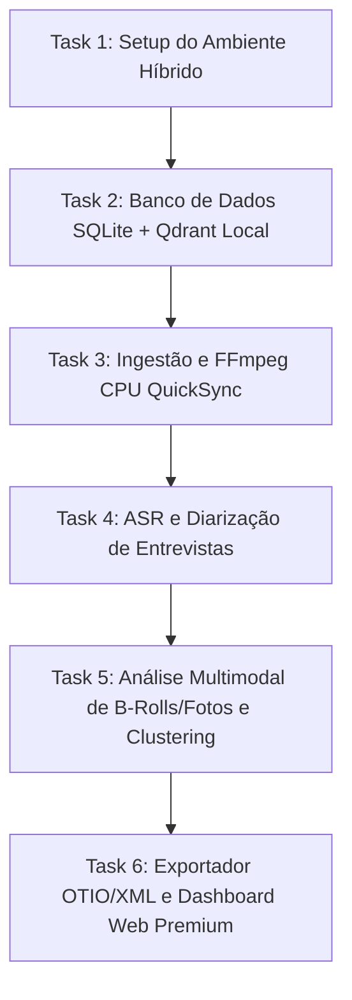

# Plano de Implementação — CapIAu MVP (Making Of & Documentário)

Este documento apresenta o plano detalhado de implementação para o MVP funcional do **CapIAu**, customizado para o fluxo de **Documentários e Making Of**, adaptado para o seu processador Intel i7 (32GB RAM, sem GPU dedicada) e atualizado com as especificações avançadas de player, interface responsiva 16:9 e orçamento detalhado de APIs via OpenRouter.

---

## 1. Visão Geral do MVP (Foco: Making Of de Cinema)

O objetivo deste MVP é construir uma ferramenta inteligente de decupagem e pré-edição automática para **Documentários e Making Of**, otimizada para lidar com grandes volumes de material (como suas ~20 horas de gravação de entrevistas, B-rolls, fotos de set e documentos). 

### O Fluxo de Trabalho do Making Of:
1. **Ingestão e Proxy:** O sistema monitora a pasta `watch/`, extrai metadados e gera proxies leves em 720p/360p via FFmpeg para reprodução suave.
2. **Transcrição de Entrevistas (ASR):** Transcreve depoimentos de diretores, atores e equipe com marcação palavra-a-palavra e identificação automática de quem está falando (diarização).
3. **Mapeamento de B-Rolls e Fotos:** Analisa imagens de bastidores e fotos de set, extraindo descrições semânticas e tags visuais.
4. **Agrupamento Temático (Clustering):** A IA lê os textos de todas as entrevistas e agrupa os trechos automaticamente por temas (ex: *Dificuldades de Roteiro*, *Efeitos Especiais*, *Direção de Arte*).
5. **Busca Semântica Híbrida:** O editor pesquisa na base ("onde o diretor fala sobre a escolha das lentes?") e o sistema localiza o trecho exato do vídeo instantaneamente.
6. **Exportação de Timeline:** O sistema cria um rascunho de edição unindo falas selecionadas com B-rolls correspondentes sugeridos pela IA, exportando para editores profissionais (XML/EDL/OTIO).

---

## 2. Ajuste de Hardware e Arquitetura Híbrida Inteligente

* **CPU:** Intel(R) Core(TM) i7-10700 CPU @ 2.90GHz (8 núcleos / 16 threads — excelente para tarefas concorrentes de CPU).
* **Memória RAM:** **32 GB** (excelente! Espaço de sobra para cache de banco de dados, busca vetorial e manipulação de timelines).
* **GPU Dedicada NVIDIA:** Não detectada (apenas placa integrada Intel HD Graphics 630).

### Estratégia Híbrida Otimizada para o seu Hardware:
Como o seu computador não possui uma GPU dedicada NVIDIA, adotaremos a **melhor arquitetura híbrida possível**:

1. **Camada Local (Leve e Eficiente na sua CPU):**
   * **FastAPI Backend (Python):** Roda de forma extremamente ágil em CPU.
   * **SQLite + Grafo SQLite:** Banco relacional ultrarrápido para metadados, tags e relações.
   * **Qdrant Client (File-based local):** Roda 100% em memória/disco local usando apenas CPU, com latência de busca menor que 5ms para milhares de clipes, sem precisar instalar Docker.
   * **Sentence-Transformers (Embeddings locais):** O modelo `all-MiniLM-L6-v2` (384 dimensões) é minúsculo (~120MB) e roda em milissegundos na CPU do seu i7-10700.
   * **Geração de Proxies (FFmpeg):** O i7-10700 possui 16 threads e decodificação via hardware (Intel QuickSync), processando os proxies de vídeo de forma nativa e rápida.

2. **Camada de Nuvem (APIs de Alto Desempenho e Baixíssimo Custo):**
   * **Única API Agregadora (OpenRouter):** Para simplificar o setup e faturamento, usaremos apenas a **OpenRouter** para todo o processamento de texto e visão. Com uma única chave de API, acessaremos o **DeepSeek Chat** (análise e clustering de baixo custo) e o **GPT-4o-mini / Qwen-VL** (visão multimodal rápida para as fotos e B-rolls).
   * **Transcrição Profissional (AssemblyAI):** Para transcrição e diarização de entrevistas. Usando o Free Tier de **$50**, você poderá processar **~330 horas** de vídeo gratuitamente (suas 20h de material consumirão menos de $3 de crédito grátis, com qualidade de estúdio e tempo de processamento de minutos).

---

## 3. Orçamento e Custo-Benefício das APIs (Limite: 200 Reais)

Garantimos que o processamento completo de suas **20 horas de material** ficará **muito abaixo do limite de R$ 200** (cerca de R$ 15 a R$ 30 no total), usando as APIs mais modernas, robustas e baratas do mercado em Junho de 2026:

### 3.1 Transcrição de Áudio (ASR)
* **API Utilizada:** AssemblyAI (Modelo Universal-2).
* **Custo:** **R$ 0,00** (Gratuito usando os $50 de crédito inicial do signup, equivalente a 330 horas).
* *Caso fosse pago:* $0,15 por hora de vídeo × 20 horas = $3,00 USD (cerca de **R$ 16,50**).

### 3.2 Visão Computacional (Frames de B-Rolls e Fotos de Set)
* **Estratégia:** Extrairemos 1 frame a cada 10 segundos de vídeo. Para 20 horas, teremos exatamente **7.200 frames** para análise visual + fotos adicionais do set.
* **API Utilizada via OpenRouter:** `google/gemini-2.5-flash` ou `openai/gpt-4o-mini` (as APIs multimodais mais rápidas, modernas e econômicas do mundo).
* **Custo:** $0,075 por 1 milhão de tokens de input (Gemini 2.5 Flash). No modo de baixo detalhe/rápido (perfeito para decupagem de bastidores), cada imagem consome poucos tokens.
* **Custo Total de Visão (7.200 imagens):** Cerca de $0,80 a $1,20 USD (cerca de **R$ 4,40 a R$ 6,60**).

### 3.3 Análise de Linguagem Natural e Clustering
* **Estratégia:** Análise estruturada de transcrições e agrupamento em temas narrativos (Making Of).
* **API Utilizada via OpenRouter:** `deepseek/deepseek-chat` (Modelo DeepSeek V3 - a IA de texto com melhor custo-benefício do planeta).
* **Custo:** $0,14 por 1 milhão de tokens de input. Para processar os roteiros e as transcrições das 20 horas, usaremos cerca de 4 a 5 milhões de tokens em prompts estruturados.
* **Custo Total de LLM:** Cerca de $1,00 a $1,50 USD (cerca de **R$ 5,50 a R$ 8,25**).

### 💰 Custo Total Estimado para 20 Horas:
* **Com Free Tier do ASR:** Cerca de **R$ 10,00 a R$ 15,00** (menos de $3 USD!).
* **Sem Free Tier (100% Pago):** Cerca de **R$ 26,00 a R$ 32,00** (menos de $6 USD!).
* *Resultado:* Economia de mais de **85% em relação ao seu limite de R$ 200**, oferecendo uma margem enorme para reanálises e experimentos!

---

## 4. Visual do Painel Interativo 16:9 (Mockup)

Abaixo está o mockup atualizado em **proporção widescreen 16:9**, refletindo o layout de edição cinematográfica com menus retráteis e player de vídeo profissional:


### 4.1 Layout Dinâmico e Menus Retráteis:
* **Menu Lateral Esquerdo (Retrátil):** Biblioteca de Mídias organizada com abas para Entrevistas, B-roll de bastidores e Fotos de set. Pode ser recolhida em um menu minimalista de ícones para dar mais espaço ao player.
* **Menu Lateral Direito (Retrátil):** Painel de Transcrição interativa e falantes coloridos. Clicar nas palavras navega no vídeo. Pode ser ocultado com um clique para foco total no corte de imagem.
* **Painel Inferior (Retrátil):** Widescreen timeline multi-trilha.
* **Centro (Área do Player):** Redimensiona-se automaticamente de forma fluida quando os menus laterais são abertos ou fechados.

### 4.2 Recursos Avançados do Player Cinematográfico:
* **Atalhos de Teclado JKL (Padrão Premiere/Resolve):**
  * `J`: Retroceder vídeo (apertar repetidamente aumenta a velocidade de retrocesso: -1x, -2x, -4x).
  * `K`: Pausar / Reproduzir.
  * `L`: Avançar vídeo (apertar repetidamente aumenta a velocidade: 1.5x, 2x, 4x, 8x).
* **Controle Manual de Velocidade:** Dropdown rápido para alterar a reprodução (0.25x a 2x).
* **Seletor de Resolução Dinâmica:** Botão para alternar entre **Original (4K/1080p)**, **Proxy High (720p)** ou **Proxy Low (360p)** para garantir que o player rode sem nenhum travamento na sua CPU.
* **Marcação de Pontos I/O (In / Out):**
  * Tecla `I`: Define o ponto de entrada da seleção.
  * Tecla `O`: Define o ponto de saída da seleção.
  * Botão "Adicionar à Timeline" (ou tecla `E`): Recorta o segmento selecionado (áudio + vídeo) e o insere diretamente na trilha ativa da timeline.
* **Função Maximizar/Tela Cheia:** Para visualização focada de frames e cortes.

---

## 5. Divisão de Tasks (Cronograma de Implementação)



### Task 1: Setup do Ambiente Híbrido [2h]
- [ ] Criar estrutura de pastas do projeto no workspace.
- [ ] Criar `requirements.txt` com as dependências otimizadas para CPU (FastAPI, uvicorn, assemblyai, qdrant-client, opentimelineio, sentence-transformers, python-dotenv, requests).
- [ ] Criar arquivo `.env` para centralizar as duas únicas chaves necessárias: `OPENROUTER_API_KEY` e `ASSEMBLYAI_API_KEY`.
- [ ] Testar conexões com os endpoints do OpenRouter (usando modelos atualizados como `deepseek/deepseek-chat`, `google/gemini-2.5-flash` e `meta-llama/llama-3.3-70b-instruct`) via scripts em `scratch/`.

### Task 2: Banco de Dados Híbrido SQLite + Qdrant CPU [3h]
- [ ] Criar `src/db/schema.py` estruturando as tabelas do **SQLite**:
  - `project`: Projetos de documentário.
  - `video`: Metadados dos vídeos (entrevistas e B-rolls).
  - `photo`: Metadados das fotos de set.
  - `transcript`: Transcrições detalhadas palavra-a-palavra.
  - `theme`: Temas narrativos extraídos por clusterização.
  - `timeline`: Edições estruturadas.
- [ ] Criar `src/search/semantic.py` implementando o **Qdrant local baseado em arquivo** (armazenado diretamente em `data/qdrant.db`):
  - Inicialização local rápida sem necessidade de Docker.
  - Indexador de textos de transcrição e tags de B-rolls/fotos usando embeddings locais gerados em CPU via `sentence-transformers` (modelo super leve).

### Task 3: Ingestão e Proxying Otimizado [3h]
- [ ] Implementar `src/ingest/watcher.py` para monitorar a pasta `watch/`:
  - Mapear depoimentos, B-rolls e fotos.
  - Deduplicação por hash SHA-256 rápida.
  - Extração de metadados técnicos ricos via **FFprobe** (resolução, fps, codec).
- [ ] Criar rotina de geração de proxy usando **FFmpeg**:
  - Configurado com decodificação otimizada para CPU i7 (H.264 CRF 23, 720p/360p selecionável, áudio AAC).
  - Preservar o timecode original ou simular a partir do frame inicial.

### Task 4: Transcrição e Diarização de Entrevistas [4h]
- [ ] Criar `src/transcription/asr_engine.py`:
  - Enviar áudio das entrevistas para o **AssemblyAI** (utilizando pt-BR, diarização para identificar entrevistados e timestamp palavra-a-palavra).
  - Salvar e organizar os retornos no SQLite, linkando cada palavra com o respectivo `speaker_id`.
- [ ] Criar rotina para organizar o texto e gerar blocos contínuos de falas por falante no SQLite.

### Task 5: Visão Multimodal de B-Rolls/Fotos e Clustering Temático [5h]
- [ ] Criar `src/vision/multimodal_engine.py`:
  - Rotina de extração de frames-chave dos B-rolls a cada 10 segundos.
  - Envio dos frames dos B-rolls e das fotos de set para o **Gemini 2.5 Flash / GPT-4o-mini** via OpenRouter para gerar descrições cinematográficas e tags.
  - Salvar descrições no SQLite e indexá-las no Qdrant local para busca.
- [ ] Criar módulo de agrupamento semântico `src/nlp/theme_cluster.py`:
  - Fazer o LLM (DeepSeek Chat via OpenRouter) analisar o conjunto de falas das entrevistas de making of e complementar o clustering temático.
  - Associar automaticamente cada segmento de entrevista a um ou mais desses tópicos.

### Task 6: Exportador de Timeline e Dashboard Web Premium [8h]
- [ ] Criar rotina de exportação `src/export/otio_export.py` usando **OpenTimelineIO**:
  - Ler a sequência de clipes selecionados no editor do dashboard e traduzir para XML compatível com Premiere/DaVinci Resolve e OTIO.
- [ ] Construir o **Dashboard Web Premium** (`src/ui/`):
  - Interface moderna com layout glassmorphism (HTML5/Vanilla JS sem frameworks pesados, rodando de forma extremamente fluida na sua CPU).
  - Componentes: player com atalhos JKL, controles de velocidade e resolução, marcadores In/Out (teclas I/O), menus laterais esquerdo (biblioteca) e direito (transcrições) 100% retráteis por clique, busca semântica cruzando fotos, B-rolls e falas, e linha do tempo interativa para montagem do making of.

---

## 6. Adição Crítica: Gerenciamento Multi-Projeto Autônomo

Para evitar o acúmulo e bagunça de mídias de diferentes produções na mesma timeline, o MVP agora conta com suporte nativo a múltiplos projetos. Isso garante o isolamento completo de vídeos, fotos de set, transcrições e timelines.

### 6.1 Correção de Bugs de Chamadas e Isolamento Semântico
Durante a análise técnica do código, detectamos três bugs cruciais que serão resolvidos junto com esta alteração:
1. **Bug no Qdrant (ASR):** O motor ASR em `asr_engine.py` chama `index_transcript_chunks(video_id, dialogues)` omitindo o `project_id` obrigatório (causando falha de tipos e índices desalinhados).
2. **Bug no Qdrant (Vision):** O motor de visão em `multimodal_engine.py` chama `index_broll_descriptions(video_id, descriptions)` e `index_photo_description(photo_id, desc, tags)` omitindo o `project_id`.
3. **Bug na Busca Semântica:** A rota `/api/search` em `server.py` chama `search_engine.search(query, media_type)` sem passar o `project_id` como primeiro parâmetro posicional da assinatura, invalidando a busca.

### 6.2 Estrutura das Novas Operações

#### [MODIFY] [config.py](file:///c:/Users/FGC/Desktop/Capiau-Talho-Kimi_MVP/src/config.py)
- Adicionar suporte a duas variáveis de ambiente:
  - `TEXT_MODEL`: Define o modelo para clustering e tarefas de texto (Padrão: `deepseek/deepseek-chat` para ultra-economia, podendo ser alterado para `anthropic/claude-3.5-sonnet` ou `meta-llama/llama-3.3-70b-instruct`).
  - `VISION_MODEL`: Define o modelo de visão multimodal para descrição de frames e fotos (Padrão: `google/gemini-2.5-flash` para custo-benefício ideal, podendo ser alterado para `anthropic/claude-3.5-sonnet` para maior refino estético ou `google/gemini-2.5-flash:free` para 100% gratuito).

#### [MODIFY] [operations.py](file:///c:/Users/FGC/Desktop/Capiau-Talho-Kimi_MVP/src/db/operations.py)
Adicionaremos funções CRUD específicas para projetos:
- `add_project(name: str, description: str = "") -> int`
- `get_projects() -> list`
- `delete_project(project_id: int)`

#### [MODIFY] [server.py](file:///c:/Users/FGC/Desktop/Capiau-Talho-Kimi_MVP/src/api/server.py)
- **Novas Rotas de Gerenciamento:**
  - `POST /api/projects` -> Cria um projeto (corpo JSON com name e description).
  - `GET /api/projects` -> Retorna a lista de todos os projetos cadastrados.
  - `DELETE /api/projects/{project_id}` -> Remove o projeto de forma física em cascata.
- **Parametrização por `project_id`:**
  - `GET /api/videos` aceitará `project_id: int` e filtrará os vídeos do projeto.
  - `GET /api/photos` aceitará `project_id: int` e filtrará as fotos do projeto.
  - `POST /api/ingest/scan` aceitará `project_id: int` para registrar novas mídias no projeto ativo.
  - `POST /api/project/cluster-themes` aceitará `project_id: int` para rodar agrupamento temático de falas do projeto ativo.
  - `GET /api/search` aceitará `project_id: int` e `query: str` para buscar apenas no Qdrant do projeto ativo.
  - `GET /api/themes` aceitará `project_id: int` e filtrará os temas daquele projeto.
  - `POST /api/timeline` aceitará `project_id` no corpo e salvará a timeline no projeto correto.
  - `GET /api/timeline` aceitará `project_id: int` e retornará timelines do projeto ativo.

#### [MODIFY] [multimodal_engine.py](file:///c:/Users/FGC/Desktop/Capiau-Talho-Kimi_MVP/src/vision/multimodal_engine.py) e [asr_engine.py](file:///c:/Users/FGC/Desktop/Capiau-Talho-Kimi_MVP/src/transcription/asr_engine.py)
- Ambos os motores passarão a ler dinamicamente `CONFIG.TEXT_MODEL` e `CONFIG.VISION_MODEL` para a execução das chamadas à API da OpenRouter.
- Antes de indexar no Qdrant, ambos consultarão o banco SQLite para descobrir o `project_id` associado ao `video_id` ou `photo_id` sob processamento, garantindo isolamento total de vetores.
- Corrigirão as assinaturas das chamadas das funções de indexação para passar o `project_id` na primeira posição.

#### [MODIFY] [index.html](file:///c:/Users/FGC/Desktop/Capiau-Talho-Kimi_MVP/src/ui/index.html)
- **Área de Seleção na Header:** Ao lado da Logo, criaremos a área `.project-area` contendo:
  - `<select id="project-selector">` glassmorphic para troca rápida.
  - Botão Novo Projeto (`<button id="btn-new-project">`) para abrir modal.
  - Botão Deletar Projeto (`<button id="btn-delete-project">`) para remover a produção ativa.
- **Modal de Criação:** Um overlay glassmorphic contendo formulário com Nome do Projeto e Descrição.

#### [MODIFY] [app.js](file:///c:/Users/FGC/Desktop/Capiau-Talho-Kimi_MVP/src/ui/app.js)
- Variável global `let currentProjectId = 1;` controlando o estado do app.
- Função `loadProjects()` no startup do app: busca todos os projetos no backend, popula o selector e define o projeto ativo.
- Evento `change` no `#project-selector`: altera a variável global e chama recarregamento limpo de todas as abas, timelines e limpa o player.
- Lógica do modal de criação: envia requisição POST, recarrega a lista e seleciona automaticamente o novo projeto criado.
- Lógica de remoção: prompt de confirmação ("Deseja deletar o projeto?") seguido por chamada DELETE e troca do projeto ativo de volta para a primeira opção da lista.

---

## 7. Plano de Verificação e Testes

### Teste Automatizado de Integração
* Arquivo: `tests/test_hybrid_pipeline.py`
* Método: Executar fluxo completo usando um clipe curto de teste de 30 segundos:
  ```bash
  python -m unittest tests/test_hybrid_pipeline.py
  ```
* Critério de Sucesso: O clipe deve ser ingerido, ter metadados extraídos, proxy generados, transcrito na nuvem, indexado localmente em CPU no Qdrant, e gerar um arquivo `.xml` de exportação válido.

### Validação Manual
1. Abrir a UI e certificar-se de que o projeto padrão "Making Of MVP" está pré-selecionado.
2. Clicar em "Novo Projeto", preencher "Projeto Curta-Metragem B" e criar.
3. Trocar entre os projetos no dropdown e certificar-se de que a biblioteca esvazia-se corretamente e o player reseta.
4. Escanear mídias na pasta `watch/` para o "Projeto Curta-Metragem B" e validar que o "Projeto Making Of MVP" permanece intocado e sem mídias misturadas.
5. Fazer uma busca semântica em um projeto e verificar que mídias do outro projeto não são retornadas.
6. Clicar em deletar projeto e atestar que a remoção em cascata limpou os registros no SQLite.

