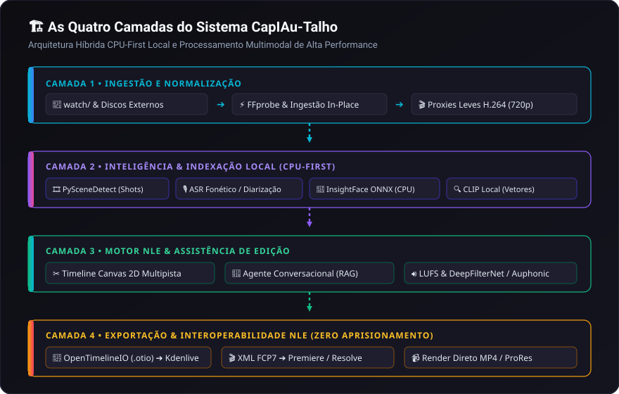

# 01. Visão Geral e Conceito

O **CapIAu-Talho** é uma ilha de **pré-edição, decupagem, logging e assistência por IA** concebida a partir das dores reais da produção cinematográfica documental e da gestão de grandes acervos audiovisuais.

---

## 🎯 O Desafio dos Documentários e Grandes Acervos

Em produções documentais e projetos de making-of, a proporção de material gravado em relação ao tempo final de tela costuma ser avassaladora (muitas vezes superior a **50:1** ou **100:1**). 

Os principais gargalos enfrentados por equipes de montagem e arquivistas incluem:

1. **Afogamento em Horas de Entrevistas Brutas:** Localizar uma frase dita no calor de uma conversa de 3 horas exige audição manual exaustiva ou leitura de transcrições desvinculadas da timeline.
2. **Material Visual Não Catalogado (B-Rolls e Fotos de Set):** Centenas de planos de cobertura gravados com nomes genéricos de câmera (ex: `MOV_0492.MOV`, `00012.MTS`) tornam a busca por conceitos visuais específicos (ex: *"diretor gesticulando sob iluminação quente"*) uma tarefa demorada e imprecisa.
3. **Privacidade e Custos em Nuvem:** Enviar terabytes de vídeo não finalizado para servidores de terceiros viola acordos de confidencialidade (NDA), expõe a privacidade de elenco/equipe e gera custos proibitivos de banda e processamento.
4. **Isolamento entre IA e Montagem:** A maioria das soluções de IA opera como ferramentas isoladas que geram planilhas ou relatórios de texto, forçando o editor a copiar e colar manualmente timecodes para o seu software de edição (NLE).

---

## 💡 A Filosofia do CapIAu-Talho

O Talho resolve esses problemas integrando inteligência artificial diretamente ao fluxo de trabalho clássico de edição não-linear (NLE), fundamentado em quatro princípios:

### 1. Arquitetura Híbrida CPU-First Local
As operações de maior frequência e sensibilidade à privacidade rodam **100% locais na CPU** do usuário:
- **Embeddings Visuais CLIP:** Vetorização e busca por similaridade sem envio de imagens para a nuvem.
- **Biometria Facial ONNX:** Detecção de rostos e agrupamento por clustering (DBSCAN) localmente.
- **Bancos Vetoriais & Relacionais:** ChromaDB e SQLite persistidos no disco local.

Apenas tarefas semânticas e linguísticas profundas de alto valor agregado utilizam modelos em nuvem (como AssemblyAI, Google Gemini, OpenAI, Groq) com chamadas econômicas, cirúrgicas e assíncronas.

### 2. Edição Guiada por Texto (Transcript-Based Editing)
Depoimentos não são mais blocos opacos de áudio. Cada palavra possui timecode preciso. O editor lê a entrevista, seleciona trechos no texto e os insere diretamente na timeline com o atalho `Shift+E`. O corte de vídeo e áudio é realizado no milissegundo exato da articulação vocal.

### 3. Timeline Canvas 2D Sem Aprisionamento
O sistema possui uma timeline multipista completa com renderização acelerada em Canvas 2D. O projeto gerado não fica preso na ferramenta: o editor realiza a pré-edição (rough cut) e o logging no Talho e exporta em formatos padrão da indústria (**OpenTimelineIO `.otio`**, **Final Cut Pro 7 XML** e **EDL**), dando continuidade imediata no **Kdenlive**, **Adobe Premiere Pro**, **DaVinci Resolve** ou **Final Cut Pro**.

### 4. Títulos Executivos Inteligentes
Nomes de arquivo crípticos de câmeras são substituídos por títulos executivos descritivos de 3 a 6 palavras gerados por IA (ex: *"Zé: Crítica ao primeiro corte"*, *"Detalhe das mãos no vinil"*), permitindo identificar o conteúdo de cada clipe visualmente na timeline e na biblioteca.

---

## 🏗️ As Quatro Camadas do Sistema

1. **Camada de Ingestão e Mídia:** Monitora diretórios de entrada, gera proxies leves em segundo plano e preserva os arquivos de alta resolução originais intactos no local de origem.
2. **Camada de Indexação e IA:** Segmenta o vídeo em cortes reais e beats narrativos, transcreve com diarização de falantes, extrai biometria facial e cria índices vetoriais multidimensionais.
3. **Camada NLE e Assistente:** Interface web reativa sem gaps com monitor duplo (Source/Program), timeline Canvas 2D com suporte a J/L-Cuts, Sync Lock e agente com RAG contextual.
4. **Camada de Intercâmbio:** Exportadores com precisão de frames e conformação de metadados para as principais suítes profissionais de pós-produção do mercado.

---

## 👥 Para Quem é o CapIAu-Talho?

- **Documentaristas:** Para transformar dezenas de horas de depoimentos gravados em um primeiro corte estruturado em poucas horas.
- **Editores de Making-Of:** Para cruzar depoimentos da equipe com os B-rolls e fotos de set correspondentes de forma instantânea.
- **Pesquisadores e Arquivistas:** Para catalogar, rotular personagens e buscar acervos audiovisuais históricos em linguagem natural com garantia total de privacidade.
- **Estudantes e Produtoras Independentes:** Para ter acesso a recursos de edição assistida por IA de ponta rodando em hardware convencional sem necessidade de workstations com GPUs caras.

---

> Próximo passo: Consulte [[02. Instalação e Configuração|02.-Instalacao-e-Configuracao]] para configurar seu ambiente de trabalho.
