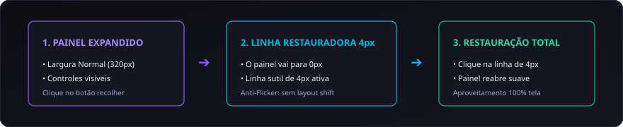

# 03. Design System e Interface NLE

O **CapIAu-Talho** possui uma linguagem visual própria focada na máxima densidade de informação, ergonomia para longas sessões de edição e aproveitamento total da tela.

---

## 🎨 Princípios do Design System Flat & Seamless

### 1. Visual Sem Espaços (Seamless Layout)
- **Zero Gaps & Paddings:** Painéis adjacentes encostam perfeitamente uns nos outros (`border-radius: 0;`, `gap: 0;`).
- **Divisores Finos (Splitters):** O redimensionamento entre painéis é feito por splitters de 4px com feedback tátil no cursor (`col-resize` / `row-resize`).
- **Eliminação de Rodapés Inúteis:** Barras de status estáticas foram abolidas para que 100% da altura vertical seja dedicada ao conteúdo scrollável.

### 2. Linhas Restauradoras de 4px (Restore Lines)
Quando qualquer sidebar ou painel retrátil é colapsado para largura zero, uma **linha finíssima de 4px** surge no fluxo flexbox exatamente onde o painel estava:



- **Cores Temáticas por Função:**
  - 🟣 **Violeta (`#8b5cf6`):** Barra de ferramentas e toolbars.
  - 🔷 **Ciano (`#06b6d4`):** Cabeçalhos de pistas e abas de navegação.
  - 🌹 **Rose (`#f43f5e`):** Painéis de configuração e ações críticas.
  - 🟢 **Esmeralda (`#10b981`):** Mídias, bibliotecas e saídas.
- **Anti-Flicker:** A largura da linha restauradora permanece rigorosamente fixada em 4px no hover para evitar layout shifts e piscas no Canvas da timeline.

---

## 📐 Sidebars Adaptativas de 3 Níveis

As barras laterais esquerda e direita respondem de forma fluida à largura disponível:

| Nível | Faixa de Largura | Comportamento dos Controles |
| :--- | :--- | :--- |
| **Normal** | $\ge 320\text{ px}$ | Exibe rótulos de texto por extenso. Sliders amplos ($180\text{--}240\text{ px}$). Ícones de abas são ocultados para economizar espaço vertical. |
| **Compacto** | $240\text{ px} \le \text{Largura} < 320\text{ px}$ | Oculta textos de abas mantendo apenas os ícones. Sliders médios ($115\text{--}135\text{ px}$) com rótulos à esquerda. |
| **Mínimo** | $< 240\text{ px}$ | Oculta textos e rótulos secundários, centralizando os sliders de controle. Tooltips contextuais são ativadas. |

> [!IMPORTANT]
> **Estabilidade Vertical:** Os cabeçalhos e paddings verticais das sidebars permanecem congelados em todos os 3 níveis para evitar que a interface salte verticalmente durante o redimensionamento.

---

## 🎛️ Componentes de Controle Especializados

### 1. Motor de Tooltips Globais em JavaScript
- Ao contrário de tooltips nativas do navegador (`title`) que cortam nas bordas de painéis com `overflow: hidden`, o Talho utiliza um elemento único flutuante (`#global-tooltip`) fixado na raiz do DOM.
- **Prevenção de Colisão:** Se a tooltip encostar no topo ou nas laterais da tela, ela se inverte automaticamente para baixo ou ajusta sua posição horizontal.
- Interceptação automática via `MutationObserver` para elementos criados dinamicamente.

### 2. Caixas de Seleção Dark Glassmorphic (`.nle-select`)
- Todos os menus `<select>` utilizam temas escuros com chevron em SVG ciano ou roxo embutido no CSS.
- Eliminação dos menus suspensos brancos padrão do Windows para harmonia visual completa.

### 3. Entradas Numéricas Flat com Steppers Minimalistas
- Os spin-buttons cinzas nativos do navegador foram removidos.
- Os números são renderizados em texto flat ciano sem caixa opaca, acompanhados de setas sutis de incremento/decremento (`.btn-fade-step`).

---

## 🎬 Monitores de Vídeo com Overlays em Hover

Os players **Source** (Origem) e **Program** (Timeline) priorizam 100% da imagem:
- **Estado de Repouso:** Os cabeçalhos e barras de controle ficam transparentes com `opacity: 0`, permitindo visualizar o vídeo sem obstruções.
- **Estado de Hover:** Ao passar o mouse sobre o monitor, os controles deslizam suavemente sobre um gradiente escuro translúcido.
- **Layout Estúdio:** Permite empilhar Source e Program verticalmente ou colocá-los lado a lado conforme a necessidade do projeto.

---

## ⚡ Padrão de Tarefas em Segundo Plano e Terminal de Logs

Nenhuma operação assíncrona longa roda de forma invisível. Ao disparar uma indexação, transcrição ou exportação:

```
[INIT]    Iniciando geração de proxies para 12 mídias...
[FFMPEG]  Processando 0012.MTS -> 720p H.264 (48%)
[LLM]     Analisando transcrição com AssemblyAI...
[SUCCESS] Transcrição concluída em 3.4s com 4 falantes identificados.
```

- **Gaveta de Tarefas Viva:** Exibe barra de progresso em tempo real e terminal com tags coloridas (`[INIT]`, `[LLM]`, `[SUCCESS]`, `[WARN]`, `[ERROR]`).
- **Cancelamento Responsivo:** Qualquer tarefa pode ser interrompida imediatamente pelo editor através do botão de cancelamento (`X`).
- **Toasts Glassmorphic:** Notificações flutuantes no canto inferior direito informam o término das operações com animação suave.

---

> Próximo passo: Aprenda como importar e organizar mídias em [[04. Ingestão e Gestão de Acervos|04.-Ingestao-e-Gestao-de-Acervos]].
