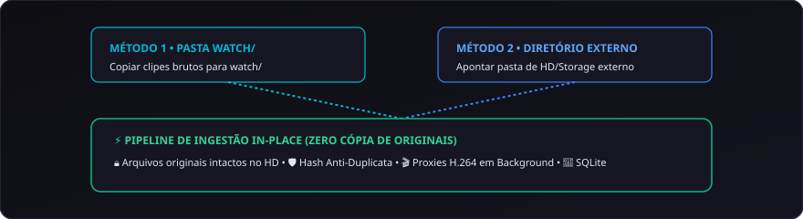

# 04. Ingestão e Gestão de Acervos

O **CapIAu-Talho** foi arquitetado para lidar com acervos gigantescos sem exigir a duplicação de terabytes de material original nem sobrecarregar o armazenamento interno do computador.

---

## 💾 Ingestão In-Place (Sem Cópia de Mídias)

O sistema opera com o conceito de **Ingestão In-Place**:
- Seus arquivos originais em alta resolução (4K, ProRes, RAW, AVCHD) podem permanecer nos **discos rígidos externos ou storages de rede**.
- O Talho armazena no banco de dados apenas os metadados técnicos e o caminho absoluto do arquivo original.
- Para a operação diária de edição e pré-visualização, o sistema cria automaticamente **proxies leves** em formato H.264 (720p ou 360p) dentro da pasta `data/proxies/`.
- Ao exportar para o software de finalização (Kdenlive, Premiere, Resolve), o Talho faz o conformamento (**relink**) direto para os arquivos em resolução máxima original.

---

## 📥 Métodos de Ingestão

### Método 1: Pasta `watch/`
1. Copie seus arquivos de vídeo, fotos ou áudio para a pasta `watch/` na raiz do projeto.
2. Na barra superior da interface, clique no botão **Escanear watch/**.

### Método 2: Ingestão de Diretórios Personalizados
1. Na aba de Mídias, informe o caminho de uma pasta em qualquer disco rígido ou partição do sistema.
2. O Talho varrerá o diretório recursivamente sem mover ou alterar a estrutura original dos seus arquivos.

---

## 🏷️ Convenção Inteligente de Nomenclatura

Para acelerar a categorização automática antes das análises profundas de IA:

| Palavra-chave no Nome do Arquivo | Categorização Automática | Pipeline de Processamento |
| :--- | :--- | :--- |
| `*entrevista*`, `*depoimento*`, `*fala*` | **Entrevistas (ASR)** | Transcrição fonética, diarização e waveform de falas. |
| `*set*`, `*bastidores*`, `*broll*`, `*cena*` | **Bastidores / B-Rolls** | Segmentação de planos (PySceneDetect), CLIP e paleta de cores. |
| Arquivos `.CR2`, `.NEF`, `.ARW`, `.JPG` | **Fotos de Set** | Processamento RAW, detecção facial e embeddings CLIP. |
| Arquivos `.WAV`, `.MP3`, `.AAC` | **Áudios Puros** | Diagnóstico LUFS EBU R128 e restauração de ruído. |

---

## 🎞️ Suporte Abrangente a Formatos Profissionais

O CapIAu-Talho lê nativamente uma ampla variedade de formatos:

- **Vídeos:** `.MOV` (Apple ProRes, H.264 Full Range Canon), `.MTS` / `.M2TS` (AVCHD de filmadoras), `.MP4`, `.MKV`, `.MXF`.
- **Fotos e Imagens RAW:** `.CR2` (Canon RAW), `.JPG`, `.PNG`, `.TIFF`, `.WEBP`.
- **Áudios:** `.WAV` (Broadcast Wave com Timecode BWF), `.AIFF`, `.MP3`, `.FLAC`, `.OGG`.

---

## 🗂️ Biblioteca em Árvore e Pastas Inteligentes (Smart Folders)

A barra lateral esquerda organiza o acervo em uma estrutura hierárquica colapsável:

- **Pastas Reais:** Refletem a estrutura de diretórios do disco (ex: `Dia 01 / Câmera A / Cartão 01`).
- **Filtros por Ciclo de Status:**
  - 🟢 **Todos:** Visão global de todas as mídias cadastradas.
  - 🟣 **Analisados:** Apenas clipes que já possuem transcrição ou decupagem de IA concluída.
  - ⚪ **Não Analisados:** Mídias pendentes de processamento.
  - 🔴 **Erros:** Clipes que apresentaram falha em codec ou áudio corrompido para rápida inspeção.
- **Visualização em Grade (Cards) ou Lista:** Alternância instantânea entre cartões com miniaturas dinâmicas e tabela detalhada com metadados técnicos (Resolução, FPS, Duração, Codec, Canais de Áudio).
- **Zoom Dinâmico de Cards (`Shift + Wheel`):** Segure `Shift` e gire a roda do mouse sobre a grade para dimensionar os cards de forma contínua e suave.
- **Sincronização em Janela Destacada:** Se a biblioteca estiver desacoplada em monitor secundário, todas as ações de zoom, duplo clique, modo de visualização e atualização de pôsteres (`setVideoThumbnail`) permanecem perfeitamente integradas.

---

## ⚡ Modos Avançados de Ingestão na Timeline

Para acelerar o fluxo de montagem, o CapIAu-Talho disponibiliza múltiplas estratégias de inserção instantânea a partir da biblioteca, acessíveis via **combinações de teclas no duplo clique** ou pelo submenu **"Adicionar à Timeline"** no menu de contexto (botão direito):

| Atalho (Duplo Clique) | Modo de Ingestão | Ação Executada na Timeline | Posição da Agulha |
| :--- | :--- | :--- | :--- |
| **`2x Clique`** | **Na Posição da Agulha (Playhead)** | Insere o clipe na agulha da pista ativa/padrão. | Final do clipe inserido |
| **`Shift + 2x Clique`** | **No Final da Timeline (Append)** | Anexa a mídia exatamente após o término do último corte da timeline. | Final do clipe inserido |
| **`Ctrl + 2x Clique`** *(ou `Cmd`)* | **No 1º Espaço Vazio (Primeiro Gap)** | Encontra o primeiro espaço vazio a partir do frame 0 e insere no início dele. | **Início do clipe inserido** |
| **`Ctrl + Shift + 2x Clique`** | **No Próximo Espaço Vazio (Após Agulha)** | Encontra o primeiro gap à frente da agulha atual e insere no início dele. | **Início do clipe inserido** |
| **`Alt + Shift + 2x Clique`** | **No Início da Timeline (Frame 0)** | Insere no frame 0 da pista de destino. | Início (Frame 0) |
| **`Alt + 2x Clique`** | **Inserir Empurrando (Ripple Insert)** | Divide o clipe sob a agulha e empurra os cortes seguintes pela duração da nova mídia. | Final do clipe inserido |
| **`Ctrl + Alt + 2x Clique`** | **Sobrepor em Pista Superior (Overlay)** | Insere na pista superior livre (ex: V2/B-Roll) na posição da agulha. | Final do clipe inserido |
| **`Botão Direito ➔ Substituir`** | **Substituir Clipe Selecionado** | Substitui a mídia do clipe atualmente selecionado na timeline mantendo a posição. | Mantém posição |

---

> Próximo passo: Entenda o funcionamento da timeline em [[05. Timeline e Edição Multipista|05.-Timeline-e-Edicao-Multipista]].
