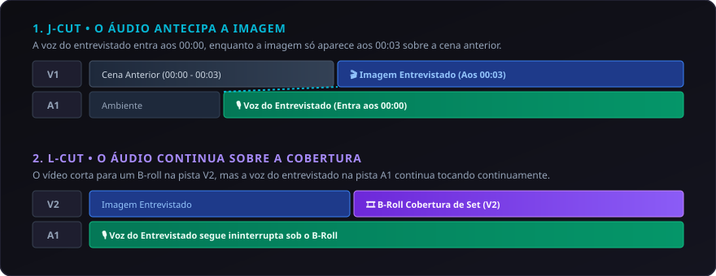

# 05. Timeline e Edição Multipista

A timeline do **CapIAu-Talho** é construída sobre um motor **Canvas 2D de alta performance**, capaz de renderizar centenas de clipes, transições e formas de onda em 60 FPS com baixíssimo consumo de memória.

---

## 🎛️ Arquitetura Multipista (Track-Based NLE)

A timeline organiza-se em camadas verticais independentes:

```
[V3]  Títulos, Lower Thirds e Cartelas Gráficas
[V2]  B-Rolls de Cobertura, Fotos de Set e Inserções
[V1]  Pista Principal de Vídeo (Entrevistas e A-Roll)
====================================================== (Divisor Central)
[A1]  Voz Principal / Diálogos (Sincronizado com V1)
[A2]  Áudio de Cobertura / Som Direto Secundário
[A3]  Trilha Sonora / Música de Fundo
[A4]  Efeitos Sonoros (SFX) e Foleys
```

### Propriedades das Pistas
- 🔒 **Bloqueio de Pista (Lock):** Impede qualquer alteração ou movimentação acidental de clipes.
- 🔗 **Trava de Sincronia (Sync Lock):** Garante que operações de Ripple Edit na pista de vídeo desloquem proporcionalmente as pistas de áudio associadas, preservando o sincronismo labial.
- 👁️ **Mute / Ocultar:** Desativa a visualização de pistas de vídeo ou muta canais de áudio específicos para audição isolada (Solo).

---

## ✂️ Ferramentas Profissionais de Edição e Trim

O Talho disponibiliza as ferramentas clássicas consagradas pelos principais NLEs da indústria:

| Ferramenta | Atalho | Ícone | Comportamento |
| :--- | :--- | :--- | :--- |
| **Seleção (Selection)** | `V` | ↖ | Seleciona, move e redimensiona clipes na timeline. |
| **Corte / Gilete (Razor)** | `C` | ✂ | Corta o clipe ativo na posição exata da agulha (Playhead). |
| **Edição com Deslocamento (Ripple)** | `B` | ⏩ | Ao encurtar ou estender um clipe, desloca automaticamente todos os clipes posteriores na timeline, eliminando gaps vazios. |
| **Rolagem de Corte (Roll)** | `N` | ↔ | Altera o ponto de corte entre dois clipes vizinhos simultaneamente sem alterar a duração total da sequência. |
| **Deslizar Conteúdo (Slip)** | `Y` | ⇄ | Altera o ponto de entrada (In) e saída (Out) interno do clipe mantendo sua posição e duração física na timeline intactas. |
| **Escorregar Clipe (Slide)** | `U` | ⇥ | Move o clipe ao longo da timeline encurtando o clipe anterior e estendendo o posterior. |

---

## 🎬 J-Cuts e L-Cuts Nativos

Em documentários, a sobreposição assimétrica entre áudio e vídeo é fundamental para um ritmo cinematográfico fluido:



- **No Talho:** Você pode desvincular temporariamente o áudio do vídeo ou arrastar as alças de corte de forma independente com `Alt + Drag`.
- O player de pré-visualização executa a compensação de áudio contínua em tempo real sem engasgos.

---

## 🧲 Magnetismo (Snapping) e Gerenciamento de Gaps

- **Snap Inteligente (`S`):** Ao arrastar clipes ou a agulha de reprodução, o sistema atrai os pontos de contato para:
  - Início e fim de clipes vizinhos.
  - Posição atual da agulha (Playhead).
  - Marcadores de timeline.
- **Detecção e Fechamento de Gaps:**
  - Clique com o botão direito sobre qualquer espaço vazio na timeline e selecione **Fechar Gap (Ripple Delete)** ou pressione `Shift + Delete` para unir os clipes instantaneamente.

---

## 📍 Marcadores de Timeline e Anotações

- Pressione **`M`** para inserir um marcador colorido no timecode atual.
- Pressione **`Shift + M`** sobre um marcador para abrir a caixa de anotação e registrar observações para a equipe (ex: *"Verificar autorização de imagem"*, *"Inserir vinheta aqui"*).

---

## 💾 Salvamento Automático e Histórico de Ações

- **Auto-Save Contínuo:** Todas as ações na timeline são persistidas no banco SQLite a cada corte ou movimentação.
- **Desfazer / Refazer Infinito:** `Ctrl + Z` e `Ctrl + Y` navegam pelo histórico completo da sessão de montagem.

---

> Próximo passo: Veja como a IA auxilia na decupagem de planos em [[06. Decupagem e Visão Computacional|06.-Decupagem-Inteligente-e-Visao]].
