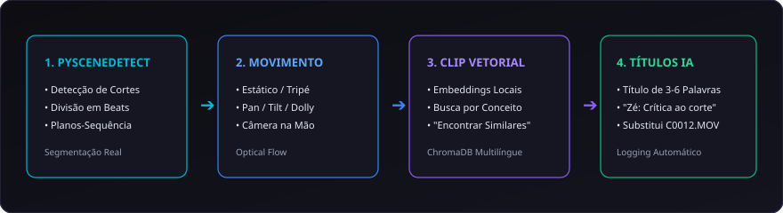

# 06. Decupagem e Visão Computacional

A decupagem de imagens no **CapIAu-Talho** vai muito além da extração periódica de frames fixos. O sistema utiliza **visão computacional local** e **modelos multimodais** para segmentar, catalogar e entender o conteúdo de cada plano de forma cinematográfica.

---

## 🎞️ Segmentação por Shots e Beats (PySceneDetect)

Em vez de capturar um frame arbitrário a cada 10 segundos, o Talho analisa a estrutura visual real dos vídeos:

1. **Detecção de Cortes (Shot Boundaries):** Identifica transições secas e dissoluções, criando segmentos exatos para cada tomada.
2. **Beats Narrativos em Planos-Sequência:** Em tomadas longas contínuas (ex: a câmera passeia pelo set e foca em diferentes objetos), o algoritmo detecta a mudança de centro de interesse e subdivide o clipe em *beats*, facilitando a busca e a inserção cirúrgica de trechos na timeline.

---

## 🎥 Classificação Automática de Movimento de Câmera

Cada shot é analisado através de fluxo óptico (Optical Flow) para classificar o movimento da câmera:

| Badge Visual | Tipo de Movimento | Descrição Técnica |
| :--- | :--- | :--- |
| 🟢 **ESTÁTICO** | Câmera Fixa no Tripé | Sem movimentação significativa de eixos ou enquadramento. |
| 🔵 **PAN (E/D)** | Panorâmica Horizontal | Movimento contínuo para a esquerda ou direita. |
| 🟣 **TILT (C/B)** | Panorâmica Vertical | Movimento de inclinação para cima ou para baixo. |
| 🟡 **TRACK / DOLLY** | Movimento de Acompanhamento | Câmera sobre trilhos ou operador caminhando com gimbal. |
| 🟠 **MÃO LIVRE** | Câmera na Mão (Handheld) | Movimentação orgânica com micro-trepidações típicas de set. |
| 🔴 **WHIP PAN** | Panorâmica Chicote | Movimento ultra-rápido usado frequentemente como transição de corte. |

---

## 🏷️ Títulos Executivos Gerados por IA

Para acabar com a confusão de arquivos como `C0012.MP4` ou `IMG_9043.JPG`, o Talho gera automaticamente títulos executivos curtos (de 3 a 6 palavras) que sintetizam o que o clipe realmente representa:

- ❌ *Evitado:* "Um vídeo de câmera mostrando um homem sentado numa cadeira..."
- ✅ *Gerado pelo Talho:* **"Zé: Crítica ao primeiro corte"**
- ✅ *Gerado pelo Talho:* **"Operador ajustando foco na lente 50mm"**
- ✅ *Gerado pelo Talho:* **"Iluminação quente no fundo do cenário"**

Esses títulos são gravados no banco de dados e aparecem nos cartões de mídia, nas tooltips e nos blocos da timeline.

---

## 👁️ Indexação Visual com CLIP Local (Sem Custo de Nuvem)

Todo keyframe e foto de making-of é processado localmente pelo modelo **OpenCLIP / Multilingual CLIP**:

- **Busca por Conceito Visual:** Permite pesquisar em português por elementos que nunca foram descritos explicitamente em texto (ex: *"olhar tenso através do vidro"*, *"luz azulada refletida na claquete"*).
- **Encontrar Similares:** Um clique no botão **Encontrar Similares** nos cards de mídia ou no inspetor localiza instantaneamente todos os planos do acervo com iluminação, enquadramento ou estética visual semelhantes.

---

## 🎨 Análise de Paleta de Cores e Enquadramento

O inspetor visual extrai e exibe:
- **Paleta Dominante (5 Cores Hexadecimais):** Mapeamento cromático da cena para harmonização na montagem.
- **Tipo de Enquadramento:** Plano Geral (Wide), Plano Médio (Medium), Primeiro Plano (Close-Up), Detalhe (Extreme Close-Up).
- **Condição de Luz:** Luz Natural, Externa Dia, Externa Noite, Estúdio / Tungstênio.

---

> Próximo passo: Aprenda sobre transcrição fonética e edição por texto em [[07. Transcrição e Edição por Texto|07.-Transcricao-ASR-e-Edicao-por-Texto]].
