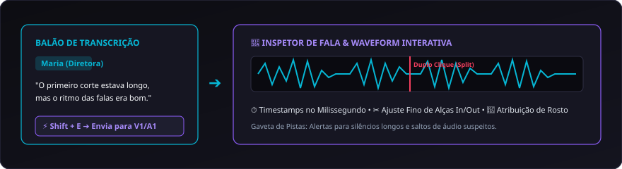

# 07. Transcrição e Edição por Texto

A transcrição de depoimentos no **CapIAu-Talho** transforma entrevistas gravadas em texto interativo diretamente sincronizado à timeline da montagem.

---

## 🎙️ Motores de Transcrição Suportados (ASR)

O sistema suporta múltiplos provedores configuráveis no `.env`:

| Provedor | Modo de Operação | Vantagens |
| :--- | :--- | :--- |
| **AssemblyAI** (Padrão) | Nuvem (API) | Alta precisão em português, diarização avançada de falantes e timestamps palavra por palavra. |
| **Groq Whisper** | Nuvem (API Ultra-Rápida) | Transcreve 1 hora de áudio em menos de 10 segundos com custo mínimo. |
| **Whisper Local** | 100% Local (CPU/GPU) | Privacidade absoluta. Roda modelos `tiny`, `base`, `small`, `medium` ou `large-v3`. |
| **OpenAI Whisper API** | Nuvem (API) | Excelente reconhecimento multilíngue e vocabulário técnico. |

---

## ⏱️ Sincronia Atômica Palavra por Palavra

Cada palavra transcrita carrega metadados de timecode de início e fim em milissegundos:

```json
{
  "text": "documentário",
  "start": 14200,
  "end": 14850,
  "confidence": 0.98,
  "speaker": "Speaker A"
}
```

- **Navegação Clicável:** Clique em qualquer palavra no painel de transcrição para que o monitor de vídeo pule instantaneamente para o frame exato em que a palavra é pronunciada.
- **Destaque Dinâmico (Karaokê):** Durante a reprodução do vídeo, as palavras faladas são destacadas em tempo real em ciano.

---

## ⚡ O Atalho `Shift+E` (Corte Direto de Fala)

Este é o comando mais poderoso para documentaristas:

1. Abra a transcrição da entrevista no painel lateral direito.
2. Selecione com o mouse uma frase ou um parágrafo inteiro da fala do entrevistado.
3. Pressione **`Shift + E`**.
4. O CapIAu-Talho insere imediatamente o segmento de vídeo (na pista V1) e de áudio (na pista A1) na timeline na posição da agulha, com pontos In e Out perfeitamente recortados no início e no final da frase.

---

## 👥 Diarização de Falantes e Gaveta de Pistas

O sistema agrupa as falas por personagens (*Speaker A*, *Speaker B*, etc.).

### A Gaveta de Pistas
No canto superior da transcrição, a **Gaveta de Pistas** analisa a conversa e emite alertas inteligentes sobre possíveis inconsistências para revisão humana:
- ⚠️ *Silêncios Prolongados:* Trechos com mais de 3 segundos sem fala no mesmo balão.
- ⚠️ *Troca Repentina de Falante:* Saltos abruptos de tom ou volume.
- ⚠️ *Discrepância Visual:* Quando o rosto identificado na cena não corresponde ao falante rotulado.

---

## 🌊 Inspetor de Fala com Waveform Interativa

Para ajustes finos no corte de diálogos:



1. Clique com o **botão direito** sobre a tag do falante em qualquer balão de texto.
2. O **Inspetor de Fala** se abre, exibindo a forma de onda de alta resolução do trecho de áudio.
3. **Divisão de Falas:** Dê um **duplo clique** em qualquer ponto da onda sonora para dividir a fala naquele milissegundo exato.
4. **Atribuição Rápida de Rosto:** Associe instantaneamente o personagem detectado visualmente àquele bloco de áudio.

---

> Próximo passo: Aprenda a pesquisar seu acervo em [[08. Busca Híbrida e Semântica|08.-Busca-Hibrida-e-Semantica]].
