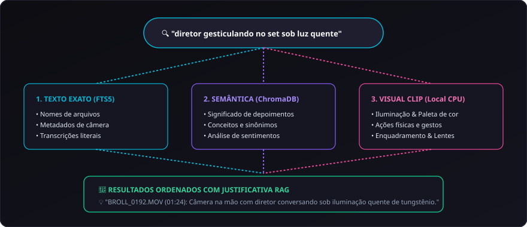

# 08. Busca Híbrida e Semântica

A busca no **CapIAu-Talho** unifica em um único motor a **busca textual clássica**, a **busca semântica por significado (RAG)** e a **busca visual por imagens (CLIP)**, operando em menos de 5 milissegundos sobre dezenas de milhares de planos.

---

## 🔍 Como Funciona a Busca Híbrida

O sistema cruza simultaneamente três fontes:
1. **Índice Textual Exato (SQLite FTS5):** Busca termos literais em nomes de arquivos, metadados técnicos de câmera, tags e transcrições completas.
2. **Índice Semântico Vetorial:** Encontra conceitos mesmo quando as palavras exatas não foram ditas (ex: ao buscar *"dificuldades de orçamento"*, o sistema encontra falas sobre *"falta de verba"*, *"cortes da produção"* ou *"crise financeira"*).
3. **Índice Visual CLIP Multilíngue:** Localiza características físicas da imagem sem depender de legendas (ex: *"contraluz na janela"*, *"lentes antigas sobre a mesa"*, *"câmera na mão em movimento"*).

---

## 🎛️ Filtros Multidimensionais em Duas Linhas

Para refinar pesquisas em acervos extensos:

- **Tipo de Mídia:** Vídeos de Entrevista, B-Rolls, Fotos RAW/JPG, Áudios Puros.
- **Personagens do Elenco / Equipe:** Filtrar apenas trechos onde determinada pessoa está presente na imagem ou falando no áudio.
- **Movimento de Câmera:** Estático, Pan, Tilt, Dolly/Tracking, Câmera na Mão, Chicote.
- **Enquadramento & Paleta:** Planos Gerais, Médios, Close-ups, Detalhes, Tons Quentes, Tons Frios.
- **Status de Análise:** Analisados, Não Analisados, Todos.

---

## 💡 Explicações Didáticas do RAG

Cada resultado de busca traz um card explicativo gerado pela IA justificando a conexão encontrada:

> **Consulta:** *"Momento tenso na gravação de externa"*  
> **Resultado:** `BROLL_0192.MOV` (01:24 - 01:48)  
> 💡 **Justificativa da IA:** *"O plano apresenta movimento rápido de câmera na mão com iluminação noturna contrastada e expressão corporal de urgência da equipe ao redor do monitor."*

---

## 🤖 Agente Editor Conversacional & Ghost Clips

No painel de Chat Inteligente, você pode interagir diretamente com o assistente do Talho como se estivesse conversando com um assistente de montagem:

### Exemplos de Comandos para o Agente:
- *"Monte uma sequência de 1 minuto sobre a escolha do elenco, intercalando falas da produtora com fotos do teste de atores."*
- *"Localize todas as vezes em que o diretor elogiou a fotografia e monte na trilha V1."*
- *"Encontre B-rolls que combinem com a fala que está tocando no player agora."*

### Clipes Fantasma (Ghost Clips)
Quando o assistente propõe uma montagem, ele não sobregrava sua timeline arbitrariamente:
- Os clipes sugeridos são inseridos na timeline como **Ghost Clips** (clipes semitransparentes com contorno tracejado violeta).
- O editor pode reproduzir a sequência na timeline, ouvir o resultado e clicar em **Aprovar Todos**, **Aprovar Individualmente** ou **Descartar Sugestão**.

---

> Próximo passo: Conheça o sistema de elenco em [[09. Reconhecimento Facial e Elenco|09.-Reconhecimento-Facial-e-Elenco]].
