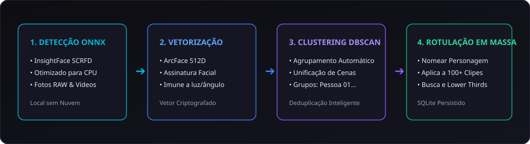

# 09. Reconhecimento Facial e Elenco

O **CapIAu-Talho** possui um sistema avançado de **biometria facial e catalogação de personagens**, projetado para mapear atores, diretores e equipe técnica em centenas de horas de filmagem com garantia total de privacidade.

---

## 🔒 Privacidade Absoluta: 100% Local na CPU

O pipeline biométrico do Talho não depende de nenhuma API externa:

- **Modelos ONNX Otimizados:** Utiliza o detector SCRFD e o extrator ArcFace rodando em CPU localmente.
- **Nenhum Dado Sai do Computador:** Nenhuma imagem ou vetor biométrico é transmitido para servidores de nuvem, respeitando normas de privacidade (LGPD/GDPR) e contratos de sigilo cinematográfico.

---

## 👥 Agrupamento Automático por Proximidade (DBSCAN)

Ao analisar o acervo, o algoritmo agrupa automaticamente os rostos da mesma pessoa que aparecem em diferentes dias, ângulos e iluminações:

1. Acesse a aba **Rostos** na interface.
2. Cada grupo não identificado aparece como um cluster numerado (ex: *Pessoa 01*, *Pessoa 02*).
3. **Rotulação em Lote:** Digite o nome real da pessoa (ex: *"Maria (Diretora)"*) no card do grupo. Automaticamente, todas as centenas de aparições daquele rosto em todos os vídeos e fotos do projeto são rotuladas de uma só vez!

---

## 🔀 Desambiguação e Resolução de Conflitos

Quando duas pessoas possuem traços semelhantes ou quando uma pessoa foi dividida em dois grupos diferentes:

### 1. Fusão de Grupos (Merge Clusters)
Se você rotular um grupo com o mesmo nome de um grupo já existente, o sistema abre uma modal inteligente:
- Exibe miniaturas lado a lado de ambos os grupos.
- Permite clicar em **Fundir Grupos (Merge)** para unificar todas as fotos e vídeos sob o mesmo personagem.

### 2. Reatribuição Individual (Reassign)
Caso uma miniatura dentro de um grupo pertença a outra pessoa:
1. Selecione a miniatura incorreta.
2. Escolha **Transferir para Outro Personagem** e indique o destino correto.

---

## 🚫 Rejeição e Catalogação de Objetos de Set

Nem todo retângulo detectado é um rosto humano:

### Descarte Simples
- Clique em **Rejeitar (Reject)** em uma detecção espúria (como uma sombra ou textura que pareça um rosto). Ela é marcada como *Não Relevante* e excluída das buscas.

### Catalogação de Objetos Personalizados
- Você pode aproveitar uma detecção para rotular um elemento de cena (ex: *"Microfone Boom"*, *"Claquete"*, *"Monstro Cenográfico"*).
- O objeto é removido do catálogo de pessoas para não poluir o elenco, mas seu nome é indexado na **busca semântica textual e visual**.

---

## ✏️ Desenho Manual de Caixas (Drag-and-Draw)

Para marcar um personagem que estava de costas, com máscara ou um objeto importante do set que o detector automático não capturou:

1. No monitor de vídeo ou foto, ative a ferramenta **Desenhar Caixa**.
2. Clique e arraste um retângulo sobre o elemento desejado.
3. Digite o nome do personagem ou objeto para vinculá-lo imediatamente ao banco de dados e à busca semântica.

---

> Próximo passo: Aprenda a diagnosticar e tratar o som em [[10. Diagnóstico e Restauração de Áudio|10.-Audio-Diagnostico-e-Restauracao]].
