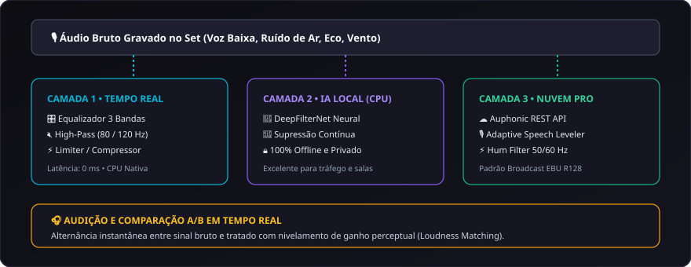

# 10. Diagnóstico e Restauração de Áudio

O **CapIAu-Talho** inclui uma suíte completa de **análise técnica, equalização e restauração inteligente de áudio**, projetada para resolver problemas acústicos típicos de captação documental (ruído de gerador, eco de sala, vento, vazamentos e níveis desbalanceados).

---

## 📊 Diagnóstico Técnico de Áudio (EBU R128)

Ao inspecionar qualquer mídia ou clipe da timeline, o sistema calcula métricas de engenharia de áudio em tempo real:

| Métrica | Padrão / Alvo | O que Significa |
| :--- | :--- | :--- |
| **Integrated LUFS** | -23.0 LUFS (Broadcast) / -14.0 LUFS (Web) | Volume percebido integrado ao longo de todo o clipe. |
| **True Peak (dBTP)** | $\le -1.0\text{ dBTP}$ | Nível máximo de pico para evitar distorção digital pós-compressão. |
| **Loudness Range (LRA)** | $4\text{ a }12\text{ LU}$ | Variação dinâmica entre os momentos mais suaves e mais intensos da voz. |
| **Relação Sinal-Ruído (SNR)** | $\ge 20\text{ dB}$ (Bom) / $< 10\text{ dB}$ (Crítico) | Nível de clareza da voz em relação ao ruído de fundo da sala/set. |

---

## 🎛️ As Três Camadas de Tratamento de Áudio

### Camada 1: Equalizador Paramétrico e Filtros Locais
- **Filtro Passa-Altas (High-Pass / Low-Cut):** Corte seletivo em 80 Hz ou 120 Hz para eliminar ruídos de manuseio de microfone e roncos graves de ar-condicionado.
- **Equalizador de 3 Bandas:** Ajuste cirúrgico de graves, médios e agudos com ganho de $\pm 12\text{ dB}$.
- **Compressor / Limiter Suave:** Nivela falas tímidas e segura picos sem gerar artefatos audíveis.

### Camada 2: DeepFilterNet Local (Rede Neural em CPU)
- Supressão de ruído profunda baseada em deep learning rodando localmente sem enviar áudio para a internet.
- Remove ruídos contínuos de tráfego, ventiladores e ruído elétrico preservando o timbre natural da voz humana.

### Camada 3: Restauração de Alta Precisão via Auphonic Cloud API
Para arquivos de áudio gravemente degradados, o Talho integra-se à API da **Auphonic**:
- **Nivelador de Voz Dinâmico (Adaptive Leveler):** Equilibra entrevistados que falam muito baixo ou afastados do microfone.
- **Filtro de Ruído Elétrico (Hum Removal 50/60 Hz):** Remove zumbidos elétricos de lâmpadas ou cabos mal aterrados.
- **Speech Isolation:** Isola a fala com nitidez broadcast.

---

## 🎚️ Presets Prontos para Uso

1. **Voz Entrevista Estúdio:** Realce suave de presença vocal (3.5 kHz) com corte de graves abaixo de 80 Hz e normalização para -23 LUFS.
2. **Externa / Redução de Vento:** High-pass agressivo em 120 Hz, DeepFilterNet ativado em 80% e atenuação de agudos ásperos.
3. **Trilha Sonora / Ducking Suave:** Rebaixa frequências médias para abrir espaço vocal aos diálogos e ajusta o volume para -28 LUFS.
4. **Master Final Web (-14 LUFS):** Nivelamento compatível com YouTube, Vimeo e plataformas de streaming.

---

## 🔄 Comparação A/B em Tempo Real

No painel de áudio, clique no botão **Comparar A/B**:
- Alterna instantaneamente entre o áudio bruto gravado e o sinal processado.
- Inclui **compensação automática de ganho (Loudness Matching)** para que o usuário avalie a qualidade real da limpeza sem ser enganado por diferenças de volume.

---

> Próximo passo: Conheça os recursos de cor e viewport em [[11. Cor, OCIO e Viewport NLE|11.-Cor-Grading-e-Transformacoes-Visuais]].
