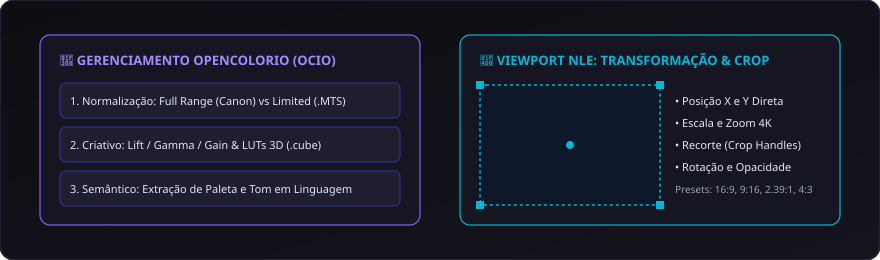

# 11. Cor, OCIO e Viewport NLE

O gerenciamento de cor e as transformações espaciais no **CapIAu-Talho** unem rigor técnico de cinema (baseado em **OpenColorIO**) à fluidez de edição visual direta no viewport do player.

---

## 🌈 Arquitetura de Cor em Três Camadas (OpenColorIO)

O Talho divide o pipeline cromático de forma transparente:

```
[Camada Técnica]    Garante que os números representem a luz real (OpenColorIO / Normalização Full vs Limited Range)
         ↓
[Camada Criativa]   Aplica estética, correções e intenção de direção (Color Wheels, Curvas e LUTs 3D .cube)
         ↓
[Camada Semântica]  Indexa a luz e a paleta em linguagem natural (ex: "luz quente de fim de tarde", "tons azulados")
```

### O Desafio das Múltiplas Câmeras em Acervos
Em um documentário real, câmeras diferentes convivem na mesma timeline:
- **Canon DSLR / Mirrorless:** Grava em *Full Range (0-255 / `pc`)* com formato `yuvj420p`.
- **Camcorders AVCHD (.MTS):** Gravam em *Limited Range (16-235)* sem tags explícitas.
- **Fotos RAW (.CR2):** Espaço de cor linear de sensor com demosaicing específico.

O pipeline de cor do Talho normaliza automaticamente esses espaços para que o preview e os exports no Kdenlive, Premiere e DaVinci Resolve apresentem níveis idênticos de preto e branco sem cortes de sombra (*crushed blacks*) ou estouro de altas luzes.

---

## 🎨 Controles de Correção Criativa de Cor

No painel de Efeitos e Inspetor de Vídeo:

| Controle | Parâmetro | Aplicação Prática |
| :--- | :--- | :--- |
| **Lift (Sombras)** | R, G, B + Master | Ajusta a densidade do ponto de preto e o tom das sombras. |
| **Gamma (Médios)** | R, G, B + Master | Controla a exposição e o tom de pele dos entrevistados. |
| **Gain (Altas Luzes)** | R, G, B + Master | Define o brilho e a tonalidade dos pontos mais claros da cena. |
| **Temperatura & Tint** | Kelvin / Verde-Magenta | Corrige desvios de balanço de branco de lâmpadas mistas. |
| **Saturação & Contraste** | 0% a 200% | Ajusta o impacto visual e a fidelidade cromática. |
| **Suporte a LUTs 3D** | Arquivos `.cube` | Aplicação de LUTs de conversão técnica ou looks criativos de pós-produção. |

---

## 📐 Viewport NLE: Alças de Transformação e Recorte (Crop)

No monitor de programa, o editor pode interagir diretamente com a imagem através de alças visuais na tela:



### 1. Transformação Direta
- **Posição (X / Y):** Reposicione o plano na tela com o mouse ou via teclado.
- **Escala e Zoom:** Amplie planos em 4K para criar falsos planos médios a partir de um plano geral.
- **Opacidade:** Ajuste o nível de transparência para sobreposições de camadas entre V1 e V2.

### 2. Recorte Interativo (Crop)
- Alterne para o modo **Recorte (Crop)** para cortar bordas indesejadas (ex: microfone boom aparecendo no topo do quadro).
- **Proporções Predefinidas de Sequência:**
  - 🎬 **16:9 (1920x1080 / 4K UHD):** Formato padrão para TV e cinema widescreen.
  - 📱 **9:16 (1080x1920):** Formato vertical para Reels, TikTok e Shorts.
  - 🎞️ **2.39:1 (Cinemascope):** Formato anamórfico cinematográfico.
  - 📺 **4:3 (1440x1080):** Formato clássico para filmes de arquivo e acervos históricos em fita (VHS/Betacam).

---

> Próximo passo: Aprenda a criar cartelas e legendas em [[12. Titler NLE, Legendas e Animação|12.-Titler-NLE-Legendas-e-Animacao]].
