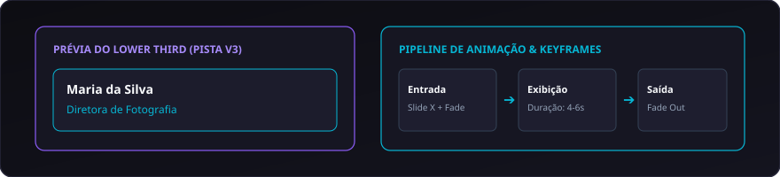

# 12. Titler NLE, Legendas e Animação

O **Titler NLE** do CapIAu-Talho é um gerador visual de cartelas, terços inferiores (*lower thirds*), créditos e legendas integrado diretamente à pista de vídeo gráfica **V3**.

---

## 📝 Tipos de Elementos Gráficos

```
[V3: Camada Gráfica] ---> 🏷️ Lower Thirds (Nome do Entrevistado e Cargo)
                     ---> 🎬 Cartelas de Capítulo ("Capítulo 1: O Início")
                     ---> 💬 Legendas Queimadas ou Acessíveis (.SRT / .VTT)
                     ---> 📜 Créditos de Abertura e Encerramento
```

1. **Lower Thirds (Identificação de Entrevistados):** Cartelas elegantes na base do vídeo com nome e cargo/função do personagem.
2. **Cartelas de Capítulo / Divisores Temáticos:** Slides de texto com fundo sólido ou translúcido para estruturar os atos do documentário.
3. **Legendas Sincronizadas:** Geradas automaticamente a partir da transcrição fonética ASR com divisão métrica de caracteres por linha.

---

## 🎨 Estilização Tipográfica Avançada

No inspetor do Titler, o editor tem controle total sobre a apresentação visual:

| Propriedade | Controles Disponíveis | Aplicação |
| :--- | :--- | :--- |
| **Tipografia** | Família da Fonte, Peso (300 a 900), Kerning | Harmonia com a identidade visual do filme. |
| **Cor e Preenchimento** | Cores sólidas Hex/RGB, Gradientes lineares | Destaque do texto contra fundos complexos. |
| **Contorno (Stroke)** | Espessura em px, Cor do contorno | Melhora imediata da legibilidade em cenas claras. |
| **Sombra Projetada (Drop Shadow)** | Deslocamento X/Y, Desfoque (Blur), Opacidade | Separação tridimensional do texto sobre a imagem. |
| **Caixa de Fundo (Backdrop Glass)** | Cor de fundo translúcida, Blur e Padding | Efeito moderno estilo vidro fosco sob o nome. |

---

## 🤖 Geração Automática de Lower Thirds a Partir dos Rostos

Graças à integração entre os módulos do Talho:
1. Quando um entrevistado rotulado no módulo de **Rostos** aparece na timeline, o sistema sugere um botão **Gerar Lower Third**.
2. O Talho cria instantaneamente uma cartela na pista V3 com o nome correto e a duração padrão da fala, alinhada à entrada da voz.

---

## ⏱️ Animação e Suporte a Keyframes

Os títulos e elementos gráficos podem ser animados ao longo do tempo:



- **Curvas de Interpolação:** Suporte a curvas *Ease-In* e *Ease-Out* para movimentos suaves e orgânicos sem paradas secas.
- **Duração de Fade Ajustável:** Sliders com passos numéricos precisos para ajustar o tempo de transição em segundos ou frames.

---

## 💬 Exportação de Legendas (.SRT e .VTT)

Além de renderizar títulos na imagem, o Talho permite exportar o arquivo de legendas autônomo:
- Formatos: **`.srt` (SubRip)** e **`.vtt` (WebVTT)**.
- Quebra automática de linhas respeitando o limite padrão de **37 a 42 caracteres por linha** e tempo de leitura de no mínimo **1.2 segundos por legenda**.

---

> Próximo passo: Veja como exportar seu projeto em [[13. Exportação e Interoperabilidade NLE|13.-Exportacao-e-Interoperabilidade-NLE]].
