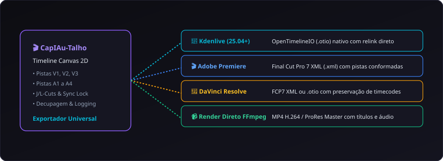

# 13. Exportação e Interoperabilidade NLE

O **CapIAu-Talho** segue uma política estrita de **Zero Aprisionamento Tecnológico**. Toda a montagem, os pontos de corte e os metadados gerados no sistema são 100% interoperáveis com os principais softwares de edição e pós-produção do mercado.

---

## 🗺️ Visão Geral dos Formatos de Exportação

| Formato | Arquivo | NLEs Compatíveis | Preservação de Pistas e Cortes | Conformação dos Originais |
| :--- | :--- | :--- | :--- | :--- |
| **OpenTimelineIO** | `.otio` | **Kdenlive (25.04+)**, DaVinci Resolve | Sim (Multitrack V1-V3 / A1-A4) | ✅ Aponta para mídias originais |
| **FCP7 XML** | `.xml` | **Adobe Premiere Pro**, **DaVinci Resolve**, Final Cut | Sim (Pistas, Níveis e Transições) | ✅ Relink automático com timecode |
| **EDL** | `.edl` | Suítes de pós-produção e color grading legadas | Pista única V1 / A1-A2 | ✅ Conforme baseado em Timecode |
| **Render Direto** | `.mp4` | Reprodução direta em qualquer dispositivo | Sequência fundida com áudio mixado | ✅ Renderizado em alta qualidade |

---

## 🐧 Fluxo de Trabalho com Kdenlive (25.04+)

O Kdenlive 25.04+ possui suporte nativo ao padrão da indústria da Academia (ASWF) **OpenTimelineIO**:

### Passo a Passo:
1. No CapIAu-Talho, clique no menu superior **Exportar** $\rightarrow$ **OpenTimelineIO (.otio)**.
2. Salve o arquivo na pasta do seu projeto.
3. No **Kdenlive**, vá em **Arquivo** $\rightarrow$ **Abrir** ou **Importar** $\rightarrow$ Selecione o arquivo `.otio`.
4. O Kdenlive reconstruirá todas as trilhas de vídeo (V1, V2, V3) e áudio (A1 a A4) com os cortes exatos, mantendo o vínculo com seus arquivos originais de alta resolução.

---

## 🎬 Fluxo de Trabalho com Adobe Premiere Pro

1. No Talho, exporte como **Final Cut Pro 7 XML (.xml)**.
2. No **Premiere Pro**, vá em **Arquivo** $\rightarrow$ **Importar** e selecione o arquivo `.xml`.
3. Uma nova sequência contendo a timeline montada aparecerá no painel de projeto.
4. Caso as mídias estejam em discos externos, o Premiere solicitará a localização da pasta uma única vez e reconectará todos os clipes automaticamente.

---

## 🎨 Fluxo de Trabalho com DaVinci Resolve

1. No **DaVinci Resolve**, abra a página **Edit** ou **Cut**.
2. Vá em **File** $\rightarrow$ **Import** $\rightarrow$ **Timeline...** $\rightarrow$ Selecione o arquivo `.xml` ou `.otio`.
3. Na janela de conformação, certifique-se de desmarcar a opção *"Automatically import source clips into media pool"* caso deseje apontar manualmente para a pasta de arquivos RAW originais.
4. Prossiga para a página **Color** para a gradação de cor cinematográfica final.

---

## 📹 Renderização Direta de Vídeo (FFmpeg Local) & Suporte a Proxies

Caso queira gerar um arquivo de vídeo completo para visualização rápida da equipe ou cliente sem abrir outro NLE:

- **Motor Local:** Utiliza o FFmpeg com aceleração de hardware detectada automaticamente (NVIDIA NVENC, Intel QuickSync, AMD AMF ou CPU libx264).
- **Opções de Saída:**
  - **Master ProRes / MP4:** Para arquivamento em qualidade máxima sem perdas a partir dos originais.
  - **Web MP4 (H.264 / AAC):** Otimizado para envio rápido via WhatsApp, Google Drive ou YouTube.
  - **Render com Proxies Locais (`_proxy.mp4`):** Permite renderizar a montagem em velocidade ultrarrápida utilizando os proxies locais, emitindo aviso informativo de fidelidade (`RENDER_COM_PROXIES`) sem bloqueios indevidos quando o HD externo estiver desconectado.
- **Mixagem de Áudio Embutida:** Aplica automaticamente os volumes e equalizações definidas na timeline no arquivo de saída.

---

## ⚡ Exportação de Timeline com Proxies Locais (Offline Editing)

Ao exportar nos formatos `.otio`, `.xml` ou `.edl`, você pode marcar a opção **"Usar proxies locais"**:
- O arquivo gerado receberá o sufixo `_proxy` (ex.: `corte_fase1_proxy.otio`).
- Todos os caminhos de mídia (`target_url` / `pathurl`) apontarão para os proxies leves em `data/proxies/`, permitindo transferir o projeto para notebooks ou ilhas remotas com fração mínima de armazenamento.

---

> Próximo passo: Consulte a tabela completa de atalhos em [[14. Guia Completo de Atalhos|14.-Guia-Completo-de-Atalhos]].
