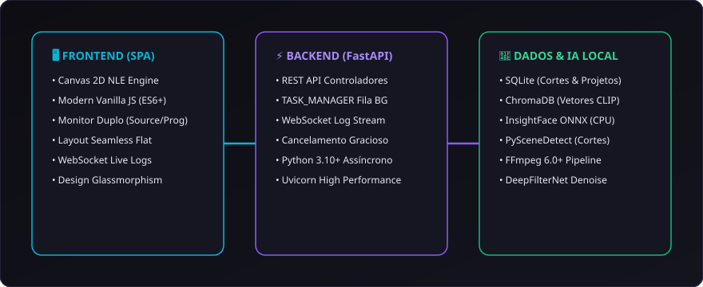

# 15. Arquitetura Técnica e API REST

O **CapIAu-Talho** é construído sobre uma arquitetura assíncrona moderna em Python com **FastAPI**, **SQLite**, **ChromaDB** e **Canvas 2D**, projetada para escalabilidade e baixa latência.

---

## 🛠️ Stack Tecnológica Completa

---

## ⚡ Gerenciador de Tarefas (`TASK_MANAGER`) e Streaming de Logs

Todas as operações pesadas (ingestão, geração de proxies, transcrição e detecção facial) rodam em threads assíncronas gerenciadas por uma fila central:

- **Chave Única:** Cada processo recebe um ID padronizado (ex: `f"scan_proj_{project_id}"`).
- **Streaming WebSocket:** O progresso percentual ($0\text{ a }100\%$) e as mensagens de log são transmitidas via WebSocket para o terminal interativo do frontend.
- **Cancelamento Suave:** Loops de processamento verificam `TASK_MANAGER.is_cancelled(task_key)` em cada iteração, liberando memória e threads instantaneamente caso o usuário cancele a tarefa.

---

## 🔌 Referência dos Principais Endpoints REST

### 1. Ingestão e Mídias (`/api/media`)

| Método | Rota | Descrição |
| :--- | :--- | :--- |
| `POST` | `/api/media/scan` | Dispara a varredura da pasta `watch/` ou de diretório customizado. |
| `GET` | `/api/media/project/{project_id}` | Retorna a lista completa de vídeos, fotos e áudios com seus metadados. |
| `GET` | `/api/media/{media_id}` | Detalhes técnicos, proxies e miniaturas de uma mídia específica. |
| `DELETE` | `/api/media/{media_id}` | Remove a mídia do catálogo sem deletar o arquivo original do disco. |

### 2. Transcrição e Diálogos (`/api/transcription`)

| Método | Rota | Descrição |
| :--- | :--- | :--- |
| `POST` | `/api/transcription/transcribe/{media_id}` | Envia o áudio para transcrição (AssemblyAI / Whisper). |
| `GET` | `/api/transcription/{media_id}` | Retorna as falas com falantes e timestamps palavra por palavra. |
| `POST` | `/api/transcription/word/update` | Corrige o texto ou os timestamps de uma palavra específica. |
| `GET` | `/api/transcription/{media_id}/clues` | Retorna as inconsistências detectadas pela Gaveta de Pistas. |

### 3. Biometria Facial e Elenco (`/api/faces`)

| Método | Rota | Descrição |
| :--- | :--- | :--- |
| `POST` | `/api/faces/face/{face_id}/label` | Atribui um nome à face ou a todo o cluster de uma só vez. |
| `POST` | `/api/faces/project/{project_id}/faces/merge` | Une dois grupos de rostos (fusão de clusters conflitantes). |
| `POST` | `/api/faces/project/{project_id}/faces/reassign` | Transfere detecções específicas para outro personagem. |
| `POST` | `/api/faces/face/{face_id}/reject` | Rejeita uma detecção falsa ou cataloga como objeto de cena. |
| `POST` | `/api/faces/face` | Cadastra uma nova caixa desenhada manualmente (Drag-and-Draw). |

### 4. Áudio e Restauração (`/api/audio`)

| Método | Rota | Descrição |
| :--- | :--- | :--- |
| `GET` | `/api/audio/{media_id}/diagnostics` | Retorna medições de LUFS, True Peak, LRA e SNR. |
| `POST` | `/api/audio/{media_id}/restore/auphonic` | Dispara a limpeza e masterização na API da Auphonic. |
| `POST` | `/api/audio/{media_id}/filter/deepfilter` | Executa o desruído neural local via DeepFilterNet. |

### 5. Timeline e Exportação (`/api/timeline`)

| Método | Rota | Descrição |
| :--- | :--- | :--- |
| `GET` | `/api/timeline/project/{project_id}` | Carrega o estado atual da timeline multipista. |
| `POST` | `/api/timeline/project/{project_id}/save` | Persiste clipes, cortes, efeitos e posições no banco SQLite. |
| `GET` | `/api/timeline/project/{project_id}/export/otio` | Gera o arquivo OpenTimelineIO (`.otio`) para o Kdenlive. |
| `GET` | `/api/timeline/project/{project_id}/export/xml` | Gera o arquivo FCP7 XML para Premiere e DaVinci Resolve. |
| `POST` | `/api/timeline/project/{project_id}/render` | Renderiza a timeline completa em MP4/ProRes via FFmpeg. |

### 6. Busca Semântica e IA (`/api/search`)

| Método | Rota | Descrição |
| :--- | :--- | :--- |
| `POST` | `/api/search/hybrid` | Executa busca unificada (texto FTS5 + vetor CLIP + transcrição). |
| `POST` | `/api/search/similar` | Localiza clipes e fotos visualmente semelhantes por vetor CLIP. |
| `POST` | `/api/search/agent/chat` | Envia mensagem para o agente editor com contexto do projeto. |

---

> Próximo passo: Aprenda a resolver eventuais dúvidas em [[16. Solução de Problemas e FAQ|16.-Solucao-de-Problemas-e-FAQ]].
