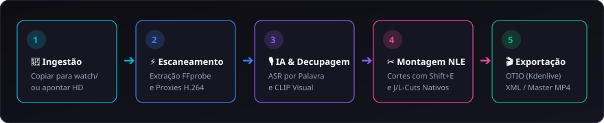

# 🎬 Bem-vindo à Wiki Oficial do CapIAu-Talho

**Ilha de pré-edição, decupagem e assistência inteligente por IA para grandes acervos e documentários**

---

## 🌟 O que é o CapIAu-Talho?

O **CapIAu-Talho** é uma plataforma profissional de **pré-edição, decupagem e logging inteligente** projetada especificamente para documentaristas, editores de making-of e gestores de grandes acervos audiovisuais.

Diferente de plugins convencionais ou ferramentas que tratam IA como uma caixa preta isolada, o CapIAu-Talho integra modelos de **visão computacional**, **transcrição fonética (ASR)**, **biometria facial local** e **processamento de linguagem natural** diretamente a uma **timeline multipista baseada em Canvas 2D (Track-Based NLE)**.

### 🏛️ Os Três Pilares do Sistema

1. **Privacidade e CPU-First Local:** Indexação vetorial, embeddings visuais CLIP e biometria facial com clustering DBSCAN rodam **100% na máquina do usuário sem exigir placa de vídeo dedicada (GPU)**. Nenhum rosto ou metadado sensível sai do seu computador.
2. **Edição Guiada por Texto e Visão:** Depoimentos transcritos palavra por palavra são navegáveis e inseríveis na timeline com precisão atômica (`Shift+E`), enquanto a busca semântica em linguagem natural localiza planos visuais em milissegundos.
3. **Zero Aprisionamento Tecnológico (Interoperabilidade NLE):** Monte o rough cut no Talho e exporte instantaneamente para **Kdenlive (OpenTimelineIO nativo)**, **Adobe Premiere Pro**, **DaVinci Resolve** e **Final Cut Pro (XML FCP7 / EDL)** com precisão de frames e conformação de originais.

---

## 🗺️ Mapa de Navegação da Wiki

Explore a documentação completa através dos módulos abaixo:

| Seção | Título | Conteúdo Principal |
| :--- | :--- | :--- |
| 🚀 **Início** | [[01. Visão Geral e Conceito\|01.-Visao-Geral-e-Conceito]] | Filosofia, desafios em documentários, acervos e arquitetura híbrida. |
| 🛠️ **Setup** | [[02. Instalação e Configuração\|02.-Instalacao-e-Configuracao]] | Requisitos de hardware, instalação local, Docker, `.env` e launcher Windows. |
| 🎨 **Interface** | [[03. Design System e Interface NLE\|03.-Design-System-e-Interface-NLE]] | Layout seamless sem gaps, sidebars adaptativas, linhas restauradoras de 4px. |
| 📂 **Acervo** | [[04. Ingestão e Gestão de Acervos\|04.-Ingestao-e-Gestao-de-Acervos]] | Ingestão in-place sem cópia, watch folder, proxies 720p/360p, RAW CR2 e MTS. |
| ✂️ **Edição** | [[05. Timeline e Edição Multipista\|05.-Timeline-e-Edicao-Multipista]] | Canvas 2D NLE, pistas V/A, Sync Lock, Magnetismo, J/L-Cuts e ferramentas de Trim. |
| 🎞️ **Visão** | [[06. Decupagem e Visão Computacional\|06.-Decupagem-Inteligente-e-Visao]] | PySceneDetect (shots/beats), movimento de câmera, títulos de IA e CLIP local. |
| 🎙️ **Texto** | [[07. Transcrição e Edição por Texto\|07.-Transcricao-ASR-e-Edicao-por-Texto]] | AssemblyAI/Whisper, diarização, gaveta de pistas, waveform e inserção rápida. |
| 🔍 **Busca** | [[08. Busca Híbrida e Semântica\|08.-Busca-Hibrida-e-Semantica]] | Busca semântica RAG, similares visuais, filtros avançados e explicações de IA. |
| 👥 **Faces** | [[09. Reconhecimento Facial e Elenco\|09.-Reconhecimento-Facial-e-Elenco]] | InsightFace ONNX CPU, DBSCAN local, rotulação, fusão de clusters e caixas manuais. |
| 🔊 **Áudio** | [[10. Diagnóstico e Restauração de Áudio\|10.-Audio-Diagnostico-e-Restauracao]] | Medição LUFS EBU R128, DeepFilterNet local, Auphonic REST API e EQ 3 bandas. |
| 🌈 **Cor & FX** | [[11. Cor, OCIO e Viewport NLE\|11.-Cor-Grading-e-Transformacoes-Visuais]] | OpenColorIO, LUTs 3D .cube, Color Wheels, Viewport NLE, Transform e Crop. |
| 📝 **Titler** | [[12. Titler NLE, Legendas e Animação\|12.-Titler-NLE-Legendas-e-Animacao]] | Gerador de títulos, Lower Thirds, legendas queimadas/SRT e animação com keyframes. |
| 🎬 **Export** | [[13. Exportação e Interoperabilidade NLE\|13.-Exportacao-e-Interoperabilidade-NLE]] | Formatos OTIO, XML FCP7, EDL, Render MP4 e integração com Kdenlive/Premiere/Resolve. |
| 🎹 **Atalhos** | [[14. Guia Completo de Atalhos\|14.-Guia-Completo-de-Atalhos]] | Tabela completa de atalhos de teclado (JKL, I/O/E, Shift+E, A, Ferramentas). |
| 🔌 **API** | [[15. Arquitetura Técnica e API REST\|15.-Arquitetura-Tecnica-e-API-REST]] | FastAPI, SQLite + ChromaDB, WebSockets, streaming de logs e endpoints REST. |
| 🩺 **Suporte** | [[16. Solução de Problemas e FAQ\|16.-Solucao-de-Problemas-e-FAQ]] | Resolução de problemas comuns, diagnóstico de erros, logs e FAQ. |
| 🗺️ **Futuro** | [[17. Roadmap e Guia de Contribuição\|17.-Roadmap-e-Guia-de-Contribuicao]] | Próximas versões, suíte de testes pytest e diretrizes para pull requests. |

---

## ⚡ Guia de Inicialização Rápida (3 Minutos)

1. **Ingestão:** Coloque seus vídeos, áudios ou fotos na pasta `watch/` ou aponte seus discos rígidos externos na interface.
2. **Indexação Automática:** Clique em **Escanear watch/**. O backend extrai metadados via FFprobe, gera proxies H.264 ultra-leves e indexa os vetores visuais CLIP.
3. **Transcrição:** Abra uma entrevista no player Source e clique em **Transcrever Vídeo**. Os diálogos aparecem divididos por personagens com marcação palavra a palavra.
4. **Montagem Rápida:** Selecione trechos de texto e tecle `Shift+E` para jogá-los direto na Timeline, ou use `I` (In), `O` (Out) e `E` para inserir trechos de vídeo.
5. **Exportação:** Exporte seu rough cut em **OpenTimelineIO (`.otio`)** para continuar a pós-produção no **Kdenlive 25.04+**, ou em **XML FCP7** para **Premiere Pro / DaVinci Resolve**.

---

## 🔄 Matriz de Interoperabilidade NLE

| Software de Destino | Formato Recomendado | Mídias Conformadas | Suporte a Pistas / Cortes | Guia Dedicado |
| :--- | :--- | :--- | :--- | :--- |
| **Kdenlive (25.04+)** | `.otio` (OpenTimelineIO) | Sim (Original / Proxy) | Multitrack V1-V3 / A1-A4 | [[Ver Guia\|13.-Exportacao-e-Interoperabilidade-NLE]] |
| **Adobe Premiere Pro** | `.xml` (Final Cut Pro 7 XML) | Sim (Relink automático) | Multitrack + Áudio Estéreo | [[Ver Guia\|13.-Exportacao-e-Interoperabilidade-NLE]] |
| **DaVinci Resolve** | `.xml` ou `.otio` | Sim (Timecode nativo) | Multitrack + Sincronia de Áudio | [[Ver Guia\|13.-Exportacao-e-Interoperabilidade-NLE]] |
| **Final Cut Pro X** | `.xml` / FCPXML via OTIO | Sim | Multitrack | [[Ver Guia\|13.-Exportacao-e-Interoperabilidade-NLE]] |
| **Render Direto (Master)** | `.mp4` (H.264 / AAC) | Sim (Render local FFmpeg) | Timeline completa com títulos e áudio | [[Ver Guia\|13.-Exportacao-e-Interoperabilidade-NLE]] |

---

> [!TIP]
> Para navegar rapidamente entre as páginas, utilize a barra de navegação à direita no GitHub Wiki ou os links no índice acima.
